# 📊 CODE MẪU VẼ BIỂU ĐỒ CHO ĐỀ TÀI QUIC

> File này chứa các code mẫu hoàn chỉnh để vẽ tất cả biểu đồ cần thiết.

---

## 📋 MỤC LỤC

1. [PYTHON MATPLOTLIB](#python-matplotlib)
2. [MERMAID DIAGRAMS](#mermaid-diagrams)
3. [HƯỚNG DẪN SỬ DỤNG](#hướng-dẫn-sử-dụng)

---

# PYTHON MATPLOTLIB

## Cài đặt

```bash
pip install matplotlib numpy pandas seaborn
```

## 1. Timeline - Lịch sử QUIC (A1.4)

```python
import matplotlib.pyplot as plt
import matplotlib.patches as mpatches

fig, ax = plt.subplots(figsize=(14, 6))

# Data
events = [
    (2012, "Google bắt đầu\nphát triển gQUIC"),
    (2013, "Deploy trên Chrome\nvà Google servers"),
    (2016, "IETF Working Group\nthành lập"),
    (2018, "HTTP/3\nđược đặt tên"),
    (2021, "RFC 9000, 9001, 9002\nQUIC v1 chính thức"),
    (2023, "RFC 9369\nQUIC v2"),
]

years = [e[0] for e in events]
labels = [e[1] for e in events]

# Draw timeline
ax.axhline(y=0, color='#3498db', linewidth=3, zorder=1)

# Draw events
for i, (year, label) in enumerate(events):
    y = 0.5 if i % 2 == 0 else -0.5
    ax.scatter(year, 0, s=200, color='#3498db', zorder=2)
    ax.annotate(f"{year}\n{label}", 
                xy=(year, 0), 
                xytext=(year, y),
                fontsize=10,
                ha='center',
                va='center' if y > 0 else 'center',
                bbox=dict(boxstyle='round,pad=0.5', facecolor='white', edgecolor='#3498db'),
                arrowprops=dict(arrowstyle='->', color='#3498db'))

ax.set_xlim(2010, 2025)
ax.set_ylim(-1.5, 1.5)
ax.set_xlabel('Năm', fontsize=12)
ax.set_title('Lịch sử phát triển QUIC Protocol', fontsize=14, fontweight='bold')
ax.axis('off')

plt.tight_layout()
plt.savefig('quic_timeline.png', dpi=300, bbox_inches='tight')
plt.show()
```

---

## 2. Bar Chart - Handshake Latency Comparison (A11.9, B2)

```python
import matplotlib.pyplot as plt
import numpy as np

# Data
protocols = ['TCP + TLS 1.2', 'TCP + TLS 1.3', 'QUIC 1-RTT', 'QUIC 0-RTT']
new_connection = [3, 2, 1, 0]  # RTT
resumed_connection = [2, 1, 1, 0]  # RTT

x = np.arange(len(protocols))
width = 0.35

fig, ax = plt.subplots(figsize=(12, 7))

# Colors
color1 = '#3498db'  # Blue
color2 = '#2ecc71'  # Green

bars1 = ax.bar(x - width/2, new_connection, width, label='New Connection', color=color1, edgecolor='white', linewidth=1.5)
bars2 = ax.bar(x + width/2, resumed_connection, width, label='Resumed Connection', color=color2, edgecolor='white', linewidth=1.5)

# Labels and styling
ax.set_ylabel('RTT (Round Trip Time)', fontsize=12)
ax.set_xlabel('Protocol', fontsize=12)
ax.set_title('Handshake Latency Comparison\nQUIC vs TCP + TLS', fontsize=14, fontweight='bold')
ax.set_xticks(x)
ax.set_xticklabels(protocols, fontsize=11)
ax.legend(fontsize=11)
ax.set_ylim(0, 4)
ax.yaxis.grid(True, alpha=0.3)

# Value labels
def add_labels(bars):
    for bar in bars:
        height = bar.get_height()
        ax.annotate(f'{int(height)} RTT',
                    xy=(bar.get_x() + bar.get_width()/2, height),
                    xytext=(0, 3),
                    textcoords="offset points",
                    ha='center', va='bottom',
                    fontsize=10, fontweight='bold')

add_labels(bars1)
add_labels(bars2)

plt.tight_layout()
plt.savefig('handshake_comparison.png', dpi=300)
plt.show()
```

---

## 3. Pie Chart - QUIC Adoption (A1.8, C2.7)

```python
import matplotlib.pyplot as plt

# Data
labels = ['QUIC (HTTP/3)', 'HTTP/2', 'HTTP/1.1']
sizes = [26.5, 45.3, 28.2]  # Approximate percentages from W3Techs
colors = ['#3498db', '#2ecc71', '#e74c3c']
explode = (0.05, 0, 0)

fig, ax = plt.subplots(figsize=(10, 8))
wedges, texts, autotexts = ax.pie(sizes, explode=explode, labels=labels, colors=colors, 
                                   autopct='%1.1f%%', shadow=True, startangle=90,
                                   textprops={'fontsize': 12})

# Bold percentages
for autotext in autotexts:
    autotext.set_fontweight('bold')
    autotext.set_color('white')

ax.set_title('Internet Traffic by Protocol (2024)', fontsize=14, fontweight='bold')

# Legend
ax.legend(wedges, labels, title="Protocols", loc="center left", bbox_to_anchor=(1, 0, 0.5, 1))

plt.tight_layout()
plt.savefig('quic_adoption_pie.png', dpi=300, bbox_inches='tight')
plt.show()
```

---

## 4. Line Chart - Packet Loss Impact (B5.7)

```python
import matplotlib.pyplot as plt
import numpy as np

# Data
packet_loss = [0, 1, 2, 5, 10, 15, 20]
quic_time = [1.0, 1.08, 1.18, 1.45, 2.1, 3.2, 4.8]  # seconds (simulated)
tcp_time = [1.0, 1.25, 1.55, 2.3, 4.0, 6.5, 10.5]   # seconds (simulated)

fig, ax = plt.subplots(figsize=(12, 7))

# Plot lines
ax.plot(packet_loss, quic_time, 'o-', label='QUIC', color='#3498db', linewidth=2.5, markersize=10, markerfacecolor='white', markeredgewidth=2)
ax.plot(packet_loss, tcp_time, 's-', label='TCP', color='#e74c3c', linewidth=2.5, markersize=10, markerfacecolor='white', markeredgewidth=2)

# Fill area between lines
ax.fill_between(packet_loss, quic_time, tcp_time, alpha=0.1, color='gray')

# Labels
ax.set_xlabel('Packet Loss (%)', fontsize=12)
ax.set_ylabel('Download Time (seconds)', fontsize=12)
ax.set_title('Impact of Packet Loss on Download Time\n10MB File Transfer', fontsize=14, fontweight='bold')
ax.legend(fontsize=12, loc='upper left')
ax.grid(True, alpha=0.3)
ax.set_xticks(packet_loss)

# Annotation
ax.annotate('QUIC more resilient\nto packet loss!', 
            xy=(10, 3), xytext=(12, 6),
            arrowprops=dict(arrowstyle='->', color='gray'),
            fontsize=11, style='italic',
            bbox=dict(boxstyle='round', facecolor='wheat', alpha=0.5))

plt.tight_layout()
plt.savefig('packet_loss_impact.png', dpi=300)
plt.show()
```

---

## 5. Radar Chart - Feature Comparison (A11.10)

```python
import matplotlib.pyplot as plt
import numpy as np

# Categories
categories = ['Handshake\nLatency', 'HOL Blocking\nResistance', 'Connection\nMigration', 
              'Built-in\nSecurity', 'Multiplexing', 'Loss\nRecovery']
N = len(categories)

# Scores (1-5 scale, 5 is best)
tcp_tls_scores = [2, 2, 1, 3, 3, 3]
quic_scores = [5, 5, 5, 5, 5, 4]

# Compute angle
angles = [n / float(N) * 2 * np.pi for n in range(N)]
angles += angles[:1]

tcp_tls_scores += tcp_tls_scores[:1]
quic_scores += quic_scores[:1]

# Plot
fig, ax = plt.subplots(figsize=(10, 10), subplot_kw=dict(projection='polar'))

# TCP + TLS
ax.plot(angles, tcp_tls_scores, 'o-', linewidth=2, label='TCP + TLS', color='#e74c3c', markersize=8)
ax.fill(angles, tcp_tls_scores, alpha=0.25, color='#e74c3c')

# QUIC
ax.plot(angles, quic_scores, 'o-', linewidth=2, label='QUIC', color='#3498db', markersize=8)
ax.fill(angles, quic_scores, alpha=0.25, color='#3498db')

# Styling
ax.set_xticks(angles[:-1])
ax.set_xticklabels(categories, fontsize=11)
ax.set_ylim(0, 5)
ax.set_yticks([1, 2, 3, 4, 5])
ax.set_yticklabels(['1', '2', '3', '4', '5'], fontsize=9)
ax.legend(loc='upper right', bbox_to_anchor=(1.3, 1.1), fontsize=12)
ax.set_title('Feature Comparison: QUIC vs TCP+TLS\n(Score 1-5, higher is better)', fontsize=14, fontweight='bold', pad=20)

plt.tight_layout()
plt.savefig('feature_radar.png', dpi=300, bbox_inches='tight')
plt.show()
```

---

## 6. Scalability Chart (B6.6)

```python
import matplotlib.pyplot as plt
import numpy as np

# Data
clients = [1, 5, 10, 20, 50, 100, 200]
quic_throughput = [100, 98, 95, 90, 82, 72, 60]  # Mbps per client (simulated)
tcp_throughput = [100, 95, 88, 78, 65, 50, 35]   # Mbps per client (simulated)

fig, ax = plt.subplots(figsize=(12, 7))

ax.plot(clients, quic_throughput, 'o-', label='QUIC Server', color='#3498db', linewidth=2.5, markersize=10)
ax.plot(clients, tcp_throughput, 's-', label='TCP Server', color='#e74c3c', linewidth=2.5, markersize=10)

ax.set_xlabel('Number of Concurrent Clients', fontsize=12)
ax.set_ylabel('Throughput per Client (Mbps)', fontsize=12)
ax.set_title('Server Scalability: QUIC vs TCP', fontsize=14, fontweight='bold')
ax.legend(fontsize=12)
ax.grid(True, alpha=0.3)
ax.set_xscale('log')
ax.set_xticks(clients)
ax.set_xticklabels(clients)

plt.tight_layout()
plt.savefig('scalability.png', dpi=300)
plt.show()
```

---

## 7. Congestion Window Graph (A8.10)

```python
import matplotlib.pyplot as plt
import numpy as np

# Time axis
time = np.linspace(0, 100, 1000)

# CUBIC cwnd simulation
def cubic_cwnd(t):
    cwnd = np.zeros_like(t)
    for i, ti in enumerate(t):
        if ti < 10:
            cwnd[i] = ti * 10  # Slow start
        elif ti < 25:
            cwnd[i] = 100 * (1 - np.exp(-0.3 * (ti - 10)))  # Recovery
        elif ti < 35:
            cwnd[i] = 70 + (ti - 25) ** 1.3  # CUBIC growth
        elif ti < 45:
            cwnd[i] = max(90 - (ti - 35) * 8, 30)  # Loss event
        elif ti < 60:
            cwnd[i] = 30 + (ti - 45) ** 1.5  # CUBIC recovery
        else:
            cwnd[i] = min(60 + (ti - 60) ** 1.2, 120)
    return cwnd

# NewReno cwnd simulation
def newreno_cwnd(t):
    cwnd = np.zeros_like(t)
    for i, ti in enumerate(t):
        if ti < 10:
            cwnd[i] = ti * 10
        elif ti < 25:
            cwnd[i] = 100 * (1 - np.exp(-0.2 * (ti - 10)))
        elif ti < 35:
            cwnd[i] = 60 + (ti - 25) * 2  # Linear growth
        elif ti < 45:
            cwnd[i] = max(80 - (ti - 35) * 6, 30)
        elif ti < 60:
            cwnd[i] = 30 + (ti - 45) * 2
        else:
            cwnd[i] = min(60 + (ti - 60) * 1.5, 100)
    return cwnd

fig, ax = plt.subplots(figsize=(14, 7))

ax.plot(time, cubic_cwnd(time), label='CUBIC', color='#3498db', linewidth=2)
ax.plot(time, newreno_cwnd(time), label='NewReno', color='#e74c3c', linewidth=2)

# Add loss event markers
loss_times = [35, 45]
for lt in loss_times:
    ax.axvline(x=lt, color='gray', linestyle='--', alpha=0.5)
    ax.annotate('Packet\nLoss', xy=(lt, 90), fontsize=9, ha='center', color='gray')

ax.set_xlabel('Time (s)', fontsize=12)
ax.set_ylabel('Congestion Window (packets)', fontsize=12)
ax.set_title('Congestion Window Evolution: CUBIC vs NewReno', fontsize=14, fontweight='bold')
ax.legend(fontsize=12)
ax.grid(True, alpha=0.3)
ax.set_ylim(0, 130)

plt.tight_layout()
plt.savefig('cwnd_comparison.png', dpi=300)
plt.show()
```

---

## 8. HOL Blocking Comparison (A5.9)

```python
import matplotlib.pyplot as plt
import matplotlib.patches as mpatches
import numpy as np

fig, axes = plt.subplots(1, 2, figsize=(16, 7))

# === TCP + HTTP/2 (Left) ===
ax1 = axes[0]
ax1.set_title('TCP + HTTP/2: Head-of-Line Blocking', fontsize=13, fontweight='bold')

# Packets
packets = [
    {'id': 1, 'stream': 'A', 'status': 'delivered', 'y': 4},
    {'id': 2, 'stream': 'B', 'status': 'lost', 'y': 3},
    {'id': 3, 'stream': 'A', 'status': 'blocked', 'y': 2},
    {'id': 4, 'stream': 'C', 'status': 'blocked', 'y': 1},
]

colors = {'delivered': '#27ae60', 'lost': '#e74c3c', 'blocked': '#f39c12'}
labels = {'delivered': '✓ Delivered', 'lost': '✗ Lost', 'blocked': '⏳ Blocked'}

for p in packets:
    color = colors[p['status']]
    rect = mpatches.FancyBboxPatch((0.5, p['y'] - 0.3), 3, 0.6,
                                    boxstyle="round,pad=0.02",
                                    facecolor=color, edgecolor='white', linewidth=2)
    ax1.add_patch(rect)
    ax1.text(2, p['y'], f"Packet {p['id']} (Stream {p['stream']})\n{labels[p['status']]}", 
             ha='center', va='center', fontsize=11, fontweight='bold', color='white')

ax1.set_xlim(0, 4)
ax1.set_ylim(0, 5)
ax1.axis('off')

# Explanation box
ax1.text(2, 0.3, "ALL streams blocked when Packet 2 is lost!\n(TCP requires in-order delivery)", 
         ha='center', fontsize=11, style='italic',
         bbox=dict(boxstyle='round', facecolor='#fff3cd', edgecolor='#ffc107'))

# === QUIC (Right) ===
ax2 = axes[1]
ax2.set_title('QUIC: No Head-of-Line Blocking', fontsize=13, fontweight='bold')

packets_quic = [
    {'id': 1, 'stream': 'A', 'status': 'delivered', 'y': 4},
    {'id': 2, 'stream': 'B', 'status': 'lost', 'y': 3},
    {'id': 3, 'stream': 'A', 'status': 'delivered', 'y': 2},
    {'id': 4, 'stream': 'C', 'status': 'delivered', 'y': 1},
]

colors_quic = {'delivered': '#27ae60', 'lost': '#e74c3c'}
labels_quic = {'delivered': '✓ Delivered', 'lost': '✗ Waiting retransmit'}

for p in packets_quic:
    color = colors_quic[p['status']]
    rect = mpatches.FancyBboxPatch((0.5, p['y'] - 0.3), 3, 0.6,
                                    boxstyle="round,pad=0.02",
                                    facecolor=color, edgecolor='white', linewidth=2)
    ax2.add_patch(rect)
    text = f"Packet {p['id']} (Stream {p['stream']})\n{labels_quic[p['status']]}"
    ax2.text(2, p['y'], text, ha='center', va='center', fontsize=11, fontweight='bold', color='white')

ax2.set_xlim(0, 4)
ax2.set_ylim(0, 5)
ax2.axis('off')

# Explanation box
ax2.text(2, 0.3, "Only Stream B is blocked!\nStreams A and C continue normally.", 
         ha='center', fontsize=11, style='italic',
         bbox=dict(boxstyle='round', facecolor='#d4edda', edgecolor='#28a745'))

plt.tight_layout()
plt.savefig('hol_blocking_comparison.png', dpi=300, bbox_inches='tight')
plt.show()
```

---

## 9. Performance Dashboard (C1.8)

```python
import matplotlib.pyplot as plt
import numpy as np

fig = plt.figure(figsize=(16, 10))

# Create grid
gs = fig.add_gridspec(2, 3, hspace=0.3, wspace=0.3)

# 1. Handshake Comparison (top left)
ax1 = fig.add_subplot(gs[0, 0])
protocols = ['TCP+TLS\n1.2', 'TCP+TLS\n1.3', 'QUIC\n1-RTT', 'QUIC\n0-RTT']
rtt = [3, 2, 1, 0]
colors = ['#e74c3c', '#f39c12', '#3498db', '#27ae60']
bars = ax1.bar(protocols, rtt, color=colors, edgecolor='white', linewidth=2)
ax1.set_ylabel('RTT')
ax1.set_title('Handshake Latency', fontweight='bold')
ax1.set_ylim(0, 4)
for bar, val in zip(bars, rtt):
    ax1.text(bar.get_x() + bar.get_width()/2, val + 0.1, f'{val}', ha='center', fontweight='bold')

# 2. Packet Loss Impact (top middle)
ax2 = fig.add_subplot(gs[0, 1])
loss = [0, 5, 10, 15, 20]
quic_t = [1.0, 1.4, 2.0, 3.0, 4.5]
tcp_t = [1.0, 2.0, 3.5, 6.0, 10.0]
ax2.plot(loss, quic_t, 'o-', label='QUIC', color='#3498db', linewidth=2)
ax2.plot(loss, tcp_t, 's-', label='TCP', color='#e74c3c', linewidth=2)
ax2.set_xlabel('Packet Loss (%)')
ax2.set_ylabel('Download Time (s)')
ax2.set_title('Packet Loss Resilience', fontweight='bold')
ax2.legend(fontsize=9)
ax2.grid(True, alpha=0.3)

# 3. Scalability (top right)
ax3 = fig.add_subplot(gs[0, 2])
clients = [1, 10, 50, 100]
throughput = [100, 95, 80, 65]
ax3.plot(clients, throughput, 'o-', color='#3498db', linewidth=2, markersize=8)
ax3.fill_between(clients, throughput, alpha=0.3, color='#3498db')
ax3.set_xlabel('Concurrent Clients')
ax3.set_ylabel('Throughput/Client (Mbps)')
ax3.set_title('Server Scalability', fontweight='bold')
ax3.grid(True, alpha=0.3)

# 4. Feature Radar (bottom left, spanning 2 columns)
ax4 = fig.add_subplot(gs[1, 0:2], projection='polar')
categories = ['Latency', 'HOL\nBlocking', 'Migration', 'Security', 'Recovery']
tcp_scores = [2, 2, 1, 3, 3]
quic_scores = [5, 5, 5, 5, 4]

angles = [n / float(len(categories)) * 2 * np.pi for n in range(len(categories))]
angles += angles[:1]
tcp_scores += tcp_scores[:1]
quic_scores += quic_scores[:1]

ax4.plot(angles, tcp_scores, 'o-', label='TCP+TLS', color='#e74c3c', linewidth=2)
ax4.fill(angles, tcp_scores, alpha=0.25, color='#e74c3c')
ax4.plot(angles, quic_scores, 'o-', label='QUIC', color='#3498db', linewidth=2)
ax4.fill(angles, quic_scores, alpha=0.25, color='#3498db')
ax4.set_xticks(angles[:-1])
ax4.set_xticklabels(categories, fontsize=10)
ax4.set_ylim(0, 5)
ax4.legend(loc='upper right', bbox_to_anchor=(1.2, 1.0))
ax4.set_title('Feature Comparison', fontweight='bold', pad=20)

# 5. Protocol Adoption (bottom right)
ax5 = fig.add_subplot(gs[1, 2])
labels = ['QUIC\n(HTTP/3)', 'HTTP/2', 'HTTP/1.1']
sizes = [26, 46, 28]
colors = ['#3498db', '#27ae60', '#e74c3c']
explode = (0.05, 0, 0)
ax5.pie(sizes, explode=explode, labels=labels, colors=colors, autopct='%1.0f%%',
        shadow=True, startangle=90, textprops={'fontsize': 10})
ax5.set_title('Protocol Adoption', fontweight='bold')

plt.suptitle('QUIC Performance Dashboard', fontsize=16, fontweight='bold', y=1.02)
plt.tight_layout()
plt.savefig('performance_dashboard.png', dpi=300, bbox_inches='tight')
plt.show()
```

---

## 10. Stream Interleaving Timeline (B3.7)

```python
import matplotlib.pyplot as plt
import matplotlib.patches as mpatches

fig, ax = plt.subplots(figsize=(16, 6))

# Stream colors
colors = {'A': '#3498db', 'B': '#e74c3c', 'C': '#27ae60', 'D': '#9b59b6', 'E': '#f39c12'}

# Simulated packet data (time, stream, size_proportion)
packets = [
    (0.0, 'A', 0.2), (0.1, 'B', 0.15), (0.2, 'C', 0.18), (0.3, 'A', 0.22),
    (0.4, 'D', 0.16), (0.5, 'E', 0.2), (0.6, 'B', 0.19), (0.7, 'A', 0.17),
    (0.8, 'C', 0.21), (0.9, 'D', 0.15), (1.0, 'E', 0.18), (1.1, 'A', 0.23),
    (1.2, 'B', 0.2), (1.3, 'C', 0.16), (1.4, 'D', 0.19), (1.5, 'E', 0.17),
]

# Draw packets as colored bars
for time, stream, size in packets:
    y = {'A': 5, 'B': 4, 'C': 3, 'D': 2, 'E': 1}[stream]
    rect = mpatches.FancyBboxPatch((time, y - 0.3), 0.08, 0.6,
                                    boxstyle="round,pad=0.01",
                                    facecolor=colors[stream], 
                                    edgecolor='white', linewidth=1)
    ax.add_patch(rect)

# Draw timeline
ax.axhline(y=0, color='gray', linewidth=1)
for i, t in enumerate(np.arange(0, 1.7, 0.1)):
    ax.axvline(x=t, color='lightgray', linewidth=0.5, alpha=0.5)

# Labels
ax.set_yticks([1, 2, 3, 4, 5])
ax.set_yticklabels(['Stream E', 'Stream D', 'Stream C', 'Stream B', 'Stream A'], fontsize=11)
ax.set_xlabel('Time (seconds)', fontsize=12)
ax.set_title('QUIC Stream Multiplexing: Packet Interleaving\nDuring 5-File Concurrent Download', fontsize=14, fontweight='bold')

ax.set_xlim(-0.05, 1.7)
ax.set_ylim(0.3, 5.7)
ax.grid(True, axis='x', alpha=0.3)

# Legend
patches = [mpatches.Patch(color=colors[s], label=f'Stream {s}') for s in ['A', 'B', 'C', 'D', 'E']]
ax.legend(handles=patches, loc='upper right', fontsize=10)

plt.tight_layout()
plt.savefig('stream_interleaving.png', dpi=300, bbox_inches='tight')
plt.show()
```

---

# MERMAID DIAGRAMS

> Có thể nhúng trực tiếp trong README.md hoặc sử dụng https://mermaid.live để generate images.

## 1. Timeline - Lịch sử QUIC

```mermaid
timeline
    title Lịch sử phát triển QUIC Protocol
    section Google Era
        2012 : Google bắt đầu phát triển gQUIC
        2013 : Deploy trên Chrome và Google servers
    section IETF Standardization
        2016 : IETF Working Group thành lập
        2018 : HTTP/3 được đặt tên
    section Official Release
        2021 : RFC 9000, 9001, 9002 - QUIC v1 chính thức
        2023 : RFC 9369 - QUIC v2
```



## 2. Sequence Diagram - 1-RTT Handshake

```mermaid
sequenceDiagram
    autonumber
    participant C as 🖥️ Client
    participant S as 🌐 Server
    
    Note over C,S: QUIC 1-RTT Handshake
    
    C->>S: Initial [CRYPTO: ClientHello]
    
    S->>C: Initial [CRYPTO: ServerHello]
    S->>C: Handshake [CRYPTO: EncryptedExtensions]
    S->>C: Handshake [CRYPTO: Certificate]
    S->>C: Handshake [CRYPTO: CertificateVerify]
    S->>C: Handshake [CRYPTO: Finished]
    
    Note right of S: 1 RTT elapsed
    
    C->>S: Handshake [CRYPTO: Finished]
    C->>S: 1-RTT [STREAM: Application Data]
    
    S->>C: 1-RTT [STREAM: Response Data]
    S->>C: HANDSHAKE_DONE
    
    Note over C,S: ✅ Total: 1 RTT before sending data!
```



## 3. Sequence Diagram - 0-RTT Handshake

```mermaid
sequenceDiagram
    autonumber
    participant C as 🖥️ Client
    participant S as 🌐 Server
    
    Note over C,S: QUIC 0-RTT Handshake (Session Resumption)
    Note left of C: Client có PSK từ session trước
    
    C->>S: Initial [CRYPTO: ClientHello + PSK]
    C->>S: 0-RTT [STREAM: Early Application Data]
    
    Note right of S: Data nhận được NGAY!
    
    S->>C: Initial [CRYPTO: ServerHello]
    S->>C: Handshake [CRYPTO: ...]
    S->>C: 1-RTT [STREAM: Response]
    
    Note over C,S: ✅ Total: 0 RTT before sending data!
```



## 4. Protocol Stack Comparison

```mermaid
graph TB
    subgraph QUIC["🚀 QUIC Stack"]
        direction TB
        A1["Application Layer"]
        H31["HTTP/3"]
        Q1["QUIC<br/>(Connection, Stream, Flow Control)"]
        T1["TLS 1.3<br/>(Integrated)"]
        U1["UDP"]
        I1["IP"]
        A1 --> H31
        H31 --> Q1
        Q1 --> T1
        T1 --> U1
        U1 --> I1
        
        style Q1 fill:#3498db,color:#fff
        style T1 fill:#2ecc71,color:#fff
    end
    
    subgraph TCP["📦 TCP/TLS Stack"]
        direction TB
        A2["Application Layer"]
        H2["HTTP/1.1 or HTTP/2"]
        T2["TLS 1.2/1.3<br/>(Separate Layer)"]
        TC["TCP"]
        I2["IP"]
        A2 --> H2
        H2 --> T2
        T2 --> TC
        TC --> I2
        
        style TC fill:#e74c3c,color:#fff
        style T2 fill:#f39c12,color:#fff
    end
```



## 5. Stream State Machine

```mermaid
stateDiagram-v2
    [*] --> Idle: Stream created
    
    Idle --> Open: open()
    
    state Open {
        [*] --> Ready
        Ready --> Sending: send()
        Ready --> Receiving: receive()
        Ready --> Bidirectional: send() + receive()
        
        Sending --> DataSent: all data sent
        Receiving --> DataReceived: all data received
        Bidirectional --> DataSent: FIN sent
        Bidirectional --> DataReceived: FIN received
    }
    
    DataSent --> ResetSent: RESET_STREAM
    DataReceived --> DataRead: application read
    
    ResetSent --> Closed: acked
    DataRead --> Closed: all data consumed
    DataSent --> Closed: acked
    
    Closed --> [*]
    
    note right of Open: Có thể gửi/nhận data
    note right of Closed: Stream resources freed
```



## 6. Connection Migration Sequence

```mermaid
sequenceDiagram
    autonumber
    participant C as 🖥️ Client
    participant S as 🌐 Server
    
    Note over C,S: Connection đang hoạt động<br/>Client IP: 192.168.1.100
    
    C->>S: 1-RTT [STREAM: Data] (IP: 192.168.1.100)
    S->>C: 1-RTT [ACK]
    
    Note left of C: Client đổi sang WiFi<br/>New IP: 192.168.43.50
    
    C->>S: 1-RTT [STREAM: Data] (IP: 192.168.43.50)
    
    Note right of S: Server detect IP change!<br/>Trigger Path Validation
    
    S->>C: PATH_CHALLENGE (random data)
    C->>S: PATH_RESPONSE (same random data)
    
    Note right of S: ✅ Path validated!
    
    S->>C: 1-RTT [STREAM: Continue...] (to new IP)
    
    Note over C,S: ✅ Connection survived migration!<br/>No data loss, no reconnection needed
```



## 7. HOL Blocking Comparison


## 8. Flow Control Diagram


---

# HƯỚNG DẪN SỬ DỤNG

## 1. Chạy Python Code

```bash
# 1. Cài đặt thư viện
pip install matplotlib numpy pandas seaborn

# 2. Tạo file .py và paste code
nano draw_charts.py

# 3. Chạy
python draw_charts.py

# 4. File PNG sẽ được lưu trong cùng thư mục
```

## 2. Sử dụng Mermaid

### Option A: Nhúng trong README.md

GitHub tự động render Mermaid diagrams:

````markdown

````

### Option B: Mermaid Live Editor

1. Truy cập https://mermaid.live
2. Paste code Mermaid
3. Download PNG/SVG

### Option C: CLI Tool

```bash
# Cài đặt
npm install -g @mermaid-js/mermaid-cli

# Convert to PNG
mmdc -i diagram.mmd -o diagram.png -b transparent
```

## 3. Export từ Draw.io

1. Truy cập https://app.diagrams.net
2. Vẽ diagram
3. File → Export as → PNG (DPI: 300)

## 4. Tips để có biểu đồ đẹp

1. **Consistent Colors**: Sử dụng color palette nhất quán
   - QUIC: `#3498db` (blue)
   - TCP: `#e74c3c` (red)
   - Success: `#27ae60` (green)
   - Warning: `#f39c12` (orange)

2. **High DPI**: Export với dpi=300 cho print quality

3. **Clear Labels**: Font size ≥ 10pt

4. **White Background**: Dễ đọc khi in

5. **Legend**: Luôn có legend cho multi-series charts

---

*File này chứa tất cả code mẫu để vẽ 25 biểu đồ cho đề tài QUIC*
