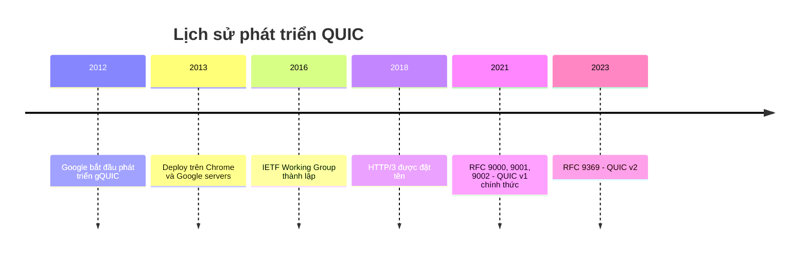
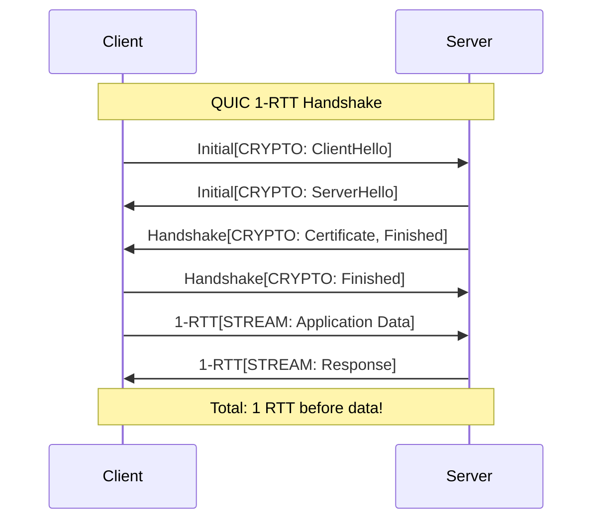
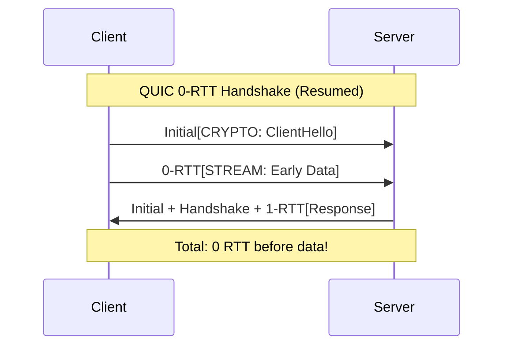
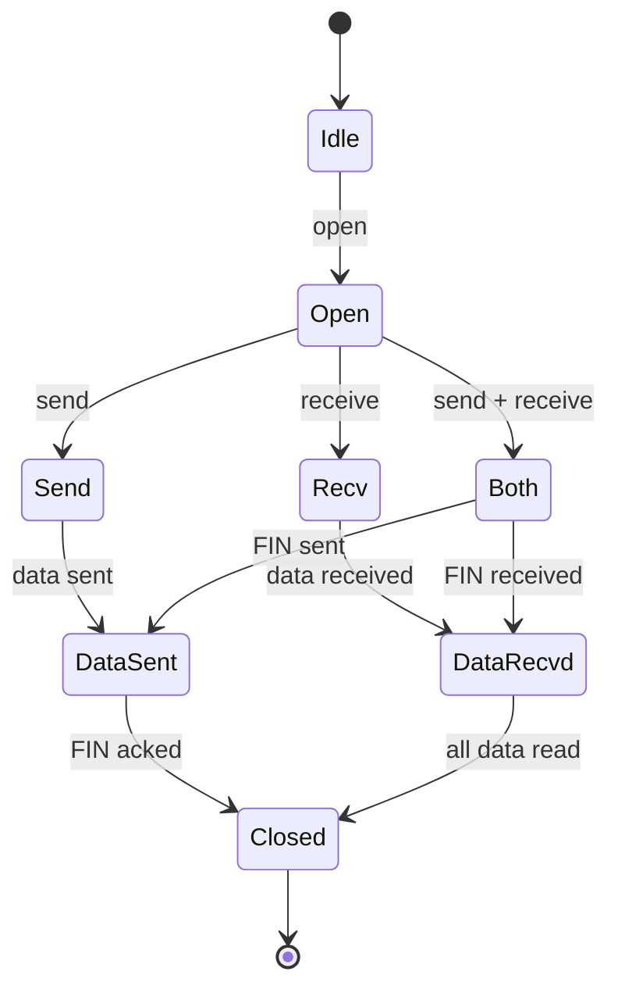
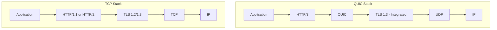
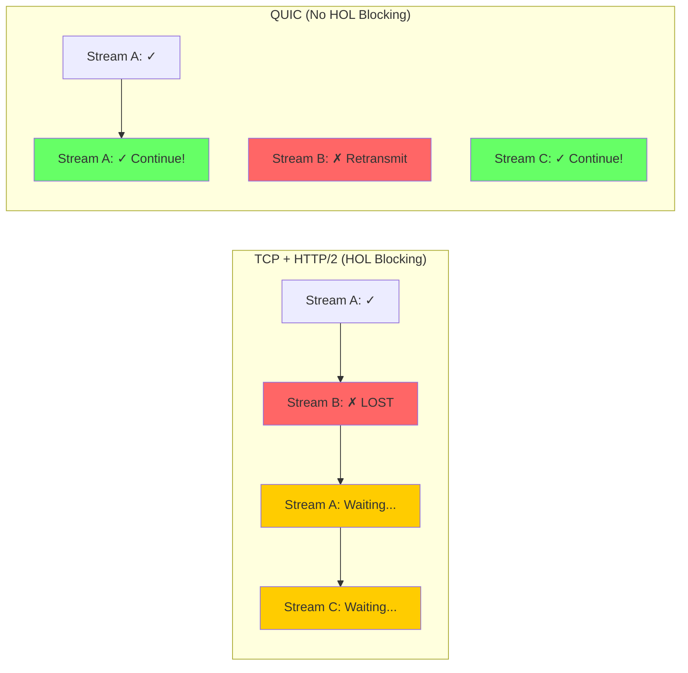
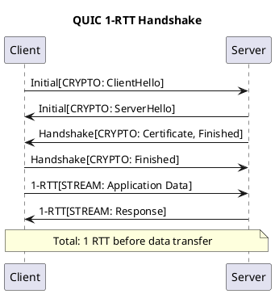
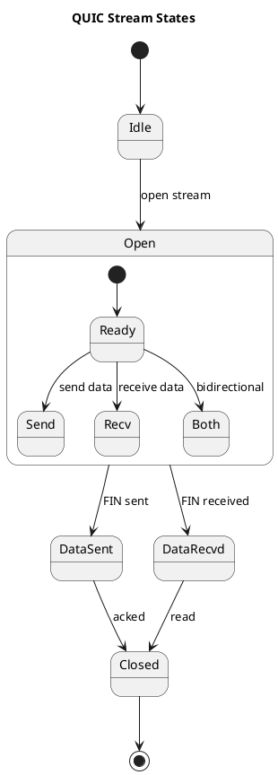

# 📋 CHI TIẾT CÔNG VIỆC NGHIÊN CỨU QUIC

> Tài liệu này mô tả chi tiết từng công việc cần làm, những gì cần tìm hiểu, và cách vẽ biểu đồ bằng code.

---

## 📑 MỤC LỤC

1. [PHẦN A: LÝ THUYẾT VÀ NGHIÊN CỨU](#phần-a-lý-thuyết-và-nghiên-cứu)
2. [PHẦN B: THỰC HÀNH VÀ DEMO](#phần-b-thực-hành-và-demo)
3. [PHẦN C: PHÂN TÍCH VÀ BÁO CÁO](#phần-c-phân-tích-và-báo-cáo)
4. [HƯỚNG DẪN VẼ BIỂU ĐỒ BẰNG CODE](#hướng-dẫn-vẽ-biểu-đồ-bằng-code)

---

# PHẦN A: LÝ THUYẾT VÀ NGHIÊN CỨU

## A1. Tổng quan về QUIC

### 🎯 Mục tiêu
Hiểu **tại sao QUIC ra đời**, **QUIC là gì**, và **ai đang sử dụng QUIC**.

### 📝 Công việc chi tiết

#### Thành viên 1 (TV1)

| Công việc | Cần làm gì | Cần tìm hiểu gì | Output |
|-----------|------------|-----------------|--------|
| **A1.1: Lịch sử phát triển QUIC** | Viết tài liệu về lịch sử QUIC từ 2012-2023 | - 2012: Google bắt đầu gQUIC<br>- 2013: Deploy trên Chrome/Google servers<br>- 2016: IETF Working Group<br>- 2018: HTTP/3 được đặt tên<br>- 2021: RFC 9000, 9001, 9002 (QUIC v1)<br>- 2023: RFC 9369 (QUIC v2) | Timeline document 1-2 trang |
| **A1.2: Động lực phát triển** | Phân tích các vấn đề của TCP | - Handshake latency: TCP 3-way + TLS = nhiều RTT<br>- Head-of-Line (HOL) blocking<br>- Không có Connection Migration<br>- Ossification: TCP trong kernel<br>- Middlebox interference | Analysis document 2-3 trang |
| **A1.3: QUIC adoption statistics** | Thu thập số liệu sử dụng QUIC | - Google: >7% global Internet traffic<br>- Cloudflare: Hỗ trợ tất cả websites<br>- Meta: Mobile apps<br>- Nguồn: W3Techs, HTTP Archive | Statistics summary |
| **A1.4: Vẽ Timeline Diagram** | Vẽ timeline phát triển QUIC | - Sử dụng draw.io hoặc Mermaid<br>- Mốc từ 2012 → 2023<br>- Có logo Google, IETF nếu được | **Timeline PNG/SVG** |

#### Thành viên 2 (TV2)

| Công việc | Cần làm gì | Cần tìm hiểu gì | Output |
|-----------|------------|-----------------|--------|
| **A1.5: Các RFC liên quan** | Đọc và tóm tắt các RFC | - RFC 9000: Core protocol<br>- RFC 9001: TLS Security<br>- RFC 9002: Loss Detection<br>- RFC 9114: HTTP/3<br>- RFC 9369: QUIC v2 | RFC summary table |
| **A1.6: QUIC implementations** | So sánh các implementation | - **quiche** (Cloudflare, Rust) - Dùng cho demo<br>- **ngtcp2** (C) - Dùng trong curl<br>- **quinn** (Rust) - Async<br>- **quic-go** (Go) - Caddy<br>- **msquic** (Microsoft, C) | Comparison table |
| **A1.7: Browser support** | Kiểm tra QUIC support | - Chrome: Enabled từ version?<br>- Firefox: Enabled từ version?<br>- Edge, Safari support<br>- `chrome://flags/#enable-quic` | Support matrix + Screenshots |
| **A1.8: Vẽ Adoption Chart** | Vẽ biểu đồ adoption | - Pie chart: % traffic QUIC vs HTTP/2 vs HTTP/1.1<br>- Bar chart: Adoption % theo company | **Adoption PNG** |

---

## A2. Kiến trúc QUIC Protocol

### 🎯 Mục tiêu
Hiểu **cấu trúc** của QUIC protocol, **Connection** và **Stream** concepts.

### 📝 Công việc chi tiết (TV1)

| Công việc | Cần làm gì | Cần tìm hiểu gì | Output |
|-----------|------------|-----------------|--------|
| **A2.1: Protocol Stack** | Vẽ sơ đồ các tầng QUIC | Application → HTTP/3 → QUIC → TLS 1.3 → UDP → IP | Sơ đồ kiến trúc |
| **A2.2: So sánh với TCP/IP** | Vẽ 2 stack cạnh nhau | - QUIC Stack: HTTP/3 > QUIC > UDP > IP<br>- TCP Stack: HTTP/1.1 > TLS > TCP > IP | Comparison diagram |
| **A2.3: Connection concept** | Giải thích Connection ID | - CID là identifier, không dùng 4-tuple<br>- Cho phép Connection Migration<br>- Client và Server có CID riêng<br>- Connection States: Handshaking, Connected, Draining, Closed | Technical document |
| **A2.4: Stream concept** | Giải thích Stream | - Stream là lightweight channel<br>- Nhiều streams trong 1 connection<br>- Streams độc lập (không HOL blocking)<br>- Stream ID encoding:<br>  Bit 0: Client(0)/Server(1)<br>  Bit 1: Bidi(0)/Unidi(1) | Technical document |
| **A2.5: Đọc RFC 9000** | Đọc Sections 1-5 | Overview, Versions, Streams, Flow Control, Connections | Ghi chú tóm tắt |
| **A2.6: Vẽ Stack Diagram** | Vẽ so sánh QUIC vs TCP | - 2 columns: QUIC Stack và TCP Stack<br>- Dùng màu khác nhau<br>- Có arrows chỉ data flow | **Stack PNG/SVG** |

---

## A3. Packet và Frame Structure

### 🎯 Mục tiêu
Hiểu **cấu trúc chi tiết** của QUIC packets và frames ở mức byte-level.

### 📝 Công việc chi tiết (TV2)

| Công việc | Cần làm gì | Cần tìm hiểu gì | Output |
|-----------|------------|-----------------|--------|
| **A3.1: Long Header Packets** | Document 4 loại | 1. **Initial**: ClientHello, Initial keys<br>2. **0-RTT**: Early data, PSK<br>3. **Handshake**: TLS messages<br>4. **Retry**: Address validation | Diagrams + Table |
| **A3.2: Short Header Packets** | Document 1-RTT packets | - Dùng sau handshake<br>- Header nhỏ gọn<br>- Chỉ có Destination CID | Diagrams |
| **A3.3: Packet Number Spaces** | Giải thích 3 spaces | 1. Initial<br>2. Handshake<br>3. Application Data<br>- Mỗi space có ACK riêng | Document |
| **A3.4: Frame Types** | Tạo bảng tất cả Frame Types | PADDING(0x00), PING(0x01), ACK(0x02-03), RESET_STREAM(0x04), CRYPTO(0x06), STREAM(0x08-0f), MAX_DATA(0x10)... | Complete table |
| **A3.5-A3.8: Chi tiết Frames** | Document STREAM, ACK, CRYPTO, Flow Control frames | - STREAM: FIN, LEN, OFF flags, Stream ID, Offset, Data<br>- ACK: ACK ranges, ECN counts<br>- CRYPTO: TLS handshake data | Technical documents |
| **A3.9: Đọc RFC 9000** | Sections 12-19 | Packet/Frame formats | Ghi chú |
| **A3.10: Vẽ Diagrams** | Vẽ cấu trúc Packet/Frame | Long Header, Short Header, STREAM Frame, ACK Frame | **Packet/Frame PNGs** |

---

## A4. Connection Establishment (0-RTT/1-RTT)

### 🎯 Mục tiêu
Hiểu **handshake process** - **điểm mạnh nổi bật nhất** của QUIC. Đặc biệt 0-RTT handshake.

### 📝 Công việc chi tiết (TV1)

| Công việc | Cần làm gì | Cần tìm hiểu gì | Output |
|-----------|------------|-----------------|--------|
| **A4.1-A4.2: 1-RTT Handshake** | Vẽ sequence diagram | - Client gửi Initial[CRYPTO: ClientHello]<br>- Server reply Initial, Handshake, 1-RTT<br>- Client gửi Handshake, 1-RTT[DATA]<br>- **1 RTT = Data có thể gửi ngay!** | Detailed sequence |
| **A4.3: 0-RTT Early Data** | Vẽ 0-RTT sequence | - Client gửi Initial + 0-RTT[DATA] cùng lúc!<br>- Yêu cầu: đã connect trước đó<br>- Server gửi NEW_TOKEN/session ticket<br>- **0 RTT = Data gửi ngay lập tức!** | Sequence diagram |
| **A4.4: TLS 1.3 Integration** | Giải thích cách tích hợp | - Không dùng TLS record layer<br>- TLS messages trong CRYPTO frames<br>- Header protection<br>- Packet protection với AEAD | Technical document |
| **A4.5: Encryption Levels** | Document 4 levels | 1. Initial: Derived từ Destination CID<br>2. 0-RTT: TLS early_traffic_secret<br>3. Handshake: TLS handshake_secret<br>4. 1-RTT: TLS traffic_secret | Document + Diagram |
| **A4.6: Key Derivation** | Document HKDF process | HKDF, traffic secrets | Crypto document |
| **A4.7: Address Validation** | Document Token, Retry | Token mechanism, Retry packets | Security document |
| **A4.9: 0-RTT Security** | Phân tích replay attack | - Attacker có thể replay 0-RTT packets<br>- Mitigation: idempotent requests, time window<br>- 1-2 trang phân tích | Security analysis |
| **A4.11: Vẽ Timing Diagram** | So sánh TCP+TLS vs QUIC | TCP+TLS 1.3: 2 RTT<br>QUIC 1-RTT: 1 RTT<br>QUIC 0-RTT: ~0 RTT | **Timing PNG** |
| **A4.12: Vẽ Sequence Diagrams** | Handshake flows chi tiết | 1-RTT và 0-RTT flows | **Sequence PNGs** |

---

## A5. Stream Multiplexing

### 🎯 Mục tiêu
Hiểu **Stream Multiplexing** và **HOL Blocking Problem** - **điểm mạnh thứ 2** của QUIC.

### 📝 Công việc chi tiết (TV2)

| Công việc | Cần làm gì | Cần tìm hiểu gì | Output |
|-----------|------------|-----------------|--------|
| **A5.1: Stream Types** | Document 4 loại | - 0x0: Client-initiated Bidirectional<br>- 0x1: Server-initiated Bidirectional<br>- 0x2: Client-initiated Unidirectional<br>- 0x3: Server-initiated Unidirectional | Document |
| **A5.2: Stream ID Encoding** | Giải thích numbering | Stream IDs: 0,4,8,12... (client-bidi), 1,5,9... (server-bidi), 2,6,10... (client-unidi), 3,7,11... (server-unidi) | Technical document |
| **A5.3: Stream States** | Vẽ state diagram | Idle → Open → (Send/Both/Receive) → Data Sent/Received → Closed | State diagram |
| **A5.5: HOL Blocking Problem** | Giải thích TCP HOL | **TCP**: Tất cả streams BLOCKED khi 1 packet mất!<br>- HTTP/2 multiplexing ở app layer nhưng TCP vẫn ordered<br>- 1 packet loss = tất cả chờ | Explanation + Diagram |
| **A5.6: QUIC giải quyết HOL** | Giải thích QUIC solution | **QUIC**: Chỉ affected stream bị blocked!<br>- Streams độc lập<br>- Packet loss stream A không ảnh hưởng stream B, C | Explanation + Diagram |
| **A5.9: Vẽ HOL Diagram** | So sánh trực quan | TCP + HTTP/2: Tất cả blocked<br>QUIC: Chỉ 1 stream blocked | **HOL comparison PNG** |
| **A5.10: Vẽ State Diagram** | Stream state machine | Vẽ đầy đủ state transitions | **State machine PNG** |

---

## A6. Connection Migration

### 🎯 Mục tiêu
Hiểu **Connection Migration** - **đặc điểm độc đáo** mà TCP không có.

### 📝 Công việc chi tiết (TV1)

| Công việc | Cần làm gì | Cần tìm hiểu gì | Output |
|-----------|------------|-----------------|--------|
| **A6.1: Connection ID** | Giải thích CID | - CID là opaque byte string (max 20 bytes)<br>- Client và Server có CID riêng<br>- Nhiều CIDs active cùng lúc<br>- **Không dùng 4-tuple như TCP!** | Document |
| **A6.2: CID Rotation** | Document frames | NEW_CONNECTION_ID, RETIRE_CONNECTION_ID frames | Technical document |
| **A6.3: Path Validation** | Vẽ sequence | Client packet từ new IP → Server PATH_CHALLENGE → Client PATH_RESPONSE → Validated | Sequence diagram |
| **A6.4: NAT Rebinding** | Document handling | NAT timeout, port change handling | Document |
| **A6.5: Active Migration** | Client-initiated | Client chủ động đổi network | Document |
| **A6.6: Passive Migration** | Server detects | Server nhận packet từ new address | Document |
| **A6.7: Migration Security** | Off-path attack prevention | Path validation prevents redirect attacks | Security analysis |
| **A6.9: Vẽ Migration Sequence** | Migration process | Complete sequence với timestamps | **Migration PNG** |

---

## A7. Flow Control

### 📝 Công việc chi tiết (TV2)

| Công việc | Cần làm gì | Cần tìm hiểu gì | Output |
|-----------|------------|-----------------|--------|
| **A7.1: Connection-level** | Document MAX_DATA | Credit-based, connection limit | Document |
| **A7.2: Stream-level** | Document MAX_STREAM_DATA | Per-stream limit | Document |
| **A7.3: Credit-based System** | Giải thích mechanism | How flow control credits work | Explanation |
| **A7.4: BLOCKED frames** | Document blocked signals | DATA_BLOCKED, STREAM_DATA_BLOCKED | Document |
| **A7.8: Vẽ Flow Control Diagram** | Credit-based mechanism | Visual diagram showing credits | **Flow control PNG** |

---

## A8. Loss Detection & Congestion Control

### 📝 Công việc chi tiết (TV1)

| Công việc | Cần làm gì | Cần tìm hiểu gì | Output |
|-----------|------------|-----------------|--------|
| **A8.1: ACK Mechanism** | Document ACK frame | ACK ranges, selective ACK | Technical document |
| **A8.2: Packet Number** | Document numbering | Strictly increasing, never reused | Document |
| **A8.3: Loss Detection** | Document algorithms | Time-based, packet-based detection | Algorithm document |
| **A8.4: RTT Estimation** | Document calculation | min_rtt, smoothed_rtt, rttvar | Technical document |
| **A8.5: PTO** | Probe Timeout | Replacing traditional RTO | Document |
| **A8.6: Congestion Control** | Document algorithms | CUBIC, NewReno default | Algorithm overview |
| **A8.10: Vẽ cwnd Graph** | Congestion window | CUBIC vs NewReno over time | **cwnd line chart** |
| **A8.11: Vẽ RTT Diagram** | RTT calculation | Visual diagram | **RTT PNG** |

---

## A9. Security (TLS 1.3 Integration)

### 📝 Công việc chi tiết (TV2)

| Công việc | Cần làm gì | Cần tìm hiểu gì | Output |
|-----------|------------|-----------------|--------|
| **A9.1: TLS 1.3 trong QUIC** | Không dùng record layer | TLS messages trong CRYPTO frames | Document |
| **A9.3: Header Protection** | Packet number encryption | Header encryption mechanism | Document |
| **A9.4: Payload Encryption** | AEAD | AES-GCM, ChaCha20 | Document |
| **A9.5: Key Update** | Document process | Key rotation mechanism | Technical document |
| **A9.7: Anti-Amplification** | Address validation | Retry mechanism | Security document |

---

## A10. HTTP/3 over QUIC

### 📝 Công việc chi tiết (TV1)

| Công việc | Cần làm gì | Cần tìm hiểu gì | Output |
|-----------|------------|-----------------|--------|
| **A10.1: HTTP/3 Overview** | HTTP semantics over QUIC | Request/Response model | Document |
| **A10.2: Stream Mapping** | Request/Response streams | How HTTP/3 uses QUIC streams | Diagram |
| **A10.3: QPACK** | Header compression | QPACK vs HPACK (HTTP/2) | Technical document |
| **A10.5: HTTP/2 vs HTTP/3** | Comparison | Performance, features differences | Comparison table |

---

## A11. So sánh QUIC vs TCP+TLS

### 📝 Công việc chi tiết (Cả 2)

| Công việc | Cần làm gì | Người | Output |
|-----------|------------|-------|--------|
| **A11.1: Handshake latency** | Compare RTT | TV1 | Comparison table |
| **A11.2: HOL blocking** | Compare behavior | TV2 | Diagram + Explanation |
| **A11.3: Migration capability** | Feature comparison | TV1 | Feature table |
| **A11.4: Security comparison** | Compare security | TV2 | Security analysis |
| **A11.7: Bảng so sánh tổng hợp** | Complete comparison | Cả 2 | Final table |
| **A11.9: Vẽ Bar Chart** | Latency, throughput | TV1 | **Bar chart PNG** |
| **A11.10: Vẽ Radar Chart** | Feature comparison | TV2 | **Radar chart PNG** |

---

# PHẦN B: THỰC HÀNH VÀ DEMO

## B1. Setup Topology

### Mục tiêu: Setup 2 Ubuntu PCs + Oracle Cloud VM

### TV1 (Server):
- Install Ubuntu 22.04
- Install dependencies: build-essential, cmake, openssl
- Install Rust, Clone và build quiche
- Generate certificates
- Create test files
- Configure firewall

### TV2 (Client):
- Install Ubuntu 22.04
- Install dependencies
- Install Rust, Clone và build quiche
- Install Wireshark, tc (iproute2)
- Configure network

### Cả 2 (Cloud):
- Tạo Oracle Cloud account (Free Tier)
- Tạo VM.Standard.E2.1.Micro
- Configure Security List (UDP 4433)
- SSH và setup quiche

---

## B2. Demo 1: Handshake Comparison

### 🎯 Mục tiêu: Chứng minh QUIC handshake nhanh hơn TCP+TLS

### Kịch bản:
1. **Local (LAN ~1ms RTT)**: So sánh thấy ít khác biệt
2. **Cloud (~50-100ms RTT)**: Thấy rõ lợi ích 0-RTT!

### Commands:
```bash
# QUIC 1-RTT
time ./quiche-client --no-verify https://SERVER_IP:4433/index.html

# QUIC 0-RTT (lần 2)
time ./quiche-client --no-verify https://SERVER_IP:4433/index.html
```

### Output: **Bar chart so sánh timing**

---

## B3. Demo 2: Stream Multiplexing

### 🎯 Mục tiêu: Chứng minh QUIC không bị HOL blocking

### Kịch bản:
```bash
# Simulate 5% packet loss
sudo tc qdisc add dev eth0 root netem loss 5% delay 20ms

# Download 5 files concurrently
for i in {1..5}; do
  ./quiche-client --no-verify https://SERVER_IP:4433/file$i.bin &
done
wait
```

### Output: **Stream interleaving diagram**, **Completion time chart**

---

## B4. Demo 3: Connection Migration

### 🎯 Mục tiêu: Chứng minh connection duy trì khi đổi network

### Yêu cầu: PC2 có cả WiFi và Ethernet

### Kịch bản:
```bash
# Start download qua Ethernet
./quiche-client --no-verify https://SERVER_IP:4433/large.bin &

# Trong khi download - switch to WiFi
sudo ip link set eth0 down

# Download vẫn tiếp tục!
```

### Output: **Migration timeline diagram**, PATH frames captures

---

## B5. Demo 4: Packet Loss Recovery

### 🎯 Mục tiêu: Chứng minh QUIC recovery tốt hơn TCP

### Kịch bản:
```bash
# Test với các mức loss
for LOSS in 0 1 5 10; do
  sudo tc qdisc add dev eth0 root netem loss $LOSS%
  time ./quiche-client --no-verify https://SERVER_IP:4433/medium.bin
  sudo tc qdisc del dev eth0 root
done
```

### Output: **Line chart: Packet loss % vs Download time**

---

## B6. Demo 5: Multi-client Stress Test

### 🎯 Mục tiêu: Chứng minh Server handle nhiều clients

### Kịch bản:
```bash
# Run 10 concurrent connections
for i in {1..10}; do
  ./quiche-client --no-verify https://SERVER_IP:4433/small.bin &
done
wait
```

### Output: **Scalability chart: Clients vs Throughput**

---

## B7. Wireshark Analysis

### Công việc (TV2):
- Capture QUIC handshake
- Analyze Initial, Handshake, 1-RTT packets
- Analyze STREAM, ACK, PATH frames
- Create analysis document với screenshots

---

# PHẦN C: PHÂN TÍCH VÀ BÁO CÁO

## C1. Performance Analysis (TV1)
- Tổng hợp metrics từ Demo 1-5
- Handshake latency analysis
- Throughput analysis
- Migration performance
- **Comprehensive performance charts**
- **Performance dashboard**

## C2. Case Studies (TV2)
- Google QUIC: YouTube, Search
- Cloudflare QUIC: Edge network
- Meta QUIC: Facebook, Instagram
- **Adoption statistics charts**

## C3. QUIC v2 và Future (TV1)
- QUIC v2 (RFC 9369)
- Multipath QUIC
- WebTransport, DNS over QUIC

## C4. Viết Báo cáo (TV1)
- 40-50 trang
- 7 chương

## C5. Làm Slides (TV2)
- 45 slides
- Embedded video

## C6. Quay Video Demo (Cả 2)
- 5 demo clips
- Final video 10-15 phút

---

# HƯỚNG DẪN VẼ BIỂU ĐỒ BẰNG CODE

## 1. Vẽ bằng Mermaid (Markdown)

Mermaid có thể nhúng trực tiếp trong Markdown, GitHub hỗ trợ render.

### Timeline Diagram (A1.4)


### Sequence Diagram - Handshake (A4.12)


### Sequence Diagram - 0-RTT (A4.12)


### State Diagram - Stream States (A5.10)


### Flowchart - Protocol Stack (A2.6)


### Comparison Diagram - HOL Blocking (A5.9)


---

## 2. Vẽ bằng Python (Matplotlib)

### Bar Chart - Handshake Timing (A11.9)
```python
import matplotlib.pyplot as plt
import numpy as np

# Data
protocols = ['TCP + TLS 1.2', 'TCP + TLS 1.3', 'QUIC 1-RTT', 'QUIC 0-RTT']
new_connection = [3, 2, 1, 0]  # RTT
resumed_connection = [2, 1, 1, 0]  # RTT

x = np.arange(len(protocols))
width = 0.35

fig, ax = plt.subplots(figsize=(10, 6))
bars1 = ax.bar(x - width/2, new_connection, width, label='New Connection', color='#3498db')
bars2 = ax.bar(x + width/2, resumed_connection, width, label='Resumed Connection', color='#2ecc71')

ax.set_ylabel('RTT (Round Trip Time)')
ax.set_title('Handshake Latency Comparison')
ax.set_xticks(x)
ax.set_xticklabels(protocols)
ax.legend()
ax.set_ylim(0, 4)

# Add value labels
for bar in bars1 + bars2:
    height = bar.get_height()
    ax.annotate(f'{height}',
                xy=(bar.get_x() + bar.get_width()/2, height),
                ha='center', va='bottom')

plt.tight_layout()
plt.savefig('handshake_comparison.png', dpi=300)
plt.show()
```

### Line Chart - Packet Loss Impact (B5.7)
```python
import matplotlib.pyplot as plt

# Data
packet_loss = [0, 1, 5, 10, 15, 20]
quic_time = [1.0, 1.1, 1.4, 2.0, 3.0, 4.5]  # seconds
tcp_time = [1.0, 1.3, 2.0, 3.5, 6.0, 10.0]  # seconds

plt.figure(figsize=(10, 6))
plt.plot(packet_loss, quic_time, 'o-', label='QUIC', color='#3498db', linewidth=2, markersize=8)
plt.plot(packet_loss, tcp_time, 's-', label='TCP', color='#e74c3c', linewidth=2, markersize=8)

plt.xlabel('Packet Loss (%)')
plt.ylabel('Download Time (seconds)')
plt.title('Impact of Packet Loss on Download Time')
plt.legend()
plt.grid(True, alpha=0.3)
plt.xticks(packet_loss)

plt.tight_layout()
plt.savefig('packet_loss_impact.png', dpi=300)
plt.show()
```

### Pie Chart - QUIC Adoption (A1.8)
```python
import matplotlib.pyplot as plt

# Data
labels = ['QUIC (HTTP/3)', 'HTTP/2', 'HTTP/1.1']
sizes = [25, 45, 30]  # Example percentages
colors = ['#3498db', '#2ecc71', '#e74c3c']
explode = (0.05, 0, 0)

fig, ax = plt.subplots(figsize=(8, 8))
ax.pie(sizes, explode=explode, labels=labels, colors=colors, autopct='%1.1f%%',
       shadow=True, startangle=90)
ax.set_title('Internet Traffic by Protocol (2024)')

plt.tight_layout()
plt.savefig('quic_adoption.png', dpi=300)
plt.show()
```

### Radar Chart - Feature Comparison (A11.10)
```python
import matplotlib.pyplot as plt
import numpy as np

# Categories
categories = ['Latency', 'HOL Blocking', 'Migration', 'Security', 'Multiplexing', 'Recovery']
N = len(categories)

# Scores (1-5 scale, 5 is best)
tcp_scores = [2, 2, 1, 3, 3, 3]
quic_scores = [5, 5, 5, 5, 5, 4]

# Compute angle
angles = [n / float(N) * 2 * np.pi for n in range(N)]
angles += angles[:1]

tcp_scores += tcp_scores[:1]
quic_scores += quic_scores[:1]

# Plot
fig, ax = plt.subplots(figsize=(8, 8), subplot_kw=dict(projection='polar'))

ax.plot(angles, tcp_scores, 'o-', linewidth=2, label='TCP + TLS', color='#e74c3c')
ax.fill(angles, tcp_scores, alpha=0.25, color='#e74c3c')

ax.plot(angles, quic_scores, 'o-', linewidth=2, label='QUIC', color='#3498db')
ax.fill(angles, quic_scores, alpha=0.25, color='#3498db')

ax.set_xticks(angles[:-1])
ax.set_xticklabels(categories)
ax.set_ylim(0, 5)
ax.legend(loc='upper right', bbox_to_anchor=(1.3, 1.0))
ax.set_title('Feature Comparison: QUIC vs TCP+TLS')

plt.tight_layout()
plt.savefig('feature_radar.png', dpi=300)
plt.show()
```

### Scalability Chart (B6.6)
```python
import matplotlib.pyplot as plt

# Data
clients = [1, 5, 10, 20, 50, 100]
throughput_mbps = [100, 95, 90, 85, 75, 60]  # Example data

plt.figure(figsize=(10, 6))
plt.plot(clients, throughput_mbps, 'o-', color='#3498db', linewidth=2, markersize=8)

plt.xlabel('Number of Concurrent Clients')
plt.ylabel('Throughput per Client (Mbps)')
plt.title('QUIC Server Scalability')
plt.grid(True, alpha=0.3)
plt.xscale('log')

plt.tight_layout()
plt.savefig('scalability.png', dpi=300)
plt.show()
```

### Congestion Window Graph (A8.10)
```python
import matplotlib.pyplot as plt
import numpy as np

# Simulate time
time = np.linspace(0, 100, 1000)

# Simulate CUBIC cwnd
cubic_cwnd = np.zeros_like(time)
for i, t in enumerate(time):
    if t < 10:
        cubic_cwnd[i] = t * 10  # Slow start
    elif t < 30:
        cubic_cwnd[i] = 100 - (t - 10) * 3  # Loss and recovery
    elif t < 50:
        cubic_cwnd[i] = 40 + (t - 30) ** 1.5  # CUBIC growth
    elif t < 60:
        cubic_cwnd[i] = 100 - (t - 50) * 4  # Another loss
    else:
        cubic_cwnd[i] = 60 + (t - 60) ** 1.5

# Simulate NewReno cwnd
newreno_cwnd = np.zeros_like(time)
for i, t in enumerate(time):
    if t < 10:
        newreno_cwnd[i] = t * 10
    elif t < 30:
        newreno_cwnd[i] = 100 - (t - 10) * 3
    elif t < 50:
        newreno_cwnd[i] = 40 + (t - 30) * 2  # Linear growth
    elif t < 60:
        newreno_cwnd[i] = 80 - (t - 50) * 4
    else:
        newreno_cwnd[i] = 40 + (t - 60) * 1.5

plt.figure(figsize=(12, 6))
plt.plot(time, cubic_cwnd, label='CUBIC', color='#3498db', linewidth=2)
plt.plot(time, newreno_cwnd, label='NewReno', color='#e74c3c', linewidth=2)

plt.xlabel('Time (s)')
plt.ylabel('Congestion Window (packets)')
plt.title('Congestion Window Evolution: CUBIC vs NewReno')
plt.legend()
plt.grid(True, alpha=0.3)

plt.tight_layout()
plt.savefig('cwnd_comparison.png', dpi=300)
plt.show()
```

---

## 3. Vẽ bằng PlantUML

### Sequence Diagram


### State Diagram


---

## 4. Vẽ bằng Draw.io (Diagrams.net)

Draw.io là công cụ trực quan, phù hợp cho:
- Network topology
- Protocol stack diagrams
- Packet/Frame structure
- Complex flowcharts

**Cách sử dụng:**
1. Truy cập https://app.diagrams.net
2. Chọn template phù hợp
3. Drag & drop shapes
4. Export PNG/SVG

**Tips:**
- Sử dụng shapes từ "Network" category
- Dùng colors nhất quán
- Export với DPI cao (300+)

---

## 5. Tổng hợp công cụ theo loại biểu đồ

| Loại biểu đồ | Công cụ khuyến nghị | Lý do |
|--------------|---------------------|-------|
| Timeline | Mermaid, draw.io | Đơn giản, nhúng được Markdown |
| Sequence Diagram | Mermaid, PlantUML | Text-based, dễ version control |
| State Diagram | Mermaid, PlantUML | Text-based, chính xác |
| Bar/Line/Pie Chart | Python Matplotlib | Dữ liệu động, chuyên nghiệp |
| Radar Chart | Python Matplotlib | Nhiều parameters so sánh |
| Protocol Stack | draw.io | Trực quan, flexible |
| Packet Structure | draw.io | Chi tiết byte-level |
| Network Topology | draw.io | Network shapes có sẵn |
| Infographics | Canva | Đẹp, chuyên nghiệp |

---

## 📝 Checklist Biểu đồ

### PHẦN A (Lý thuyết): 14 biểu đồ
- [ ] A1.4: Timeline lịch sử QUIC (TV1)
- [ ] A1.8: Adoption chart (TV2)
- [ ] A2.6: Protocol Stack comparison (TV1)
- [ ] A3.10: Packet/Frame structure (TV2)
- [ ] A4.11: Timing comparison (TV1)
- [ ] A4.12: Handshake sequences (TV1)
- [ ] A5.9: HOL blocking comparison (TV2)
- [ ] A5.10: Stream state machine (TV2)
- [ ] A6.9: Migration sequence (TV1)
- [ ] A7.8: Flow control diagram (TV2)
- [ ] A8.10: Congestion window graph (TV1)
- [ ] A8.11: RTT estimation diagram (TV1)
- [ ] A11.9: Performance bar chart (TV1)
- [ ] A11.10: Feature radar chart (TV2)

### PHẦN B (Demo): 7 biểu đồ
- [ ] B2: Handshake timing bar chart (TV1)
- [ ] B3.7: Stream interleaving timeline (TV2)
- [ ] B3.8: Completion time comparison (TV2)
- [ ] B4.7: Migration timeline (TV1)
- [ ] B5.7: Packet loss line chart (TV2)
- [ ] B5.8: Recovery comparison chart (TV2)
- [ ] B6.6: Scalability chart (TV1)

### PHẦN C (Phân tích): 4 biểu đồ
- [ ] C1.7: Comprehensive performance charts (TV1)
- [ ] C1.8: Performance dashboard (TV1)
- [ ] C2.7: Adoption statistics charts (TV2)
- [ ] C2.8: Case study performance charts (TV2)

**TỔNG CỘNG: 25 biểu đồ**
- TV1: 13 biểu đồ
- TV2: 12 biểu đồ

---

*Tài liệu được tạo để hỗ trợ nghiên cứu đề tài QUIC - NT531.Q21*
