# 🚀 ĐỒ ÁN: NGHIÊN CỨU TOÀN DIỆN GIAO THỨC QUIC (QUIC PROTOCOL)

## Đề tài: Nghiên cứu và Demo các Đặc điểm Nổi bật của Giao thức QUIC

### Môn học: NT531.Q21 - Đánh giá hiệu năng mạng máy tính

---

## 📋 Thông tin nhóm

| STT | Họ và tên | MSSV | Vai trò | Thiết bị |
|-----|-----------|------|---------|----------|
| 1 | Đỗ Hoàng Phúc | [MSSV] | Trưởng nhóm | ☁️ Cloud VM 1 - Server (US East) |
| 2 | Bùi Lê Huy Phước | [MSSV] | Thành viên | ☁️ Cloud VM 2 - Client (AP Singapore) |
| - | Cả 2 | - | Cùng quản lý | SSH từ máy cá nhân vào 2 Cloud VMs |

---

## 📑 MỤC LỤC CÔNG VIỆC

### PHẦN A: LÝ THUYẾT VÀ NGHIÊN CỨU

| Chương | Nội dung | Thành viên | Trang |
|--------|----------|------------|-------|
| **A1** | [Tổng quan về QUIC](#a1-tổng-quan-về-quic) | TV1 + TV2 | [↓](#a1-tổng-quan-về-quic) |
| **A2** | [Kiến trúc QUIC Protocol](#a2-kiến-trúc-quic-protocol) | TV1 | [↓](#a2-kiến-trúc-quic-protocol) |
| **A3** | [Packet và Frame Structure](#a3-packet-và-frame-structure) | TV2 | [↓](#a3-packet-và-frame-structure) |
| **A4** | [Connection Establishment (0-RTT/1-RTT)](#a4-connection-establishment-0-rtt1-rtt) | TV1 | [↓](#a4-connection-establishment-0-rtt1-rtt) |
| **A5** | [Stream Multiplexing](#a5-stream-multiplexing) | TV2 | [↓](#a5-stream-multiplexing) |
| **A6** | [Connection Migration](#a6-connection-migration) | TV1 | [↓](#a6-connection-migration) |
| **A7** | [Flow Control](#a7-flow-control) | TV2 | [↓](#a7-flow-control) |
| **A8** | [Loss Detection & Congestion Control](#a8-loss-detection--congestion-control) | TV1 | [↓](#a8-loss-detection--congestion-control) |
| **A9** | [Security (TLS 1.3 Integration)](#a9-security-tls-13-integration) | TV2 | [↓](#a9-security-tls-13-integration) |
| **A10** | [HTTP/3 over QUIC](#a10-http3-over-quic) | TV1 | [↓](#a10-http3-over-quic) |
| **A11** | [So sánh QUIC vs TCP+TLS](#a11-so-sánh-quic-vs-tcptls) | TV1 + TV2 | [↓](#a11-so-sánh-quic-vs-tcptls) |

### PHẦN B: THỰC HÀNH VÀ DEMO

| Chương | Nội dung | Thành viên | Trang |
|--------|----------|------------|-------|
| **B1** | [Setup Topology](#b1-setup-topology) | TV1 + TV2 | [↓](#b1-setup-topology) |
| **B2** | [Demo 1: Handshake Comparison](#b2-demo-1-handshake-comparison) | TV1 | [↓](#b2-demo-1-handshake-comparison) |
| **B3** | [Demo 2: Stream Multiplexing](#b3-demo-2-stream-multiplexing) | TV2 | [↓](#b3-demo-2-stream-multiplexing) |
| **B4** | [Demo 3: Connection Migration](#b4-demo-3-connection-migration) | TV1 | [↓](#b4-demo-3-connection-migration) |
| **B5** | [Demo 4: Packet Loss Recovery](#b5-demo-4-packet-loss-recovery) | TV2 | [↓](#b5-demo-4-packet-loss-recovery) |
| **B6** | [Demo 5: Multi-client Stress Test](#b6-demo-5-multi-client-stress-test) | TV1 + TV2 | [↓](#b6-demo-5-multi-client-stress-test) |
| **B7** | [Wireshark Analysis](#b7-wireshark-analysis) | TV2 | [↓](#b7-wireshark-analysis) |

### PHẦN C: PHÂN TÍCH VÀ BÁO CÁO

| Chương | Nội dung | Thành viên | Trang |
|--------|----------|------------|-------|
| **C1** | [Performance Analysis](#c1-performance-analysis) | TV1 | [↓](#c1-performance-analysis) |
| **C2** | [Case Studies](#c2-case-studies) | TV2 | [↓](#c2-case-studies) |
| **C3** | [QUIC v2 và Future](#c3-quic-v2-và-future) | TV1 | [↓](#c3-quic-v2-và-future) |
| **C4** | [Viết báo cáo](#c4-viết-báo-cáo) | TV1 + TV2 | [↓](#c4-viết-báo-cáo) |
| **C5** | [Làm slides thuyết trình](#c5-làm-slides-thuyết-trình) | TV1 + TV2 | [↓](#c5-làm-slides-thuyết-trình) |
| **C6** | [Quay video demo](#c6-quay-video-demo) | TV1 + TV2 | [↓](#c6-quay-video-demo) |

---

## 🎯 Mục tiêu đề tài - Điểm 10/10

### Các đặc điểm nổi bật của QUIC cần nghiên cứu:

| # | Đặc điểm | Tại sao quan trọng? | Output |
|---|----------|---------------------|--------|
| 1 | **0-RTT/1-RTT Handshake** | Giảm latency từ 2-3 RTT xuống 0-1 RTT | So sánh với TCP+TLS |
| 2 | **Stream Multiplexing** | Không có Head-of-Line blocking | Demo nhiều streams |
| 3 | **Connection Migration** | Duy trì kết nối khi đổi network | Demo đổi network path trên Cloud |
| 4 | **Built-in Encryption** | TLS 1.3 tích hợp, always encrypted | Phân tích bảo mật |
| 5 | **Flow Control** | Connection + Stream level | Demo flow control |
| 6 | **Loss Detection & Recovery** | ACK ranges, improved recovery | Demo packet loss |
| 7 | **Congestion Control** | CUBIC, BBR support | Phân tích throughput |
| 8 | **HTTP/3** | Application layer trên QUIC | Demo HTTP/3 requests |
| 9 | **QUIC v2** | RFC 9369, improvements | Tài liệu tóm tắt |

---

## 🌐 TOPOLOGY DEMO - 2 CLOUD VMs (Cross-Region End-to-End)

### Sơ đồ Topology

```
┌─────────────────────────────────────────────────────────────────────────────────────────────────────┐
│                                    QUIC DEMO TOPOLOGY                                                │
│          (2 Cloud VMs ở 2 vùng khác nhau — US East ↔ AP Singapore — End-to-End Cloud)               │
├─────────────────────────────────────────────────────────────────────────────────────────────────────┤
│                                                                                                      │
│   ☁️ ORACLE CLOUD VM 1 — REGION: US EAST (Ashburn)       ☁️ ORACLE CLOUD VM 2 — REGION: AP (Singapore)│
│   ┌──────────────────────────────────────┐               ┌──────────────────────────────────────┐    │
│   │     QUIC SERVER                      │               │     QUIC CLIENT + ANALYSIS           │    │
│   │     (quiche-server)                  │               │     (quiche-client)                  │    │
│   │     Public IP: <SERVER_IP>           │               │     Public IP: <CLIENT_IP>           │    │
│   │     Port: 4433/UDP                   │◄─── INTERNET ─┤     Wireshark / tshark               │    │
│   │     OS: Ubuntu 22.04 LTS             │  RTT ~200-300ms│     tcpdump, tc (traffic control)    │    │
│   │     VM.Standard.E2.1.Micro (Free)    │               │     OS: Ubuntu 22.04 LTS             │    │
│   │     1 OCPU, 1GB RAM                  │               │     VM.Standard.E2.1.Micro (Free)    │    │
│   │     nginx (TCP+TLS baseline)         │               │     1 OCPU, 1GB RAM                  │    │
│   │     tcpdump, test files              │               │     curl (TCP+TLS baseline)          │    │
│   └──────────────────────────────────────┘               └──────────────────────────────────────┘    │
│              ▲                                                         ▲                              │
│              │ SSH                                                     │ SSH                          │
│              │                                                         │                              │
│   ┌──────────┴────────────────────┐                       ┌───────────┴───────────────────┐          │
│   │  💻 Laptop TV1 (Việt Nam)     │                       │  💻 Laptop TV2 (Việt Nam)     │          │
│   │  (Đỗ Hoàng Phúc)             │                       │  (Bùi Lê Huy Phước)          │          │
│   │  SSH → Cloud VM 1 (Server)    │                       │  SSH → Cloud VM 2 (Client)    │          │
│   └───────────────────────────────┘                       └───────────────────────────────┘          │
│                                                                                                      │
│   ┌──────────────────────────────────────────────────────────────────────────────────────────────┐   │
│   │                                    DEMO SCENARIOS                                             │   │
│   │                                                                                               │   │
│   │   🔹 CLOUD END-TO-END (High latency US↔Asia, thấy rõ lợi ích QUIC):                         │   │
│   │      ├── VM1 (Server US) ↔ VM2 (Client Asia): 0-RTT vs 1-RTT handshake                      │   │
│   │      ├── VM1 ↔ VM2: Stream multiplexing, HOL blocking comparison                             │   │
│   │      ├── VM1 ↔ VM2: Packet loss simulation với tc netem                                      │   │
│   │      ├── VM1 ↔ VM2: Connection migration (đổi network interface trên VM2)                    │   │
│   │      └── VM1 ↔ VM2: Multi-client stress test                                                 │   │
│   │                                                                                               │   │
│   │   🔹 WIRESHARK ANALYSIS (trên VM2):                                                          │   │
│   │      ├── Capture QUIC handshake packets                                                       │   │
│   │      ├── Analyze STREAM, ACK, PATH frames                                                     │   │
│   │      └── So sánh QUIC vs TCP+TLS packets                                                      │   │
│   │                                                                                               │   │
│   │   💡 Lợi thế End-to-End Cloud:                                                                │   │
│   │      ├── RTT thực tế ~200-300ms (US ↔ Asia) — thấy rõ lợi ích 0-RTT                          │   │
│   │      ├── Không phụ thuộc mạng LAN local — ổn định, reproducible                               │   │
│   │      └── Dễ demo từ bất kỳ đâu — chỉ cần SSH                                                 │   │
│   └──────────────────────────────────────────────────────────────────────────────────────────────┘   │
│                                                                                                      │
└─────────────────────────────────────────────────────────────────────────────────────────────────────┘
```

### Chi tiết các thành phần

#### ☁️ Cloud VM 1 — Server (TV1: Đỗ Hoàng Phúc quản lý)

| Thành phần | Chi tiết |
|------------|----------|
| **Provider** | Oracle Cloud Infrastructure — **Always Free Tier** |
| **Instance** | VM.Standard.E2.1.Micro (1 OCPU, 1GB RAM) |
| **Region** | **US East (Ashburn)** — xa Việt Nam, RTT cao (~200-300ms tới Asia) |
| **OS** | Ubuntu 22.04 LTS |
| **Network** | Public IP (<SERVER_IP>), Security List allow UDP 4433, TCP 443 |
| **Software** | quiche (server+client), nginx (TCP+TLS baseline), tcpdump |
| **Vai trò** | QUIC Server + TCP+TLS baseline server |
| **Người phụ trách** | **Thành viên 1 (TV1)** — SSH từ laptop cá nhân |

#### ☁️ Cloud VM 2 — Client + Analysis (TV2: Bùi Lê Huy Phước quản lý)

| Thành phần | Chi tiết |
|------------|----------|
| **Provider** | Oracle Cloud Infrastructure — **Always Free Tier** |
| **Instance** | VM.Standard.E2.1.Micro (1 OCPU, 1GB RAM) |
| **Region** | **AP Southeast (Singapore)** hoặc **AP Northeast (Tokyo)** — gần Việt Nam hơn so với US East, tạo khoảng cách cross-continent |
| **OS** | Ubuntu 22.04 LTS |
| **Network** | Public IP (<CLIENT_IP>), Security List allow UDP outbound |
| **Software** | quiche-client, tshark, tcpdump, tc (iproute2), curl |
| **Vai trò** | QUIC Client + Packet analysis + TCP comparison |
| **Người phụ trách** | **Thành viên 2 (TV2)** — SSH từ laptop cá nhân |

### Network Architecture: Cloud End-to-End

```
☁️ Cloud VM 1 (US East - Ashburn)          ☁️ Cloud VM 2 (AP - Singapore)
   QUIC Server: 0.0.0.0:4433/UDP              QUIC Client
   nginx: 0.0.0.0:443/TCP                     tshark, tcpdump, tc
   Public IP: <SERVER_IP>                      Public IP: <CLIENT_IP>
          │                                            │
          └────────── INTERNET (RTT ~200-300ms) ───────┘
                    (Cross-continent: US ↔ Asia)

💻 Laptop TV1 (Việt Nam) ── SSH ──→ Cloud VM 1 (Server)
💻 Laptop TV2 (Việt Nam) ── SSH ──→ Cloud VM 2 (Client)
```

> 💡 **Tại sao chọn 2 region xa nhau?**
> - RTT ~200-300ms giữa US và Asia → thấy rõ lợi ích 0-RTT (tiết kiệm 200-600ms)
> - Mô phỏng thực tế: user ở châu Á truy cập server ở Mỹ (rất phổ biến)
> - QUIC được thiết kế để giải quyết vấn đề high-latency networks → demo đúng use case
> - Không phụ thuộc mạng LAN local → kết quả ổn định, reproducible

---

# PHẦN A: LÝ THUYẾT VÀ NGHIÊN CỨU

---

## A1. Tổng quan về QUIC

### 🎯 Mục tiêu phần này:
> Hiểu **tại sao QUIC ra đời**, **QUIC là gì**, và **ai đang sử dụng QUIC**. Đây là nền tảng để hiểu các phần tiếp theo.

### Công việc của Thành viên 1:

| STT | Công việc | Chi tiết | Output |
|-----|-----------|----------|--------|
| A1.1 | Lịch sử phát triển QUIC | gQUIC (2012) → IETF QUIC (2016-2021) → RFC 9000 | Timeline document |
| A1.2 | Động lực phát triển | Tại sao cần QUIC? Vấn đề của TCP? | Analysis document |
| A1.3 | QUIC adoption statistics | Google, Cloudflare, Meta, etc. | Statistics summary |
| A1.4 | 📊 **Vẽ biểu đồ timeline** | Timeline phát triển QUIC từ 2012-2021 | **Timeline diagram** |

<details>
<summary><b>📖 Hướng dẫn chi tiết cho TV1</b></summary>

#### A1.1: Lịch sử phát triển QUIC
**Cần làm gì:**
- Nghiên cứu và viết tài liệu về lịch sử QUIC từ 2012 đến nay
- Các mốc quan trọng cần đề cập:
  - **2012**: Google bắt đầu phát triển gQUIC (Google QUIC)
  - **2013**: gQUIC được deploy trên Chrome và Google servers
  - **2016**: IETF Working Group thành lập, bắt đầu chuẩn hóa
  - **2018**: HTTP/3 được đặt tên (trước đó là HTTP-over-QUIC)
  - **2021**: RFC 9000, 9001, 9002 được publish → QUIC v1 chính thức
  - **2023**: RFC 9369 → QUIC v2

**Tại sao cần làm:**
- Để hiểu quá trình phát triển và motivation của QUIC
- Để biết QUIC đã được sử dụng production từ lâu, không phải công nghệ mới thử nghiệm

**Kết quả mong đợi:**
- Document 1-2 trang với timeline rõ ràng
- Có thể đưa vào báo cáo chương 1

#### A1.2: Động lực phát triển QUIC
**Cần làm gì:**
- Phân tích các vấn đề của TCP khiến Google phải phát triển QUIC:
  1. **Handshake latency**: TCP 3-way handshake + TLS handshake = nhiều RTT
  2. **Head-of-Line (HOL) blocking**: Mất 1 packet → block tất cả data
  3. **Không có Connection Migration**: Đổi IP/port = mất connection
  4. **Ossification**: TCP trong kernel, khó upgrade
  5. **Middlebox interference**: Firewall/NAT can thiệp TCP

**Tại sao cần làm:**
- Để trả lời câu hỏi quan trọng: "Tại sao không cải tiến TCP mà lại tạo protocol mới?"
- Đây là phần quan trọng khi thuyết trình

**Kết quả mong đợi:**
- Document 2-3 trang phân tích chi tiết
- Mỗi vấn đề có ví dụ minh họa

#### A1.3: QUIC Adoption Statistics
**Cần làm gì:**
- Thu thập số liệu về việc sử dụng QUIC:
  - Google: >7% of global Internet traffic
  - Cloudflare: Hỗ trợ QUIC cho tất cả websites
  - Meta (Facebook, Instagram): Dùng QUIC cho mobile apps
  - Akamai: CDN hỗ trợ QUIC
- Nguồn: W3Techs, HTTP Archive, blog posts của các công ty

**Kết quả mong đợi:**
- Bảng thống kê với số liệu cụ thể
- Có nguồn reference cho mỗi số liệu

#### A1.4: Vẽ Timeline Diagram
**Cần làm gì:**
- Sử dụng draw.io hoặc Canva vẽ timeline ngang
- Các mốc từ 2012 → 2023
- Có hình ảnh logo (Google, IETF) nếu được

**Kết quả mong đợi:**
- File PNG/SVG chất lượng cao
- Có thể in ra A4 hoặc đưa vào slides

</details>

### Công việc của Thành viên 2:

| STT | Công việc | Chi tiết | Output |
|-----|-----------|----------|--------|
| A1.5 | Các RFC liên quan | RFC 9000, 9001, 9002, 9114, 9369 | RFC summary |
| A1.6 | QUIC implementations | quiche, ngtcp2, quinn, etc. | Comparison table |
| A1.7 | Browser support | Chrome, Firefox, Edge, Safari | Support matrix |
| A1.8 | 📊 **Vẽ biểu đồ adoption** | Pie/Bar chart: QUIC adoption % theo platform | **Adoption chart** |

<details>
<summary><b>📖 Hướng dẫn chi tiết cho TV2</b></summary>

#### A1.5: Các RFC liên quan
**Cần làm gì:**
- Đọc tổng quan (Introduction, Abstract) của các RFC:
  - **RFC 9000**: QUIC: A UDP-Based Multiplexed and Secure Transport (core protocol)
  - **RFC 9001**: Using TLS to Secure QUIC (security)
  - **RFC 9002**: QUIC Loss Detection and Congestion Control
  - **RFC 9114**: HTTP/3 (HTTP over QUIC)
  - **RFC 9369**: QUIC Version 2 (improvements)

**Tại sao cần làm:**
- RFC là nguồn chính thức và authoritative nhất
- Khi cần tra cứu chi tiết, biết tìm ở RFC nào

**Kết quả mong đợi:**
- Bảng tóm tắt 5 RFC với mô tả ngắn gọn
- Ghi chú số trang quan trọng để dễ tra cứu

#### A1.6: QUIC Implementations
**Cần làm gì:**
- Nghiên cứu các implementation phổ biến:
  - **quiche** (Cloudflare, Rust): Chúng ta sẽ dùng cái này
  - **ngtcp2** (C): Được dùng trong curl
  - **quinn** (Rust): Async QUIC
  - **quic-go** (Go): Được dùng trong Caddy
  - **msquic** (Microsoft, C): Windows native
  - **lsquic** (LiteSpeed, C): Web server

**Kết quả mong đợi:**
- Bảng so sánh: Language, License, Features, Who uses

#### A1.7: Browser Support
**Cần làm gì:**
- Kiểm tra và document QUIC/HTTP/3 support:
  - **Chrome**: Enabled by default từ version nào?
  - **Firefox**: Enabled by default từ version nào?
  - **Edge**: Chromium-based, same as Chrome
  - **Safari**: iOS 15+, macOS Big Sur+
- Cách kiểm tra: `chrome://flags/#enable-quic`

**Kết quả mong đợi:**
- Support matrix với version numbers
- Screenshot của browser settings

#### A1.8: Vẽ Adoption Chart
**Cần làm gì:**
- Dùng Excel/Google Sheets hoặc Canva
- Vẽ Pie chart: % traffic QUIC vs HTTP/2 vs HTTP/1.1
- Hoặc Bar chart: Adoption % theo company

**Kết quả mong đợi:**
- Chart đẹp, có legend rõ ràng
- File PNG chất lượng cao

**Code Jupyter -- QUIC Implementations & Browser Support:**

```python
# === [A1.6-A1.7] QUIC Implementations & Browser Support (Jupyter Notebook) ===
import matplotlib.pyplot as plt
import matplotlib.patches as mpatches
import numpy as np

fig, (ax1, ax2) = plt.subplots(1, 2, figsize=(18, 8))

# === QUIC Implementations Comparison ===
impls = ['quiche\n(Cloudflare)', 'ngtcp2\n(curl)', 'quinn\n(Rust)', 'quic-go\n(Caddy)',
         'msquic\n(Microsoft)', 'lsquic\n(LiteSpeed)']
languages = ['Rust', 'C', 'Rust', 'Go', 'C', 'C']
maturity = [95, 90, 85, 88, 92, 80]
colors_impl = ['#e67e22', '#3498db', '#9b59b6', '#00d2d3', '#00a4ef', '#27ae60']

bars = ax1.barh(impls, maturity, color=colors_impl, edgecolor='white', linewidth=2, height=0.6)
ax1.set_xlabel('Maturity Score (%)', fontsize=12)
ax1.set_title('QUIC Implementations Comparison', fontsize=14, fontweight='bold')
ax1.set_xlim(0, 110)
ax1.grid(axis='x', alpha=0.3)

for bar, val, lang in zip(bars, maturity, languages):
    ax1.text(val + 1, bar.get_y() + bar.get_height()/2, f'{val}% ({lang})',
             va='center', fontsize=10, fontweight='bold')

# === Browser HTTP/3 Support Timeline ===
browsers = ['Chrome', 'Firefox', 'Edge', 'Safari', 'Opera']
support_year = [2020, 2021, 2020, 2021, 2020]
versions = ['v87+', 'v88+', 'v87+', 'v15+', 'v73+']
colors_br = ['#4285F4', '#FF7139', '#0078D7', '#007AFF', '#FF1B2D']

y_pos = np.arange(len(browsers))
bars2 = ax2.barh(y_pos, [2024 - y for y in support_year], left=support_year,
                  color=colors_br, edgecolor='white', linewidth=2, height=0.5)
ax2.set_yticks(y_pos)
ax2.set_yticklabels(browsers, fontsize=11)
ax2.set_xlabel('Year', fontsize=12)
ax2.set_title('Browser HTTP/3 (QUIC) Support', fontsize=14, fontweight='bold')
ax2.set_xlim(2019, 2025)
ax2.grid(axis='x', alpha=0.3)

for i, (bar, ver) in enumerate(zip(bars2, versions)):
    ax2.text(2024.1, i, ver, va='center', fontsize=10, fontweight='bold', color=colors_br[i])

plt.tight_layout()
plt.savefig('a1_implementations_browsers.png', dpi=300, bbox_inches='tight', facecolor='white')
plt.show()
```

</details>

### 📋 Deliverables A1:
- [ ] Timeline lịch sử QUIC (TV1)
- [ ] Analysis tại sao cần QUIC (TV1)
- [ ] RFC summary table (TV2)
- [ ] Implementation comparison (TV2)
- [ ] 📊 **Timeline diagram (TV1)**
- [ ] 📊 **Adoption pie/bar chart (TV2)**

### 📊 Code Jupyter — Biểu đồ minh họa A1

#### 🔹 A1.4: Timeline lịch sử phát triển QUIC

```python
# === [A1.4] QUIC Protocol History Timeline (Jupyter Notebook) ===
import matplotlib.pyplot as plt
import matplotlib.patches as mpatches
import numpy as np

fig, ax = plt.subplots(figsize=(16, 7))

# QUIC development milestones
events = [
    (2012, "Google starts\ndeveloping gQUIC", "#e74c3c"),
    (2013, "Deployed on Chrome\n& Google servers", "#e67e22"),
    (2016, "IETF Working Group\nformed for standardization", "#f1c40f"),
    (2018, "HTTP/3 officially\nnamed", "#2ecc71"),
    (2021, "RFC 9000, 9001, 9002\nQUIC v1 published", "#3498db"),
    (2023, "RFC 9369\nQUIC v2", "#9b59b6"),
]

years = [e[0] for e in events]
labels_text = [e[1] for e in events]
colors = [e[2] for e in events]

# Draw timeline
ax.plot([2011, 2024], [0, 0], color='#2c3e50', linewidth=4, zorder=1)

# Draw events alternating above/below
for i, (year, label, color) in enumerate(events):
    y_pos = 0.7 if i % 2 == 0 else -0.7
    ax.scatter(year, 0, s=250, color=color, zorder=3, edgecolors='white', linewidth=2)
    ax.annotate(f"{year}\n{label}",
                xy=(year, 0),
                xytext=(year, y_pos),
                fontsize=10, ha='center', va='center',
                bbox=dict(boxstyle='round,pad=0.5', facecolor=color, alpha=0.15, edgecolor=color, linewidth=2),
                arrowprops=dict(arrowstyle='->', color=color, linewidth=2))

# Development phases
ax.annotate('', xy=(2016, -1.3), xytext=(2012, -1.3),
            arrowprops=dict(arrowstyle='<->', color='#e74c3c', lw=2))
ax.text(2014, -1.5, 'gQUIC (Google)', ha='center', fontsize=9, color='#e74c3c', fontweight='bold')

ax.annotate('', xy=(2021, -1.3), xytext=(2016, -1.3),
            arrowprops=dict(arrowstyle='<->', color='#3498db', lw=2))
ax.text(2018.5, -1.5, 'IETF Standardization', ha='center', fontsize=9, color='#3498db', fontweight='bold')

ax.annotate('', xy=(2024, -1.3), xytext=(2021, -1.3),
            arrowprops=dict(arrowstyle='<->', color='#9b59b6', lw=2))
ax.text(2022.5, -1.5, 'QUIC v2+', ha='center', fontsize=9, color='#9b59b6', fontweight='bold')

ax.set_xlim(2011, 2024.5)
ax.set_ylim(-2, 1.5)
ax.set_title('QUIC Protocol History (2012 - 2023)', fontsize=15, fontweight='bold', pad=15)
ax.axis('off')

plt.tight_layout()
plt.savefig('a1_quic_timeline.png', dpi=300, bbox_inches='tight', facecolor='white')
plt.show()
```

#### 🔹 A1.8: QUIC Adoption Statistics — Pie Chart + Bar Chart

```python
# === [A1.8] QUIC Adoption Statistics (Jupyter Notebook) ===
import matplotlib.pyplot as plt
import numpy as np

fig, (ax1, ax2) = plt.subplots(1, 2, figsize=(16, 7))

# --- Pie Chart: Protocol share on Internet ---
labels_pie = ['QUIC (HTTP/3)', 'HTTP/2', 'HTTP/1.1']
sizes = [26.5, 45.3, 28.2]
colors_pie = ['#3498db', '#2ecc71', '#e74c3c']
explode = (0.06, 0, 0)

wedges, texts, autotexts = ax1.pie(
    sizes, explode=explode, labels=labels_pie, colors=colors_pie,
    autopct='%1.1f%%', shadow=True, startangle=90,
    textprops={'fontsize': 12}, pctdistance=0.75)

for autotext in autotexts:
    autotext.set_fontweight('bold')
    autotext.set_color('white')

ax1.set_title('Internet Traffic by Protocol (2024)\nSource: W3Techs', fontsize=13, fontweight='bold')

# --- Bar Chart: Adoption by company ---
companies = ['Google\n(YouTube)', 'Cloudflare', 'Meta\n(FB, IG)', 'Akamai', 'Microsoft', 'Apple']
adoption = [95, 85, 75, 60, 50, 45]
colors_bar = ['#4285F4', '#F38020', '#1877F2', '#009ACD', '#00A4EF', '#A2AAAD']

bars = ax2.barh(companies, adoption, color=colors_bar, edgecolor='white', linewidth=2, height=0.6)
ax2.set_xlabel('QUIC Adoption (%)', fontsize=12)
ax2.set_title('QUIC Adoption by Company (2024 est.)', fontsize=13, fontweight='bold')
ax2.set_xlim(0, 110)
ax2.grid(axis='x', alpha=0.3)

for bar, val in zip(bars, adoption):
    ax2.text(val + 1.5, bar.get_y() + bar.get_height()/2, f'{val}%',
             va='center', fontsize=11, fontweight='bold')

plt.tight_layout()
plt.savefig('a1_quic_adoption.png', dpi=300, bbox_inches='tight', facecolor='white')
plt.show()
```

---

## A2. Kiến trúc QUIC Protocol

### 🎯 Mục tiêu phần này:
> Hiểu **cấu trúc** của QUIC protocol, **các khái niệm cơ bản** như Connection và Stream. Đây là nền tảng kỹ thuật quan trọng nhất.

### Công việc của Thành viên 1:

| STT | Công việc | Chi tiết | Output |
|-----|-----------|----------|--------|
| A2.1 | Protocol Stack | Application → HTTP/3 → QUIC → UDP → IP | Sơ đồ kiến trúc |
| A2.2 | So sánh với TCP/IP stack | QUIC stack vs TCP/TLS/HTTP stack | Comparison diagram |
| A2.3 | Connection concept | Connection ID, multiplexing, states | Technical document |
| A2.4 | Stream concept | Stream ID, types (bidi/unidi), states | Technical document |
| A2.5 | Đọc RFC 9000 Sections 1-5 | Overview, Versions, Streams | Ghi chú tóm tắt |
| A2.6 | 📊 **Vẽ sơ đồ Protocol Stack** | QUIC vs TCP/TLS/HTTP stack side-by-side | **Stack comparison diagram** |

<details>
<summary><b>📖 Hướng dẫn chi tiết cho TV1</b></summary>

#### A2.1: Protocol Stack
**Cần làm gì:**
- Vẽ sơ đồ các tầng của QUIC:
  ```
  ┌─────────────────┐
  │  Application    │  ← Ứng dụng (Browser, curl...)
  ├─────────────────┤
  │  HTTP/3         │  ← HTTP semantics
  ├─────────────────┤
  │  QUIC           │  ← Connection, Stream, Flow Control, Loss Recovery
  ├─────────────────┤
  │  TLS 1.3        │  ← Encryption (tích hợp trong QUIC)
  ├─────────────────┤
  │  UDP            │  ← Transport layer
  ├─────────────────┤
  │  IP             │  ← Network layer
  └─────────────────┘
  ```

**Điểm quan trọng cần giải thích:**
- QUIC chạy trên **UDP** thay vì TCP
- TLS 1.3 được **tích hợp** vào QUIC, không phải layer riêng
- HTTP/3 là tên mới của "HTTP over QUIC"

#### A2.2: So sánh với TCP/TLS/HTTP Stack
**Cần làm gì:**
- Vẽ 2 stack cạnh nhau để so sánh:
  ```
  QUIC Stack          vs      TCP/TLS Stack
  ─────────────              ─────────────
  HTTP/3                     HTTP/1.1 hoặc HTTP/2
  QUIC                       TLS 1.2/1.3
  UDP                        TCP
  IP                         IP
  ```

**Điểm khác biệt quan trọng:**
- TCP stack: 3 layers riêng biệt (TCP, TLS, HTTP)
- QUIC stack: Hợp nhất nhiều chức năng vào QUIC layer

#### A2.3: Connection Concept
**Cần làm gì:**
- Giải thích **Connection ID** (CID):
  - CID là identifier cho QUIC connection
  - Không dùng 4-tuple (src IP, src port, dst IP, dst port) như TCP
  - Cho phép **Connection Migration** (đổi IP vẫn giữ connection)
  - Client và Server có CID riêng

- Connection States:
  - **Handshaking**: Đang thiết lập connection
  - **Connected**: Đã kết nối, có thể transfer data
  - **Draining**: Đang đóng connection
  - **Closed**: Đã đóng

**Code Jupyter -- Connection State Machine:**

```python
# === [A2.3] QUIC Connection State Machine (Jupyter Notebook) ===
import matplotlib.pyplot as plt
import matplotlib.patches as mpatches

fig, ax = plt.subplots(figsize=(14, 8))
ax.set_xlim(0, 14)
ax.set_ylim(0, 10)
ax.axis('off')
ax.set_title('QUIC Connection State Machine (RFC 9000)', fontsize=15, fontweight='bold', pad=15)

# States
states = [
    ('Idle', 7, 9, '#95a5a6', 'No connection'),
    ('Handshaking', 3, 6.5, '#e67e22', 'Initial + Handshake\npackets exchanged'),
    ('Connected', 7, 4, '#27ae60', 'Data transfer active\n(1-RTT packets)'),
    ('Draining', 11, 6.5, '#3498db', 'CONNECTION_CLOSE sent\nWaiting 3x PTO'),
    ('Closed', 7, 1, '#e74c3c', 'Connection terminated'),
]

for name, x, y, color, desc in states:
    circle = plt.Circle((x, y), 1.0, facecolor=color, edgecolor='white',
                         linewidth=3, alpha=0.85)
    ax.add_patch(circle)
    ax.text(x, y + 0.2, name, ha='center', va='center',
            fontsize=12, fontweight='bold', color='white')
    ax.text(x, y - 0.3, desc, ha='center', va='center',
            fontsize=7, color='white', alpha=0.9)

# Transitions (arrows)
transitions = [
    (7, 8, 3.8, 7.1, 'Client/Server\nsends Initial', '#e67e22'),
    (3.8, 5.9, 6.2, 4.6, 'Handshake\ncomplete', '#27ae60'),
    (7.8, 4.6, 10.2, 6, 'Send\nCONNECTION_CLOSE', '#3498db'),
    (10.2, 5.9, 7.8, 1.6, 'Drain timeout\n(3x PTO)', '#e74c3c'),
    (6.2, 3.4, 6.2, 1.8, 'Idle timeout or\nimmediate close', '#e74c3c'),
]

for x1, y1, x2, y2, label, color in transitions:
    ax.annotate('', xy=(x2, y2), xytext=(x1, y1),
                arrowprops=dict(arrowstyle='->', color=color, lw=2))
    mx, my = (x1+x2)/2, (y1+y2)/2
    ax.text(mx, my, label, ha='center', va='center', fontsize=8,
            bbox=dict(boxstyle='round,pad=0.2', facecolor='white', edgecolor=color, alpha=0.9))

plt.tight_layout()
plt.savefig('a2_connection_state_machine.png', dpi=300, bbox_inches='tight', facecolor='white')
plt.show()
```

#### A2.4: Stream Concept
**Cần làm gì:**
- Giải thích **Stream** trong QUIC:
  - Stream là **lightweight channel** trong 1 connection
  - Mỗi connection có thể có **nhiều streams** đồng thời
  - Streams **độc lập** nhau (không HOL blocking)

- Stream ID Encoding:
  ```
  Bit 0: Client (0) / Server (1) initiated
  Bit 1: Bidirectional (0) / Unidirectional (1)
  
  Ví dụ:
  - Stream ID 0: Client-initiated, Bidirectional
  - Stream ID 1: Server-initiated, Bidirectional
  - Stream ID 2: Client-initiated, Unidirectional
  - Stream ID 3: Server-initiated, Unidirectional
  ```

#### A2.5: Đọc RFC 9000
**Cần làm gì:**
- Đọc các sections sau của RFC 9000:
  - **Section 1**: Introduction (tổng quan)
  - **Section 2**: Streams (quan trọng!)
  - **Section 3**: Stream States
  - **Section 4**: Flow Control
  - **Section 5**: Connections

**Tips khi đọc RFC:**
- Không cần đọc hết, tập trung vào concepts
- Ghi chú những điểm quan trọng
- Mark những phần không hiểu để thảo luận với teammate

#### A2.6: Vẽ Stack Comparison Diagram
**Cần làm gì:**
- Dùng draw.io vẽ sơ đồ so sánh
- 2 columns: QUIC Stack và TCP Stack
- Dùng màu khác nhau cho từng layer
- Có arrows chỉ data flow

**Kết quả mong đợi:**
- File PNG/SVG chất lượng cao
- Có thể dùng trong báo cáo và slides

</details>

### 📋 Deliverables A2:
- [ ] QUIC Protocol Stack diagram (TV1)
- [ ] Stack comparison diagram (TV1)
- [ ] Connection/Stream concepts document (TV1)
- [ ] 📊 **Stack comparison visual diagram (TV1)**

### 📊 Code Jupyter — Biểu đồ minh họa A2

#### 🔹 A2.6: So sánh Protocol Stack — QUIC vs TCP/TLS

```python
# === [A2.6] Protocol Stack Comparison: QUIC vs TCP/TLS (Jupyter Notebook) ===
import matplotlib.pyplot as plt
import matplotlib.patches as mpatches

fig, axes = plt.subplots(1, 2, figsize=(16, 9))

def draw_stack(ax, title, layers, colors, emoji):
    """Draw a protocol stack."""
    ax.set_xlim(0, 10)
    ax.set_ylim(0, len(layers) + 1)
    ax.set_title(f'{title}', fontsize=15, fontweight='bold', pad=15)
    ax.axis('off')

    for i, (name, desc, color) in enumerate(layers):
        y = i + 0.5
        rect = mpatches.FancyBboxPatch((1, y), 8, 0.85,
                                        boxstyle="round,pad=0.05",
                                        facecolor=color, edgecolor='white', linewidth=3, alpha=0.9)
        ax.add_patch(rect)
        ax.text(5, y + 0.42, name, ha='center', va='center',
                fontsize=13, fontweight='bold', color='white')
        ax.text(5, y + 0.15, desc, ha='center', va='center',
                fontsize=9, color='white', alpha=0.85)

# --- QUIC Stack ---
quic_layers = [
    ("IP", "Network Layer", "#7f8c8d"),
    ("UDP", "Unreliable Datagram", "#95a5a6"),
    ("TLS 1.3 (Integrated)", "Encryption integrated in QUIC", "#27ae60"),
    ("QUIC", "Connection, Stream, Flow Control, Loss Recovery", "#3498db"),
    ("HTTP/3", "HTTP Semantics", "#2980b9"),
    ("Application", "Browser, curl, App...", "#8e44ad"),
]
draw_stack(axes[0], "QUIC Stack", quic_layers, None, "")

# Bracket showing QUIC + TLS merge
bracket = mpatches.FancyBboxPatch((0.1, 2.5), 0.5, 1.85,
                                   boxstyle="round,pad=0.1",
                                   facecolor='none', edgecolor='#e74c3c', linewidth=2, linestyle='--')
axes[0].add_patch(bracket)
axes[0].text(0.35, 3.45, '<-- Merged!', fontsize=8, color='#e74c3c', fontweight='bold', ha='center')

# --- TCP/TLS Stack ---
tcp_layers = [
    ("IP", "Network Layer", "#7f8c8d"),
    ("TCP", "Reliable, Ordered Byte Stream", "#e74c3c"),
    ("TLS 1.2 / 1.3", "Separate Encryption Layer", "#f39c12"),
    ("HTTP/1.1 or HTTP/2", "HTTP Semantics", "#e67e22"),
    ("Application", "Browser, curl, App...", "#8e44ad"),
]
draw_stack(axes[1], "TCP/TLS Stack", tcp_layers, None, "")

# Comparison annotation
fig.text(0.5, 0.02,
         "QUIC integrates TLS -> fewer RTT | TCP has 3 separate layers -> more RTT",
         ha='center', fontsize=12, style='italic',
         bbox=dict(boxstyle='round', facecolor='#fff3cd', edgecolor='#ffc107', alpha=0.8))

plt.tight_layout(rect=[0, 0.06, 1, 1])
plt.savefig('a2_protocol_stack_comparison.png', dpi=300, bbox_inches='tight', facecolor='white')
plt.show()
```

#### 🔹 A2.3 & A2.4: Connection ID vs 4-Tuple & Stream Concept

```python
# === [A2.3-A2.4] Connection Identification & Stream Types (Jupyter Notebook) ===
import matplotlib.pyplot as plt
import matplotlib.patches as mpatches

fig, (ax1, ax2) = plt.subplots(1, 2, figsize=(16, 7))

# --- TCP vs QUIC Connection Identification ---
ax1.set_xlim(0, 10)
ax1.set_ylim(0, 8)
ax1.set_title('Connection Identification Comparison', fontsize=14, fontweight='bold')
ax1.axis('off')

# TCP box
rect_tcp = mpatches.FancyBboxPatch((0.5, 4.5), 9, 3, boxstyle="round,pad=0.1",
                                     facecolor='#fadbd8', edgecolor='#e74c3c', linewidth=2)
ax1.add_patch(rect_tcp)
ax1.text(5, 7, '[X] TCP: 4-Tuple Identification', ha='center', fontsize=12, fontweight='bold', color='#c0392b')
ax1.text(5, 6.2, '(Src IP, Src Port, Dst IP, Dst Port)', ha='center', fontsize=10)
ax1.text(5, 5.4, 'Change IP -> 4-tuple changes -> Connection LOST!', ha='center', fontsize=10, color='#e74c3c')
ax1.text(5, 4.8, 'WiFi -> 4G = Lost connection, must reconnect', ha='center', fontsize=9, style='italic')

# QUIC box
rect_quic = mpatches.FancyBboxPatch((0.5, 0.5), 9, 3, boxstyle="round,pad=0.1",
                                      facecolor='#d4efdf', edgecolor='#27ae60', linewidth=2)
ax1.add_patch(rect_quic)
ax1.text(5, 3, '[OK] QUIC: Connection ID', ha='center', fontsize=12, fontweight='bold', color='#27ae60')
ax1.text(5, 2.2, 'CID: 0x1a2b3c4d5e6f (opaque, max 20 bytes)', ha='center', fontsize=10)
ax1.text(5, 1.4, '[OK] Change IP -> CID unchanged -> Connection SURVIVES!', ha='center', fontsize=10, color='#27ae60')
ax1.text(5, 0.8, 'WiFi -> 4G = Connection survives!', ha='center', fontsize=9, style='italic')

# --- Stream Types ---
ax2.set_xlim(0, 10)
ax2.set_ylim(0, 8)
ax2.set_title('QUIC Stream Types (4 types)', fontsize=14, fontweight='bold')
ax2.axis('off')

stream_types = [
    ("Client -> Bidi", "ID: 0, 4, 8...", "#3498db", 6.5),
    ("Server -> Bidi", "ID: 1, 5, 9...", "#2ecc71", 4.8),
    ("Client -> Unidi", "ID: 2, 6, 10...", "#e67e22", 3.1),
    ("Server -> Unidi", "ID: 3, 7, 11...", "#9b59b6", 1.4),
]

for name, ids, color, y in stream_types:
    rect = mpatches.FancyBboxPatch((1, y), 8, 1.1, boxstyle="round,pad=0.05",
                                    facecolor=color, alpha=0.2, edgecolor=color, linewidth=2)
    ax2.add_patch(rect)
    ax2.text(5, y + 0.7, name, ha='center', fontsize=12, fontweight='bold', color=color)
    ax2.text(5, y + 0.3, ids, ha='center', fontsize=10, color=color)

plt.tight_layout()
plt.savefig('a2_connection_stream_concepts.png', dpi=300, bbox_inches='tight', facecolor='white')
plt.show()
```

---

## A3. Packet và Frame Structure

### 🎯 Mục tiêu phần này:
> Hiểu **cấu trúc chi tiết** của QUIC packets và frames. Đây là phần kỹ thuật quan trọng để hiểu cách QUIC hoạt động ở mức byte-level.

### Công việc của Thành viên 2:

| STT | Công việc | Chi tiết | Output |
|-----|-----------|----------|--------|
| A3.1 | Long Header Packets | Initial, 0-RTT, Handshake, Retry | Diagrams + Table |
| A3.2 | Short Header Packets | 1-RTT packets, format | Diagrams |
| A3.3 | Packet Number Spaces | Initial, Handshake, Application | Document |
| A3.4 | Frame Types | STREAM, ACK, CRYPTO, MAX_DATA, etc. | Complete table |
| A3.5 | STREAM Frame chi tiết | Format, flags, offset, length | Technical document |
| A3.6 | ACK Frame chi tiết | ACK ranges, ECN counts | Technical document |
| A3.7 | CRYPTO Frame | TLS handshake messages | Document |
| A3.8 | Flow Control Frames | MAX_DATA, MAX_STREAM_DATA, etc. | Document |
| A3.9 | Đọc RFC 9000 Sections 12-19 | Packet/Frame formats | Ghi chú |
| A3.10 | 📊 **Vẽ sơ đồ Packet/Frame** | Diagram các loại packet và frame structure | **Packet/Frame diagrams** |

<details>
<summary><b>📖 Hướng dẫn chi tiết cho TV2</b></summary>

#### A3.1: Long Header Packets
**Cần làm gì:**
- Nghiên cứu và document 4 loại Long Header packets:

1. **Initial Packet**: Packet đầu tiên trong handshake
   - Chứa CRYPTO frame (TLS ClientHello)
   - Encrypted với Initial keys (derived từ Destination CID)
   
2. **0-RTT Packet**: Early data packet
   - Gửi data trước khi handshake hoàn thành
   - Dùng PSK (Pre-Shared Key) từ session trước
   
3. **Handshake Packet**: Tiếp tục handshake
   - Chứa CRYPTO frame (TLS messages)
   - Encrypted với Handshake keys
   
4. **Retry Packet**: Server yêu cầu retry
   - Dùng cho address validation
   - Chứa Retry Token

**Cấu trúc Long Header:**
```
Long Header Format:
+-+-+-+-+-+-+-+-+
|1|1|T T|X X X X|    1 bit: Header Form (1=Long), 1 bit: Fixed, 2 bits: Type, 4 bits: Type-specific
+-+-+-+-+-+-+-+-+-+-+-+-+-+-+-+-+-+-+-+-+-+-+-+-+-+-+-+-+-+-+-+-+
|                         Version (32)                          |
+-+-+-+-+-+-+-+-+-+-+-+-+-+-+-+-+-+-+-+-+-+-+-+-+-+-+-+-+-+-+-+-+
| DCID Len (8)  |
+-+-+-+-+-+-+-+-+-+-+-+-+-+-+-+-+-+-+-+-+-+-+-+-+-+-+-+-+-+-+-+-+
|               Destination Connection ID (0..160)              |
+-+-+-+-+-+-+-+-+-+-+-+-+-+-+-+-+-+-+-+-+-+-+-+-+-+-+-+-+-+-+-+-+
| SCID Len (8)  |
+-+-+-+-+-+-+-+-+-+-+-+-+-+-+-+-+-+-+-+-+-+-+-+-+-+-+-+-+-+-+-+-+
|                 Source Connection ID (0..160)                 |
+-+-+-+-+-+-+-+-+-+-+-+-+-+-+-+-+-+-+-+-+-+-+-+-+-+-+-+-+-+-+-+-+
```

#### A3.2: Short Header Packets (1-RTT)
**Cần làm gì:**
- Document cấu trúc Short Header:
  - Dùng sau khi handshake hoàn thành
  - Header nhỏ gọn hơn Long Header
  - Chỉ có Destination CID (không có Source CID)

**Cấu trúc Short Header:**
```
Short Header Format:
+-+-+-+-+-+-+-+-+
|0|1|S|R|R|K|P P|    1 bit: Header Form (0=Short), 1 bit: Fixed, các bit khác
+-+-+-+-+-+-+-+-+-+-+-+-+-+-+-+-+-+-+-+-+-+-+-+-+-+-+-+-+-+-+-+-+
|                 Destination Connection ID (*)                 |
+-+-+-+-+-+-+-+-+-+-+-+-+-+-+-+-+-+-+-+-+-+-+-+-+-+-+-+-+-+-+-+-+
|                      Packet Number (8/16/24/32)               |
+-+-+-+-+-+-+-+-+-+-+-+-+-+-+-+-+-+-+-+-+-+-+-+-+-+-+-+-+-+-+-+-+
|                          Payload (*)                          |
+-+-+-+-+-+-+-+-+-+-+-+-+-+-+-+-+-+-+-+-+-+-+-+-+-+-+-+-+-+-+-+-+
```

#### A3.3: Packet Number Spaces
**Cần làm gì:**
- Giải thích 3 Packet Number Spaces:
  1. **Initial**: Cho Initial packets
  2. **Handshake**: Cho Handshake packets
  3. **Application Data**: Cho 0-RTT và 1-RTT packets

**Tại sao có 3 spaces:**
- Mỗi space có ACK riêng
- Tránh confusion giữa các loại packets
- Loss recovery riêng biệt

#### A3.4: Frame Types
**Cần làm gì:**
- Tạo bảng tất cả Frame Types trong QUIC:

| Frame Type | Value | Mô tả |
|------------|-------|-------|
| PADDING | 0x00 | Padding bytes |
| PING | 0x01 | Keep-alive |
| ACK | 0x02-0x03 | Acknowledgment |
| RESET_STREAM | 0x04 | Reset a stream |
| STOP_SENDING | 0x05 | Stop sending on stream |
| CRYPTO | 0x06 | TLS data |
| NEW_TOKEN | 0x07 | New token for 0-RTT |
| STREAM | 0x08-0x0f | Stream data |
| MAX_DATA | 0x10 | Connection flow control |
| MAX_STREAM_DATA | 0x11 | Stream flow control |
| MAX_STREAMS | 0x12-0x13 | Stream count limit |
| DATA_BLOCKED | 0x14 | Connection blocked |
| STREAM_DATA_BLOCKED | 0x15 | Stream blocked |
| STREAMS_BLOCKED | 0x16-0x17 | Stream limit blocked |
| NEW_CONNECTION_ID | 0x18 | New CID |
| RETIRE_CONNECTION_ID | 0x19 | Retire CID |
| PATH_CHALLENGE | 0x1a | Path validation |
| PATH_RESPONSE | 0x1b | Path validation response |
| CONNECTION_CLOSE | 0x1c-0x1d | Close connection |
| HANDSHAKE_DONE | 0x1e | Handshake complete |

#### A3.5-A3.8: Chi tiết các Frame quan trọng
**STREAM Frame:**
- Chứa application data
- Có flags: FIN, LEN, OFF
- Stream ID, Offset, Length, Data

**ACK Frame:**
- Acknowledge received packets
- ACK Ranges: Cho phép ACK nhiều packets với gaps
- ECN counts (optional)

**CRYPTO Frame:**
- Chứa TLS handshake messages
- Offset + Length + Crypto Data

#### A3.10: Vẽ Diagrams
**Cần làm gì:**
- Dùng draw.io vẽ:
  1. Long Header structure
  2. Short Header structure
  3. STREAM Frame structure
  4. ACK Frame structure

</details>

### 📋 Deliverables A3:
- [ ] Packet Types diagram (TV2)
- [ ] Complete Frame Types table (TV2)
- [ ] STREAM/ACK Frame analysis (TV2)
- [ ] 📊 **Packet structure diagrams (TV2)**

### 📊 Code Jupyter — Biểu đồ minh họa A3

#### 🔹 A3.10: Packet Structure Visualization (Long Header vs Short Header)

```python
# === [A3.10] QUIC Packet Structure Visualization (Jupyter Notebook) ===
import matplotlib.pyplot as plt
import matplotlib.patches as mpatches

fig, (ax1, ax2) = plt.subplots(2, 1, figsize=(16, 10))

def draw_field(ax, x, y, w, h, label, sublabel, color, fontsize=10):
    """Draw a packet field."""
    rect = mpatches.FancyBboxPatch((x, y), w, h, boxstyle="round,pad=0.02",
                                    facecolor=color, edgecolor='white', linewidth=2, alpha=0.85)
    ax.add_patch(rect)
    ax.text(x + w/2, y + h*0.65, label, ha='center', va='center',
            fontsize=fontsize, fontweight='bold', color='white')
    if sublabel:
        ax.text(x + w/2, y + h*0.25, sublabel, ha='center', va='center',
                fontsize=7, color='white', alpha=0.8)

# === Long Header Packet ===
ax1.set_xlim(0, 16)
ax1.set_ylim(0, 5)
ax1.set_title('QUIC Long Header Packet (Initial, Handshake, 0-RTT, Retry)', fontsize=14, fontweight='bold')
ax1.axis('off')

# Header fields
y = 3.5
draw_field(ax1, 0.5, y, 1.5, 1, 'Form\n(1=Long)', '1 bit', '#e74c3c')
draw_field(ax1, 2, y, 1.5, 1, 'Fixed\nBit=1', '1 bit', '#e67e22')
draw_field(ax1, 3.5, y, 2, 1, 'Packet\nType', '2 bits', '#f1c40f')
draw_field(ax1, 5.5, y, 2, 1, 'Type-\nSpecific', '4 bits', '#f39c12')
draw_field(ax1, 7.5, y, 4, 1, 'Version', '32 bits', '#3498db')
draw_field(ax1, 11.5, y, 4, 1, 'DCID Len + DCID', '8 + 0-160 bits', '#2980b9')

y = 2
draw_field(ax1, 0.5, y, 4, 1, 'SCID Len + SCID', '8 + 0-160 bits', '#27ae60')
draw_field(ax1, 4.5, y, 3, 1, 'Packet\nNumber', '8-32 bits', '#8e44ad')
draw_field(ax1, 7.5, y, 8, 1, 'Payload (Frames)', 'Variable length', '#2c3e50')

# Packet Types legend
ax1.text(0.5, 0.8, 'Packet Types:', fontsize=10, fontweight='bold')
types_text = '  0x00: Initial  |  0x01: 0-RTT  |  0x02: Handshake  |  0x03: Retry'
ax1.text(0.5, 0.3, types_text, fontsize=9,
         bbox=dict(boxstyle='round', facecolor='#eee', alpha=0.5))

# === Short Header Packet (1-RTT) ===
ax2.set_xlim(0, 16)
ax2.set_ylim(0, 4)
ax2.set_title('QUIC Short Header Packet (1-RTT -- after handshake)', fontsize=14, fontweight='bold')
ax2.axis('off')

y = 2
draw_field(ax2, 0.5, y, 1.5, 1, 'Form\n(0=Short)', '1 bit', '#95a5a6')
draw_field(ax2, 2, y, 1.5, 1, 'Fixed\nBit=1', '1 bit', '#95a5a6')
draw_field(ax2, 3.5, y, 1.2, 1, 'Spin', '1 bit', '#16a085')
draw_field(ax2, 4.7, y, 1.5, 1, 'Reserved', '2 bits', '#7f8c8d')
draw_field(ax2, 6.2, y, 1.5, 1, 'Key\nPhase', '1 bit', '#e74c3c')
draw_field(ax2, 7.7, y, 1.5, 1, 'PN Len', '2 bits', '#9b59b6')

y = 0.5
draw_field(ax2, 0.5, y, 4, 1, 'Destination CID', 'Variable (no SCID!)', '#3498db')
draw_field(ax2, 4.5, y, 3, 1, 'Packet Number', '8-32 bits', '#8e44ad')
draw_field(ax2, 7.5, y, 8, 1, 'Payload (Encrypted Frames)', 'Variable length', '#2c3e50')

# Annotation
ax2.text(9, 3.2, 'Short Header = more compact\nNo Version, no SCID -> less overhead',
         fontsize=10, style='italic',
         bbox=dict(boxstyle='round', facecolor='#d5f5e3', edgecolor='#27ae60'))

plt.tight_layout()
plt.savefig('a3_packet_structure.png', dpi=300, bbox_inches='tight', facecolor='white')
plt.show()
```

#### 🔹 A3.4: Frame Types — Phân loại và thống kê

```python
# === [A3.4] QUIC Frame Types Overview (Jupyter Notebook) ===
import matplotlib.pyplot as plt
import matplotlib.patches as mpatches
import numpy as np

fig, ax = plt.subplots(figsize=(14, 8))

# Frame categories
categories = ['Data Transfer', 'Flow Control', 'Connection Mgmt', 'Path/Migration', 'Error Handling']
frames = {
    'Data Transfer': ['STREAM (0x08-0x0f)', 'CRYPTO (0x06)', 'DATAGRAM'],
    'Flow Control': ['MAX_DATA (0x10)', 'MAX_STREAM_DATA (0x11)', 'MAX_STREAMS (0x12-0x13)',
                     'DATA_BLOCKED (0x14)', 'STREAM_DATA_BLOCKED (0x15)'],
    'Connection Mgmt': ['ACK (0x02-0x03)', 'PING (0x01)', 'PADDING (0x00)',
                        'NEW_TOKEN (0x07)', 'HANDSHAKE_DONE (0x1e)'],
    'Path/Migration': ['NEW_CONNECTION_ID (0x18)', 'RETIRE_CONNECTION_ID (0x19)',
                       'PATH_CHALLENGE (0x1a)', 'PATH_RESPONSE (0x1b)'],
    'Error Handling': ['RESET_STREAM (0x04)', 'STOP_SENDING (0x05)',
                       'CONNECTION_CLOSE (0x1c-0x1d)'],
}

colors_cat = ['#3498db', '#27ae60', '#e67e22', '#9b59b6', '#e74c3c']

y_pos = 0
for i, (cat, frame_list) in enumerate(frames.items()):
    for j, frame in enumerate(frame_list):
        rect = mpatches.FancyBboxPatch((0.5, y_pos), 12, 0.6,
                                        boxstyle="round,pad=0.02",
                                        facecolor=colors_cat[i], alpha=0.2,
                                        edgecolor=colors_cat[i], linewidth=1.5)
        ax.add_patch(rect)
        ax.text(6.5, y_pos + 0.3, frame, ha='center', va='center',
                fontsize=10, fontweight='bold' if j == 0 else 'normal')
        if j == 0:
            ax.text(14, y_pos + 0.3, f'[{cat}]', ha='left', va='center',
                    fontsize=11, fontweight='bold', color=colors_cat[i])
        y_pos += 0.75
    y_pos += 0.3  # gap between categories

ax.set_xlim(0, 20)
ax.set_ylim(-0.5, y_pos + 0.5)
ax.invert_yaxis()
ax.set_title('QUIC Frame Types -- Classified by Function', fontsize=15, fontweight='bold')
ax.axis('off')

plt.tight_layout()
plt.savefig('a3_frame_types.png', dpi=300, bbox_inches='tight', facecolor='white')
plt.show()
```

---

## A4. Connection Establishment (0-RTT/1-RTT)

### 🎯 Mục tiêu phần này:
> Hiểu **handshake process** của QUIC - đây là **điểm mạnh nổi bật nhất** của QUIC so với TCP+TLS. Đặc biệt quan trọng là 0-RTT handshake.

### Công việc của Thành viên 1:

| STT | Công việc | Chi tiết | Output |
|-----|-----------|----------|--------|
| A4.1 | Initial Handshake | Initial packets, CRYPTO frames | Sequence diagram |
| A4.2 | 1-RTT Handshake chi tiết | Full handshake flow | Detailed sequence |
| A4.3 | 0-RTT Early Data | PSK, session resumption | Sequence diagram |
| A4.4 | TLS 1.3 Integration | Không dùng TLS record layer | Technical document |
| A4.5 | Encryption Levels | Initial, Handshake, 1-RTT, 0-RTT | Document + Diagram |
| A4.6 | Key Derivation | HKDF, traffic secrets | Crypto document |
| A4.7 | Address Validation | Token, Retry mechanism | Security document |
| A4.8 | Version Negotiation | Version selection process | Document |
| A4.9 | 0-RTT Security | Replay attack mitigation | Security analysis |
| A4.10 | Đọc RFC 9001 | Using TLS to Secure QUIC | Ghi chú |
| A4.11 | 📊 **Vẽ timing diagram** | So sánh thời gian: TCP+TLS vs QUIC 1-RTT vs 0-RTT | **Timing comparison chart** |
| A4.12 | 📊 **Vẽ sequence diagram** | Sequence diagram chi tiết cho handshake flows | **Handshake sequence diagrams** |

<details>
<summary><b>📖 Hướng dẫn chi tiết cho TV1 (QUAN TRỌNG!)</b></summary>

#### A4.1 & A4.2: 1-RTT Handshake
**Cần làm gì:**
- Hiểu và vẽ sequence diagram cho QUIC 1-RTT handshake:

```
Client                                    Server
   |                                         |
   |  Initial[CRYPTO: ClientHello]           |
   |---------------------------------------->|  (1)
   |                                         |
   |       Initial[CRYPTO: ServerHello...]   |
   |       Handshake[CRYPTO: EncryptedExts]  |
   |       Handshake[CRYPTO: Certificate]    |
   |       Handshake[CRYPTO: CertVerify]     |
   |       Handshake[CRYPTO: Finished]       |
   |<----------------------------------------|  (2)
   |                                         |
   |  Handshake[CRYPTO: Finished]            |
   |  1-RTT[STREAM: Application Data]  ←──── Data có thể gửi ngay!
   |---------------------------------------->|  (3)
   |                                         |
   |       1-RTT[STREAM: Response Data]      |
   |       HANDSHAKE_DONE                    |
   |<----------------------------------------|  (4)
```

**Điểm quan trọng:**
- **1 RTT** = Client gửi Initial → Server reply → **Client có thể gửi data**
- So sánh với TCP+TLS 1.3: 
  - TCP SYN → SYN-ACK → ACK (1 RTT cho TCP)
  - TLS ClientHello → ServerHello...Finished → Finished (1 RTT cho TLS)
  - **Tổng: 2 RTT** mới gửi được data
- QUIC kết hợp cả 2: **1 RTT** tổng cộng!

#### A4.3: 0-RTT Early Data
**Cần làm gì:**
- Hiểu và vẽ 0-RTT handshake:

```
Client                                    Server
   |                                         |
   |  Initial[CRYPTO: ClientHello]           |
   |  0-RTT[STREAM: Early Data]  ←────────── Data gửi CÙNG LÚC với handshake!
   |---------------------------------------->|  (1)
   |                                         |
   |       Initial[CRYPTO: ServerHello...]   |
   |       Handshake[CRYPTO: ...]            |
   |       1-RTT[STREAM: Response]           |
   |<----------------------------------------|  (2)
```

**Yêu cầu cho 0-RTT:**
- Client đã từng connect tới Server trước đó
- Server gửi **NEW_TOKEN** frame hoặc TLS session ticket
- Client lưu lại và dùng cho lần sau

**Ưu điểm:**
- Data gửi **ngay lập tức** không cần đợi handshake
- Với high-latency networks (100ms RTT), tiết kiệm 100-200ms!

**Nhược điểm (Security):**
- 0-RTT data có thể bị **replay attack**
- Chỉ nên dùng cho **idempotent requests** (GET, không phải POST payment)

#### A4.4: TLS 1.3 Integration
**Cần làm gì:**
- Giải thích cách QUIC tích hợp TLS 1.3:
  - **Không dùng TLS record layer**: TLS messages đặt trực tiếp trong CRYPTO frames
  - **Header protection**: QUIC header được encrypt thêm
  - **Separate packet protection**: Mỗi packet được encrypt riêng với AEAD

**Tại sao không dùng TLS record layer:**
- TLS record layer được thiết kế cho TCP (byte stream)
- QUIC là packet-based, không cần record layer
- Giảm overhead

#### A4.5: Encryption Levels
**Cần làm gì:**
- Document 4 encryption levels:

| Level | Keys derived from | Used for |
|-------|-------------------|----------|
| **Initial** | Destination Connection ID | Initial packets |
| **0-RTT** | TLS early_traffic_secret | 0-RTT packets |
| **Handshake** | TLS handshake_traffic_secret | Handshake packets |
| **1-RTT** | TLS traffic_secret | 1-RTT packets |

#### A4.9: 0-RTT Security Analysis
**Cần làm gì (QUAN TRỌNG cho báo cáo):**
- Phân tích **replay attack risk**:
  - Attacker có thể capture và replay 0-RTT packets
  - Server không thể detect replay (stateless)
  
- Mitigation strategies:
  - Chỉ accept 0-RTT cho idempotent requests
  - Server-side replay detection (với trade-off stateful)
  - Limited time window cho 0-RTT acceptance

- Viết 1-2 trang phân tích security

**Code Jupyter -- 0-RTT Replay Attack Diagram:**

```python
# === [A4.9] 0-RTT Replay Attack Visualization (Jupyter Notebook) ===
import matplotlib.pyplot as plt
import matplotlib.patches as mpatches

fig, (ax1, ax2) = plt.subplots(1, 2, figsize=(18, 9))

# === Normal 0-RTT Flow ===
ax1.set_xlim(0, 12)
ax1.set_ylim(0, 10)
ax1.axis('off')
ax1.set_title('Normal 0-RTT Flow (Legitimate)', fontsize=14, fontweight='bold', color='#27ae60')

for x, y, label, color in [(2, 9, 'Client', '#3498db'), (10, 9, 'Server', '#27ae60')]:
    rect = mpatches.FancyBboxPatch((x-1, y-0.4), 2, 0.8, boxstyle='round,pad=0.1',
                                    facecolor=color, edgecolor='white', linewidth=2)
    ax1.add_patch(rect)
    ax1.text(x, y, label, ha='center', va='center', fontsize=11, fontweight='bold', color='white')

# Vertical lines
ax1.plot([2, 2], [1, 8.5], color='#3498db', linewidth=2, alpha=0.5)
ax1.plot([10, 10], [1, 8.5], color='#27ae60', linewidth=2, alpha=0.5)

# Messages
msgs = [
    (7, 'Initial[ClientHello] + 0-RTT[GET /page]', '#3498db', '-->'),
    (5, 'Initial + Handshake + 1-RTT[Response 200 OK]', '#27ae60', '<--'),
    (3, '0-RTT data delivered immediately!', '#27ae60', None),
]
for y, text, color, direction in msgs:
    if direction == '-->':
        ax1.annotate('', xy=(9.5, y), xytext=(2.5, y),
                     arrowprops=dict(arrowstyle='->', color=color, lw=2))
    elif direction == '<--':
        ax1.annotate('', xy=(2.5, y), xytext=(9.5, y),
                     arrowprops=dict(arrowstyle='->', color=color, lw=2))
    ax1.text(6, y + 0.3, text, ha='center', fontsize=9,
             bbox=dict(boxstyle='round', facecolor=color, alpha=0.1, edgecolor=color))

ax1.text(6, 1.5, '[OK] Safe: GET is idempotent', ha='center', fontsize=11,
         fontweight='bold', color='#27ae60',
         bbox=dict(boxstyle='round', facecolor='#d5f5e3', edgecolor='#27ae60'))

# === Replay Attack ===
ax2.set_xlim(0, 16)
ax2.set_ylim(0, 10)
ax2.axis('off')
ax2.set_title('0-RTT Replay Attack (Danger!)', fontsize=14, fontweight='bold', color='#e74c3c')

for x, y, label, color in [(2, 9, 'Client', '#3498db'), (14, 9, 'Server', '#27ae60'),
                             (8, 9, 'Attacker', '#e74c3c')]:
    rect = mpatches.FancyBboxPatch((x-1, y-0.4), 2, 0.8, boxstyle='round,pad=0.1',
                                    facecolor=color, edgecolor='white', linewidth=2)
    ax2.add_patch(rect)
    ax2.text(x, y, label, ha='center', va='center', fontsize=11, fontweight='bold', color='white')

# Vertical lines
ax2.plot([2, 2], [2, 8.5], color='#3498db', linewidth=2, alpha=0.5)
ax2.plot([8, 8], [2, 8.5], color='#e74c3c', linewidth=2, alpha=0.5)
ax2.plot([14, 14], [2, 8.5], color='#27ae60', linewidth=2, alpha=0.5)

# Step 1: Normal flow
ax2.annotate('', xy=(7.5, 7), xytext=(2.5, 7),
             arrowprops=dict(arrowstyle='->', color='#3498db', lw=2))
ax2.text(5, 7.3, '1. Client sends 0-RTT data', ha='center', fontsize=9, color='#3498db')

# Step 2: Attacker captures
ax2.text(8, 6.5, 'CAPTURES!', ha='center', fontsize=10, fontweight='bold', color='#e74c3c',
         bbox=dict(boxstyle='round', facecolor='#fadbd8'))

# Step 3: Attacker replays later
ax2.annotate('', xy=(13.5, 4.5), xytext=(8.5, 4.5),
             arrowprops=dict(arrowstyle='->', color='#e74c3c', lw=2.5, linestyle='dashed'))
ax2.text(11, 4.8, '2. Replay same 0-RTT!', ha='center', fontsize=9, color='#e74c3c', fontweight='bold')
ax2.text(11, 3.8, '"POST /transfer?amount=1000"', ha='center', fontsize=9, color='#e74c3c',
         style='italic', bbox=dict(boxstyle='round', facecolor='#fadbd8'))

# Step 4: Server accepts
ax2.text(14, 3, 'Server accepts!\nDuplicate transaction!', ha='center', fontsize=9, color='#e74c3c',
         fontweight='bold')

ax2.text(8, 1.5, '[!!] Solution: Only allow idempotent requests\n(GET, HEAD) in 0-RTT data',
         ha='center', fontsize=10, fontweight='bold', color='#e67e22',
         bbox=dict(boxstyle='round', facecolor='#fef9e7', edgecolor='#f1c40f'))

plt.tight_layout()
plt.savefig('a4_replay_attack.png', dpi=300, bbox_inches='tight', facecolor='white')
plt.show()
```

#### A4.11 & A4.12: Vẽ Diagrams
**Timing Comparison Diagram:**
```
TCP + TLS 1.3:
Client ──SYN────────────────> Server
       <───────────SYN-ACK──
       ──ACK, ClientHello──>
       <─ServerHello...Fin──
       ──Finished, DATA────>          Total: 2 RTT before DATA

QUIC 1-RTT:
Client ──Initial[ClientHello]────> Server
       <─Initial,Handshake,1-RTT──
       ──Handshake,1-RTT[DATA]───>    Total: 1 RTT before DATA

QUIC 0-RTT:
Client ──Initial,0-RTT[DATA]─────> Server
       <─All responses──────────      Total: 0 RTT before DATA!
```

</details>

### 📋 Deliverables A4:
- [ ] 1-RTT Handshake sequence diagram (TV1)
- [ ] 0-RTT sequence diagram (TV1)
- [ ] TLS 1.3 integration document (TV1)
- [ ] 0-RTT security analysis (TV1)
- [ ] 📊 **Timing comparison chart: TCP vs QUIC (TV1)**
- [ ] 📊 **Detailed handshake sequence diagrams (TV1)**

### 📊 Code Jupyter — Biểu đồ minh họa A4

#### 🔹 A4.11: Timing Comparison — TCP+TLS vs QUIC 1-RTT vs 0-RTT

```python
# === [A4.11] Handshake Timing Comparison (Jupyter Notebook) ===
import matplotlib.pyplot as plt
import matplotlib.patches as mpatches
import numpy as np

fig, ax = plt.subplots(figsize=(16, 9))

# RTT = 250ms (giả lập US East ↔ AP Singapore)
RTT = 250  # ms

# Protocols data: (name, steps_list, total_rtt, color)
protocols = [
    ('TCP + TLS 1.2\n(3 RTT)', [
        ('SYN', RTT*0.5), ('SYN-ACK + TLS Hello', RTT*1), ('TLS Cert+Verify', RTT*0.5),
        ('TLS Finished', RTT*0.5), ('DATA', RTT*0.5)
    ], 3, '#c0392b'),
    ('TCP + TLS 1.3\n(2 RTT)', [
        ('SYN', RTT*0.5), ('SYN-ACK', RTT*0.5), ('TLS Hello+Finished', RTT*0.5),
        ('DATA', RTT*0.5)
    ], 2, '#e67e22'),
    ('QUIC 1-RTT\n(1 RTT)', [
        ('Initial [ClientHello]', RTT*0.5), ('Initial+HS [ServerHello+Cert]', RTT*0.5),
        ('DATA', 0)
    ], 1, '#3498db'),
    ('QUIC 0-RTT\n(~0 RTT)', [
        ('Initial + 0-RTT [DATA]', 0),
    ], 0, '#27ae60'),
]

# Vẽ bar chart ngang cho mỗi protocol
y_positions = [6, 4.2, 2.4, 0.6]

for (name, steps, total_rtt, color), y in zip(protocols, y_positions):
    total_ms = total_rtt * RTT
    # Main bar
    bar = mpatches.FancyBboxPatch((0.5, y), max(total_ms / 100, 0.3), 1.2,
                                   boxstyle="round,pad=0.05",
                                   facecolor=color, alpha=0.3, edgecolor=color, linewidth=2)
    ax.add_patch(bar)
    # Label
    ax.text(-1.5, y + 0.6, name, ha='right', va='center', fontsize=11, fontweight='bold')
    ax.text(max(total_ms / 100, 0.3) + 0.8, y + 0.6,
            f'{total_rtt} RTT = {total_ms}ms' if total_ms > 0 else '~0 RTT = ~0ms!',
            ha='left', va='center', fontsize=12, fontweight='bold', color=color)

# Tiết kiệm annotation
ax.annotate('', xy=(0.5, 0.2), xytext=(7.5, 0.2),
            arrowprops=dict(arrowstyle='<->', color='#2c3e50', lw=2))
ax.text(4, -0.3, f'QUIC 0-RTT saves up to {3*RTT}ms vs TCP+TLS 1.2!',
        ha='center', fontsize=12, fontweight='bold', color='#27ae60',
        bbox=dict(boxstyle='round', facecolor='#d5f5e3', edgecolor='#27ae60'))

ax.set_xlim(-4, 10)
ax.set_ylim(-1, 8)
ax.set_xlabel(f'Time (x100ms, RTT = {RTT}ms US-Asia)', fontsize=12)
ax.set_title('Handshake Timing Comparison: TCP+TLS vs QUIC\n(RTT = 250ms, US East - AP Singapore)',
             fontsize=15, fontweight='bold', pad=15)
ax.axis('off')

plt.tight_layout()
plt.savefig('a4_handshake_timing.png', dpi=300, bbox_inches='tight', facecolor='white')
plt.show()
```

#### 🔹 A4.5: 4 Encryption Levels trong QUIC

```python
# === [A4.5] QUIC Encryption Levels (Jupyter Notebook) ===
import matplotlib.pyplot as plt
import matplotlib.patches as mpatches

fig, ax = plt.subplots(figsize=(14, 7))
ax.set_xlim(0, 14)
ax.set_ylim(0, 10)
ax.axis('off')
ax.set_title('4 Encryption Levels in QUIC', fontsize=15, fontweight='bold', pad=15)

levels = [
    ('(1) Initial', 'Keys from Destination CID\n(not secret -- anti-DoS)', '#e74c3c', 'Initial Packets', 7.5),
    ('(2) 0-RTT', 'Keys from TLS early_traffic_secret\n(PSK from previous session)', '#e67e22', '0-RTT Packets (Early Data)', 5.5),
    ('(3) Handshake', 'Keys from TLS handshake_traffic_secret\n(after ServerHello)', '#f1c40f', 'Handshake Packets', 3.5),
    ('(4) 1-RTT (Application)', 'Keys from TLS traffic_secret\n(forward secrecy)', '#27ae60', '1-RTT Packets (App Data)', 1.5),
]

for name, desc, color, use, y in levels:
    # Level box
    rect = mpatches.FancyBboxPatch((0.5, y), 6, 1.5, boxstyle="round,pad=0.1",
                                    facecolor=color, alpha=0.2, edgecolor=color, linewidth=2)
    ax.add_patch(rect)
    ax.text(3.5, y + 1.1, name, ha='center', fontsize=13, fontweight='bold', color=color)
    ax.text(3.5, y + 0.4, desc, ha='center', fontsize=9)

    # Arrow
    ax.annotate('', xy=(7, y + 0.75), xytext=(6.7, y + 0.75),
                arrowprops=dict(arrowstyle='->', color=color, lw=2))

    # Usage box
    rect2 = mpatches.FancyBboxPatch((7.5, y + 0.2), 5.5, 1.1, boxstyle="round,pad=0.05",
                                     facecolor=color, alpha=0.1, edgecolor=color, linewidth=1.5, linestyle='--')
    ax.add_patch(rect2)
    ax.text(10.25, y + 0.75, f'{use}', ha='center', fontsize=10, color=color)

# Security indicator arrow
ax.annotate('', xy=(13.5, 1.5), xytext=(13.5, 9),
            arrowprops=dict(arrowstyle='->', color='#2c3e50', lw=3))
ax.text(13.8, 5, 'Increasing\nsecurity', ha='left', fontsize=10, fontweight='bold',
        rotation=90, va='center')

plt.tight_layout()
plt.savefig('a4_encryption_levels.png', dpi=300, bbox_inches='tight', facecolor='white')
plt.show()
```

---

## A5. Stream Multiplexing

### 🎯 Mục tiêu phần này:
> Hiểu **Stream Multiplexing** và **Head-of-Line (HOL) Blocking Problem** - đây là **điểm mạnh thứ 2** của QUIC sau 0-RTT.

### Công việc của Thành viên 2:

| STT | Công việc | Chi tiết | Output |
|-----|-----------|----------|--------|
| A5.1 | Stream Types | Client/Server initiated, Bidi/Unidi | Document |
| A5.2 | Stream ID Encoding | Bits 0-1 meaning, numbering | Technical document |
| A5.3 | Stream States | Ready, Send, Data Sent, Reset Sent, etc. | State diagram |
| A5.4 | Stream Prioritization | Priority, dependency (optional) | Document |
| A5.5 | HOL Blocking Problem | Tại sao TCP có HOL? | Explanation + Diagram |
| A5.6 | QUIC giải quyết HOL | Stream independence | Explanation + Diagram |
| A5.7 | Stream Concurrency | MAX_STREAMS frame | Document |
| A5.8 | Đọc RFC 9000 Section 2 | Streams | Ghi chú |
| A5.9 | 📊 **Vẽ HOL blocking diagram** | So sánh trực quan TCP HOL vs QUIC no-HOL | **HOL comparison diagram** |
| A5.10 | 📊 **Vẽ Stream state diagram** | State machine cho QUIC streams | **State machine diagram** |

<details>
<summary><b>📖 Hướng dẫn chi tiết cho TV2 (QUAN TRỌNG!)</b></summary>

#### A5.5: HOL Blocking Problem (QUAN TRỌNG - phải hiểu rõ!)
**Head-of-Line Blocking là gì?**

Trong **TCP**, tất cả data được coi là 1 byte stream duy nhất. Khi một packet bị mất:
```
TCP Scenario (HTTP/2 over TCP):
┌─────────────────────────────────────────────────────────────┐
│ TCP Byte Stream (single ordered sequence)                   │
│                                                             │
│  Packet 1     Packet 2     Packet 3     Packet 4            │
│  [Stream A]   [Stream B]   [Stream A]   [Stream C]          │
│     ✓           ✗ LOST        ✓            ✓                │
│                                                             │
│  Application Layer nhận được:                               │
│  Stream A: chờ... (blocked vì Packet 2 chưa tới)           │
│  Stream B: chờ... (data bị mất)                            │
│  Stream C: chờ... (blocked vì phải đợi Stream A, B)        │
│                                                             │
│  Tất cả streams đều BLOCKED vì 1 packet mất!               │
└─────────────────────────────────────────────────────────────┘
```

**Tại sao HTTP/2 vẫn bị HOL blocking?**
- HTTP/2 có multiplexing ở application layer
- Nhưng vẫn chạy trên TCP
- TCP đảm bảo ordered delivery → 1 packet mất = tất cả blocked

#### A5.6: QUIC giải quyết HOL
**Trong QUIC**, mỗi stream là **độc lập**:
```
QUIC Scenario:
┌─────────────────────────────────────────────────────────────┐
│ QUIC Streams (independent streams)                          │
│                                                             │
│  Packet 1     Packet 2     Packet 3     Packet 4            │
│  [Stream A]   [Stream B]   [Stream A]   [Stream C]          │
│     ✓           ✗ LOST        ✓            ✓                │
│                                                             │
│  Application Layer nhận được:                               │
│  Stream A: ✓ Packet 1 + ✓ Packet 3 → có thể xử lý ngay!    │
│  Stream B: chờ retransmit (CHỈ Stream B bị blocked)         │
│  Stream C: ✓ Packet 4 → có thể xử lý ngay!                 │
│                                                             │
│  Chỉ Stream B bị blocked, A và C không bị ảnh hưởng!       │
└─────────────────────────────────────────────────────────────┘
```

**Key insight:**
- QUIC streams là **độc lập** (independent)
- Packet loss trên 1 stream **không ảnh hưởng** streams khác
- Đây là lý do QUIC tốt hơn HTTP/2 over TCP trong điều kiện lossy networks

#### A5.1: Stream Types
**4 loại streams:**

| Stream Type | Bit 0 | Bit 1 | Initiated by | Direction |
|-------------|-------|-------|--------------|-----------|
| 0x0 | 0 | 0 | Client | Bidirectional |
| 0x1 | 1 | 0 | Server | Bidirectional |
| 0x2 | 0 | 1 | Client | Unidirectional |
| 0x3 | 1 | 1 | Server | Unidirectional |

**Ví dụ Stream IDs:**
- 0, 4, 8, 12, ... : Client-initiated bidirectional
- 1, 5, 9, 13, ... : Server-initiated bidirectional
- 2, 6, 10, 14, ... : Client-initiated unidirectional
- 3, 7, 11, 15, ... : Server-initiated unidirectional

#### A5.3: Stream States
**Vẽ State Diagram cho QUIC Stream:**

```
          ┌───────────┐
          │   Idle    │
          └─────┬─────┘
                │ open (send/receive)
                ▼
          ┌───────────┐
          │   Open    │
          └─────┬─────┘
                │
    ┌───────────┼───────────┐
    │           │           │
    ▼           ▼           ▼
┌───────┐  ┌────────┐  ┌───────────┐
│ Send  │  │  Both  │  │  Receive  │
│  ↓    │  │   ↓    │  │     ↓     │
│ Data  │  │  Data  │  │   Data    │
│ Sent  │  │  Both  │  │  Received │
└───┬───┘  └────┬───┘  └─────┬─────┘
    │           │            │
    └───────────┼────────────┘
                │ FIN
                ▼
          ┌───────────┐
          │  Closed   │
          └───────────┘
```

**Code Jupyter -- Stream State Machine Diagram:**

```python
# === [A5.3] QUIC Stream State Machine (Jupyter Notebook) ===
import matplotlib.pyplot as plt
import matplotlib.patches as mpatches

fig, ax = plt.subplots(figsize=(14, 10))
ax.set_xlim(0, 14)
ax.set_ylim(0, 12)
ax.axis('off')
ax.set_title('QUIC Stream States (RFC 9000 Section 3)', fontsize=15, fontweight='bold', pad=15)

# Define states with positions
states = [
    ('Idle', 7, 11, '#95a5a6', 1.0),
    ('Open', 7, 8.5, '#3498db', 1.0),
    ('Half-Closed\n(Local)', 3, 6, '#e67e22', 1.0),
    ('Half-Closed\n(Remote)', 11, 6, '#9b59b6', 1.0),
    ('Data Sent', 3, 3.5, '#f1c40f', 0.9),
    ('Data Recvd', 11, 3.5, '#2ecc71', 0.9),
    ('Reset Sent', 1.5, 1.5, '#e74c3c', 0.8),
    ('Reset Recvd', 12.5, 1.5, '#e74c3c', 0.8),
    ('Closed', 7, 0.5, '#2c3e50', 1.0),
]

for name, x, y, color, radius in states:
    circle = plt.Circle((x, y), radius, facecolor=color, edgecolor='white',
                         linewidth=2, alpha=0.85)
    ax.add_patch(circle)
    ax.text(x, y, name, ha='center', va='center',
            fontsize=9 if '\n' in name else 10, fontweight='bold', color='white')

# Draw transitions
transitions = [
    (7, 10, 7, 9.5, 'send/recv STREAM', '#3498db'),
    (6, 8, 4, 6.8, 'send FIN', '#e67e22'),
    (8, 8, 10, 6.8, 'recv FIN', '#9b59b6'),
    (3, 5, 3, 4.4, 'all data ACKed', '#f1c40f'),
    (11, 5, 11, 4.4, 'all data read', '#2ecc71'),
    (3, 2.6, 5.5, 1, 'FIN ACKed', '#2c3e50'),
    (11, 2.6, 8.5, 1, 'all read', '#2c3e50'),
    (2, 6, 1.5, 2.3, 'RESET_STREAM', '#e74c3c'),
    (12, 6, 12.5, 2.3, 'recv RESET', '#e74c3c'),
    (1.5, 0.7, 6, 0.5, '', '#e74c3c'),
    (12.5, 0.7, 8, 0.5, '', '#e74c3c'),
]

for x1, y1, x2, y2, label, color in transitions:
    ax.annotate('', xy=(x2, y2), xytext=(x1, y1),
                arrowprops=dict(arrowstyle='->', color=color, lw=1.5))
    if label:
        mx, my = (x1+x2)/2, (y1+y2)/2
        ax.text(mx, my + 0.25, label, ha='center', va='center', fontsize=7,
                bbox=dict(boxstyle='round,pad=0.15', facecolor='white',
                          edgecolor=color, alpha=0.9))

plt.tight_layout()
plt.savefig('a5_stream_state_machine.png', dpi=300, bbox_inches='tight', facecolor='white')
plt.show()
```

#### A5.9: Vẽ HOL Blocking Diagram
**Cần vẽ 2 diagrams so sánh:**
1. **TCP + HTTP/2**: Tất cả streams blocked khi 1 packet mất
2. **QUIC**: Chỉ affected stream bị blocked

**Tips:**
- Dùng màu khác nhau cho mỗi stream
- Dùng X đỏ để mark packet loss
- Dùng mũi tên để show data flow
- Highlight sự khác biệt quan trọng

</details>

### 📋 Deliverables A5:
- [ ] Stream types document (TV2)
- [ ] Stream state diagram (TV2)
- [ ] HOL blocking explanation (TV2)
- [ ] 📊 **HOL blocking comparison diagram (TV2)**
- [ ] 📊 **Stream state machine diagram (TV2)**

### 📊 Code Jupyter — Biểu đồ minh họa A5

#### 🔹 A5.9: HOL Blocking Comparison — TCP vs QUIC (Gantt-style)

```python
# === [A5.9] HOL Blocking Comparison: TCP vs QUIC (Jupyter Notebook) ===
import matplotlib.pyplot as plt
import matplotlib.patches as mpatches
import numpy as np

fig, (ax1, ax2) = plt.subplots(1, 2, figsize=(18, 8))

# === TCP + HTTP/2: ALL streams blocked ===
ax1.set_title('TCP + HTTP/2: Head-of-Line Blocking', fontsize=14, fontweight='bold', color='#c0392b')

# Timeline cho từng stream trong TCP
streams_tcp = [
    ('Stream A', [(0, 2, '#3498db', '+OK'), (2, 4, '#bdc3c7', 'BLOCKED')]),
    ('Stream B', [(0, 1, '#e74c3c', 'X LOST'), (5, 2, '#3498db', '+OK Retransmit')]),
    ('Stream C', [(0, 0.5, '#3498db', '+OK'), (2, 4, '#bdc3c7', 'BLOCKED')]),
]

for i, (name, segments) in enumerate(streams_tcp):
    y = len(streams_tcp) - i - 1
    for start, duration, color, label in segments:
        rect = mpatches.FancyBboxPatch((start, y + 0.1), duration, 0.8,
                                        boxstyle="round,pad=0.02", facecolor=color, 
                                        edgecolor='white', linewidth=2, alpha=0.85)
        ax1.add_patch(rect)
        ax1.text(start + duration/2, y + 0.5, label, ha='center', va='center',
                fontsize=9, fontweight='bold', color='white')
    ax1.text(-0.3, y + 0.5, name, ha='right', va='center', fontsize=11, fontweight='bold')

# Loss marker
ax1.axvline(x=1, color='#e74c3c', linewidth=2, linestyle='--', alpha=0.5)
ax1.text(1, 3.3, '*** Packet\nLoss! ***', ha='center', fontsize=10, color='#e74c3c', fontweight='bold')

ax1.set_xlim(-2, 8)
ax1.set_ylim(-0.5, 3.5)
ax1.set_xlabel('Time →', fontsize=12)
ax1.grid(axis='x', alpha=0.3)
ax1.set_yticks([])

# Explanation
ax1.text(4, -0.3, 'ALL streams BLOCKED because\nTCP requires in-order delivery!',
         ha='center', fontsize=10, style='italic', color='#c0392b',
         bbox=dict(boxstyle='round', facecolor='#fadbd8'))

# === QUIC: Only affected stream blocked ===
ax2.set_title('QUIC: No Head-of-Line Blocking', fontsize=14, fontweight='bold', color='#27ae60')

streams_quic = [
    ('Stream A', [(0, 2, '#3498db', '+OK'), (2, 2, '#3498db', '+OK Continue!')]),
    ('Stream B', [(0, 1, '#e74c3c', 'X LOST'), (3, 2, '#27ae60', '+OK Retransmit')]),
    ('Stream C', [(0, 1.5, '#3498db', '+OK'), (1.5, 2.5, '#3498db', '+OK Continue!')]),
]

for i, (name, segments) in enumerate(streams_quic):
    y = len(streams_quic) - i - 1
    for start, duration, color, label in segments:
        rect = mpatches.FancyBboxPatch((start, y + 0.1), duration, 0.8,
                                        boxstyle="round,pad=0.02", facecolor=color,
                                        edgecolor='white', linewidth=2, alpha=0.85)
        ax2.add_patch(rect)
        ax2.text(start + duration/2, y + 0.5, label, ha='center', va='center',
                fontsize=9, fontweight='bold', color='white')
    ax2.text(-0.3, y + 0.5, name, ha='right', va='center', fontsize=11, fontweight='bold')

ax2.axvline(x=1, color='#e74c3c', linewidth=2, linestyle='--', alpha=0.5)
ax2.text(1, 3.3, '*** Packet\nLoss! ***', ha='center', fontsize=10, color='#e74c3c', fontweight='bold')

ax2.set_xlim(-2, 8)
ax2.set_ylim(-0.5, 3.5)
ax2.set_xlabel('Time →', fontsize=12)
ax2.grid(axis='x', alpha=0.3)
ax2.set_yticks([])

ax2.text(4, -0.3, 'Only Stream B is blocked!\nStreams A and C continue normally.',
         ha='center', fontsize=10, style='italic', color='#27ae60',
         bbox=dict(boxstyle='round', facecolor='#d5f5e3'))

plt.tight_layout()
plt.savefig('a5_hol_blocking_comparison.png', dpi=300, bbox_inches='tight', facecolor='white')
plt.show()
```

---

## A6. Connection Migration

### 🎯 Mục tiêu phần này:
> Hiểu **Connection Migration** - **đặc điểm độc đáo (unique feature)** mà TCP không có. Cho phép connection tồn tại khi đổi network.

### Công việc của Thành viên 1:

| STT | Công việc | Chi tiết | Output |
|-----|-----------|----------|--------|
| A6.1 | Connection ID | Format, purpose, multiple CIDs | Document |
| A6.2 | CID Rotation | NEW_CONNECTION_ID, RETIRE_CONNECTION_ID | Technical document |
| A6.3 | Path Validation | PATH_CHALLENGE, PATH_RESPONSE | Sequence diagram |
| A6.4 | NAT Rebinding | Handling NAT timeout | Document |
| A6.5 | Active Migration | Client-initiated migration | Document |
| A6.6 | Passive Migration | Server detects address change | Document |
| A6.7 | Migration Security | Off-path attack prevention | Security analysis |
| A6.8 | Đọc RFC 9000 Section 9 | Connection Migration | Ghi chú |
| A6.9 | 📊 **Vẽ migration sequence** | Sequence diagram cho connection migration process | **Migration sequence diagram** |

<details>
<summary><b>📖 Hướng dẫn chi tiết cho TV1</b></summary>

#### Tại sao Connection Migration quan trọng?
**Vấn đề với TCP:**
- TCP connection được identify bằng **4-tuple**: (src IP, src port, dst IP, dst port)
- Khi thay đổi network (WiFi → 4G, hoặc đổi WiFi network) → IP thay đổi
- 4-tuple thay đổi → **Connection bị drop** → phải reconnect

**QUIC giải quyết:**
- Connection được identify bằng **Connection ID (CID)**, không phải IP/port
- Khi IP thay đổi, CID giữ nguyên → **Connection vẫn tồn tại**
- Data transfer tiếp tục không bị gián đoạn

#### A6.1: Connection ID
**Cần làm gì:**
- Giải thích Connection ID:
  - CID là opaque byte string (max 20 bytes)
  - Client và Server có CID riêng (Source CID, Destination CID)
  - Mỗi endpoint có thể có **nhiều CIDs** active cùng lúc

```
TCP Identification:
┌────────────────────────────────────────────────────┐
│  (192.168.1.100, 54321, 10.0.0.1, 443)            │
│  Change IP → Different 4-tuple → Connection lost! │
└────────────────────────────────────────────────────┘

QUIC Identification:
┌────────────────────────────────────────────────────┐
│  Connection ID: 0x1234567890abcdef                │
│  Change IP → CID unchanged → Connection survives!  │
└────────────────────────────────────────────────────┘
```

#### A6.3: Path Validation
**Cần làm gì:**
- Vẽ sequence diagram cho path validation:

```
Client (new IP)                           Server
       |                                     |
       |  Packet from new address            |
       |  [Application data]                 |
       |------------------------------------>|
       |                                     | (Server detects address change)
       |                                     |
       |  PATH_CHALLENGE(random_data)        |
       |<------------------------------------|
       |                                     |
       |  PATH_RESPONSE(same_random_data)    |
       |------------------------------------>|
       |                                     | (Server validates new path)
       |                                     |
       |  Continue communication             |
       |<----------------------------------->|
```

**Tại sao cần Path Validation:**
- Tránh **off-path attacks**: Attacker không thể redirect traffic
- Xác nhận client thực sự ở địa chỉ mới

#### A6.5 & A6.6: Active vs Passive Migration
**Active Migration (Client-initiated):**
- Client chủ động migrate (ví dụ: app biết sẽ đổi network)
- Client gửi data từ new address
- Server responds với PATH_CHALLENGE

**Passive Migration (Server detects):**
- Server nhận được packet từ new address
- Server trigger path validation
- Ví dụ: NAT rebinding (NAT gán port mới)

**Code Jupyter -- Active vs Passive Migration Comparison:**

```python
# === [A6.5-A6.6] Active vs Passive Migration (Jupyter Notebook) ===
import matplotlib.pyplot as plt
import matplotlib.patches as mpatches
import numpy as np

fig, (ax1, ax2) = plt.subplots(1, 2, figsize=(18, 8))

# === Active Migration ===
ax1.set_xlim(0, 12)
ax1.set_ylim(0, 10)
ax1.axis('off')
ax1.set_title('Active Migration\n(Client-initiated)', fontsize=14, fontweight='bold', color='#3498db')

steps_active = [
    (8.5, 'WiFi connected\nIP: 192.168.1.100', '#3498db'),
    (6.5, 'App detects WiFi dropping\nPrepares to switch', '#e67e22'),
    (4.5, 'Client switches to 4G\nNew IP: 10.0.0.50', '#f39c12'),
    (2.5, 'Sends data from new IP\n+ PATH_CHALLENGE/RESPONSE', '#9b59b6'),
    (0.8, 'Seamless transition!\nConnection never dropped', '#27ae60'),
]
for y, text, color in steps_active:
    rect = mpatches.FancyBboxPatch((1, y), 10, 1.5, boxstyle='round,pad=0.1',
                                    facecolor=color, alpha=0.15, edgecolor=color, linewidth=2)
    ax1.add_patch(rect)
    ax1.text(6, y + 0.75, text, ha='center', va='center', fontsize=10)

# Arrow down
for y in [8, 6, 4, 2.2]:
    ax1.annotate('', xy=(6, y - 0.15), xytext=(6, y + 0.15),
                 arrowprops=dict(arrowstyle='->', color='#2c3e50', lw=2))

# === Passive Migration ===
ax2.set_xlim(0, 12)
ax2.set_ylim(0, 10)
ax2.axis('off')
ax2.set_title('Passive Migration\n(Server detects)', fontsize=14, fontweight='bold', color='#27ae60')

steps_passive = [
    (8.5, 'Normal connection\nIP: 192.168.1.100', '#3498db'),
    (6.5, 'NAT rebinding happens\n(timeout, port change)', '#e74c3c'),
    (4.5, 'Server receives packet\nfrom different address', '#f39c12'),
    (2.5, 'Server sends PATH_CHALLENGE\nto new address', '#9b59b6'),
    (0.8, 'Path validated!\nConnection continues', '#27ae60'),
]
for y, text, color in steps_passive:
    rect = mpatches.FancyBboxPatch((1, y), 10, 1.5, boxstyle='round,pad=0.1',
                                    facecolor=color, alpha=0.15, edgecolor=color, linewidth=2)
    ax2.add_patch(rect)
    ax2.text(6, y + 0.75, text, ha='center', va='center', fontsize=10)

for y in [8, 6, 4, 2.2]:
    ax2.annotate('', xy=(6, y - 0.15), xytext=(6, y + 0.15),
                 arrowprops=dict(arrowstyle='->', color='#2c3e50', lw=2))

plt.tight_layout()
plt.savefig('a6_active_passive_migration.png', dpi=300, bbox_inches='tight', facecolor='white')
plt.show()
```

</details>

### 📋 Deliverables A6:
- [ ] Connection ID document (TV1)
- [ ] Path Validation sequence (TV1)
- [ ] Migration types comparison (TV1)
- [ ] 📊 **Migration sequence diagram (TV1)**

### 📊 Code Jupyter — Biểu đồ minh họa A6

#### 🔹 A6.9: Connection Migration Timeline

```python
# === [A6.9] Connection Migration Process (Jupyter Notebook) ===
import matplotlib.pyplot as plt
import matplotlib.patches as mpatches

fig, ax = plt.subplots(figsize=(16, 9))
ax.set_xlim(0, 16)
ax.set_ylim(0, 10)
ax.axis('off')
ax.set_title('QUIC Connection Migration Process', fontsize=16, fontweight='bold', pad=15)

# Draw two endpoints
for x, label, color in [(1.5, 'Client', '#3498db'), (14.5, 'Server', '#27ae60')]:
    rect = mpatches.FancyBboxPatch((x-1, 8.5), 2, 1, boxstyle="round,pad=0.1",
                                    facecolor=color, edgecolor='white', linewidth=2)
    ax.add_patch(rect)
    ax.text(x, 9, label, ha='center', va='center', fontsize=12, fontweight='bold', color='white')

# Timeline events
events = [
    (7.5, '(1) Normal connection with IP: 192.168.1.100 (WiFi)', '#3498db', 7.5,
     'Data -->', '#3498db'),
    (6.0, '(2) Client switches: WiFi -> 4G\nNew IP: 10.0.0.50', '#e67e22', 6.0,
     None, None),
    (4.5, '(3) Client sends data from new IP\nServer detects IP change!', '#f39c12', 4.5,
     'Data (new IP) -->', '#f39c12'),
    (3.0, '(4) PATH_CHALLENGE (Server -> Client)\nPATH_RESPONSE (Client -> Server)', '#9b59b6', 3.0,
     '<-- Challenge / Response -->', '#9b59b6'),
    (1.5, '(5) Path validated! Connection continues\nNo data loss, no reconnection', '#27ae60', 1.5,
     'Data --> (continue)', '#27ae60'),
]

for (y, text, color, y_pos, arrow_text, arrow_color) in events:
    # Event box
    rect = mpatches.FancyBboxPatch((4, y_pos - 0.3), 8, 0.8,
                                    boxstyle="round,pad=0.05",
                                    facecolor=color, alpha=0.15, edgecolor=color, linewidth=2)
    ax.add_patch(rect)
    ax.text(8, y_pos + 0.1, text, ha='center', va='center', fontsize=10)

# So sánh với TCP
ax.text(8, 0.5, 'TCP: Change IP = Connection DROPPED! Must reconnect (3-way handshake again)',
        ha='center', fontsize=11, fontweight='bold', color='#e74c3c',
        bbox=dict(boxstyle='round', facecolor='#fadbd8', edgecolor='#e74c3c'))

plt.tight_layout()
plt.savefig('a6_connection_migration.png', dpi=300, bbox_inches='tight', facecolor='white')
plt.show()
```

---

## A7. Flow Control

### Công việc của Thành viên 2:

| STT | Công việc | Chi tiết | Output |
|-----|-----------|----------|--------|
| A7.1 | Connection-level Flow Control | MAX_DATA frame | Document |
| A7.2 | Stream-level Flow Control | MAX_STREAM_DATA frame | Document |
| A7.3 | Credit-based System | How flow control works | Explanation |
| A7.4 | DATA_BLOCKED, STREAM_DATA_BLOCKED | When sender is blocked | Document |
| A7.5 | Initial Limits | Transport parameters | Document |
| A7.6 | Flow Control Tuning | Performance implications | Analysis |
| A7.7 | Đọc RFC 9000 Section 4 | Flow Control | Ghi chú |
| A7.8 | 📊 **Vẽ flow control diagram** | Diagram credit-based flow control mechanism | **Flow control visual diagram** |

### 📋 Deliverables A7:
- [ ] Flow Control mechanism document (TV2)
- [ ] Connection vs Stream flow control diagram (TV2)
- [ ] 📊 **Flow control visual diagram (TV2)**

### 📊 Code Jupyter — Biểu đồ minh họa A7

#### 🔹 A7.8: Credit-based Flow Control Mechanism

```python
# === [A7.8] QUIC Flow Control Mechanism (Jupyter Notebook) ===
import matplotlib.pyplot as plt
import matplotlib.patches as mpatches
import numpy as np

fig, (ax1, ax2) = plt.subplots(1, 2, figsize=(18, 8))

# === Connection-level Flow Control ===
ax1.set_xlim(0, 12)
ax1.set_ylim(0, 10)
ax1.axis('off')
ax1.set_title('Connection-level Flow Control\n(MAX_DATA frame)', fontsize=13, fontweight='bold')

# Buffer visualization
total_limit = 1024  # KB
used = 700
ratio = used / total_limit

# Full bar
rect_bg = mpatches.FancyBboxPatch((1, 6), 10, 2, boxstyle="round,pad=0.05",
                                   facecolor='#ecf0f1', edgecolor='#bdc3c7', linewidth=2)
ax1.add_patch(rect_bg)

# Used portion
rect_used = mpatches.FancyBboxPatch((1, 6), 10 * ratio, 2, boxstyle="round,pad=0.05",
                                     facecolor='#3498db', edgecolor='white', linewidth=2, alpha=0.8)
ax1.add_patch(rect_used)
ax1.text(1 + 10*ratio/2, 7, f'Used: {used}KB', ha='center', va='center',
         fontsize=12, fontweight='bold', color='white')
ax1.text(1 + 10*ratio + (10*(1-ratio))/2, 7, f'Available: {total_limit-used}KB',
         ha='center', va='center', fontsize=10, color='#7f8c8d')

# Labels
ax1.text(6, 8.5, f'Connection Limit (MAX_DATA): {total_limit}KB', ha='center', fontsize=11, fontweight='bold')
ax1.text(6, 5, 'When near full -> Receiver sends new MAX_DATA\nto increase limit (window update)', ha='center', fontsize=10)

# Flow diagram
ax1.text(3, 3, 'Sender', ha='center', fontsize=12, fontweight='bold', color='#3498db',
         bbox=dict(boxstyle='round', facecolor='#d6eaf8'))
ax1.text(9, 3, 'Receiver', ha='center', fontsize=12, fontweight='bold', color='#27ae60',
         bbox=dict(boxstyle='round', facecolor='#d5f5e3'))
ax1.annotate('', xy=(7.5, 3), xytext=(4.5, 3),
             arrowprops=dict(arrowstyle='->', color='#3498db', lw=2))
ax1.text(6, 3.4, 'STREAM data', ha='center', fontsize=9, color='#3498db')
ax1.annotate('', xy=(4.5, 2.2), xytext=(7.5, 2.2),
             arrowprops=dict(arrowstyle='->', color='#27ae60', lw=2))
ax1.text(6, 1.8, 'MAX_DATA (increase limit)', ha='center', fontsize=9, color='#27ae60')

ax1.text(6, 0.5, 'When limit reached -> Sender sends\nDATA_BLOCKED frame (reports blocked)',
         ha='center', fontsize=9, color='#e74c3c', style='italic')

# === Stream-level Flow Control ===
ax2.set_xlim(0, 12)
ax2.set_ylim(0, 10)
ax2.axis('off')
ax2.set_title('Stream-level Flow Control\n(MAX_STREAM_DATA frame)', fontsize=13, fontweight='bold')

streams_data = [
    ('Stream 0', 180, 256, '#3498db', 7),
    ('Stream 4', 120, 256, '#e67e22', 4.5),
    ('Stream 8', 50, 256, '#9b59b6', 2),
]

for name, used_s, limit_s, color, y in streams_data:
    ratio_s = used_s / limit_s
    # Background
    rect_bg = mpatches.FancyBboxPatch((2, y), 8, 1.5, boxstyle="round,pad=0.05",
                                       facecolor='#ecf0f1', edgecolor='#bdc3c7', linewidth=1.5)
    ax2.add_patch(rect_bg)
    # Used
    rect_u = mpatches.FancyBboxPatch((2, y), 8 * ratio_s, 1.5, boxstyle="round,pad=0.05",
                                      facecolor=color, edgecolor='white', linewidth=1.5, alpha=0.7)
    ax2.add_patch(rect_u)
    ax2.text(0.5, y + 0.75, name, ha='left', va='center', fontsize=11, fontweight='bold', color=color)
    ax2.text(6, y + 0.75, f'{used_s}/{limit_s}KB', ha='center', va='center',
             fontsize=10, fontweight='bold', color='white')

ax2.text(6, 0.5, 'Each stream has its own limit (MAX_STREAM_DATA)\nBlocked stream does not affect others!',
         ha='center', fontsize=10, style='italic',
         bbox=dict(boxstyle='round', facecolor='#fef9e7', edgecolor='#f1c40f'))

plt.tight_layout()
plt.savefig('a7_flow_control.png', dpi=300, bbox_inches='tight', facecolor='white')
plt.show()
```

---

## A8. Loss Detection & Congestion Control

### Công việc của Thành viên 1:

| STT | Công việc | Chi tiết | Output |
|-----|-----------|----------|--------|
| A8.1 | ACK Mechanism | ACK frame, ACK ranges | Technical document |
| A8.2 | Packet Number | Strictly increasing, never reused | Document |
| A8.3 | Loss Detection | Time-based, packet-based | Algorithm document |
| A8.4 | RTT Estimation | min_rtt, smoothed_rtt, rttvar | Technical document |
| A8.5 | PTO (Probe Timeout) | Replacing RTO | Document |
| A8.6 | Congestion Control | CUBIC, NewReno default | Algorithm overview |
| A8.7 | BBR Support | Optional, better for some cases | Document |
| A8.8 | ECN Support | Explicit Congestion Notification | Document |
| A8.9 | Đọc RFC 9002 | Loss Detection and Congestion Control | Ghi chú |
| A8.10 | 📊 **Vẽ congestion window graph** | Graph cwnd theo thời gian (CUBIC vs NewReno) | **Congestion control chart** |
| A8.11 | 📊 **Vẽ RTT estimation diagram** | Diagram RTT calculation | **RTT estimation diagram** |

### 📋 Deliverables A8:
- [ ] ACK mechanism document (TV1)
- [ ] Loss detection algorithm (TV1)
- [ ] Congestion control overview (TV1)
- [ ] 📊 **Congestion window graph (TV1)**
- [ ] 📊 **RTT estimation diagram (TV1)**

### 📊 Code Jupyter — Biểu đồ minh họa A8

#### 🔹 A8.10: Congestion Window — CUBIC vs NewReno

```python
# === [A8.10] Congestion Window Evolution: CUBIC vs NewReno (Jupyter Notebook) ===
import matplotlib.pyplot as plt
import numpy as np

fig, ax = plt.subplots(figsize=(16, 8))

# Simulate congestion window over time
time = np.linspace(0, 100, 1000)

def cubic_cwnd(t):
    cwnd = np.zeros_like(t)
    for i, ti in enumerate(t):
        if ti < 10:   cwnd[i] = ti * 10          # Slow start
        elif ti < 25: cwnd[i] = 100 * (1 - np.exp(-0.3 * (ti - 10)))
        elif ti < 35: cwnd[i] = 70 + (ti - 25) ** 1.3     # CUBIC growth
        elif ti < 42: cwnd[i] = max(95 - (ti - 35) * 8, 35)  # Loss
        elif ti < 60: cwnd[i] = 35 + (ti - 42) ** 1.5     # CUBIC recovery
        elif ti < 70: cwnd[i] = min(75 + (ti - 60) ** 1.2, 110)
        elif ti < 78: cwnd[i] = max(110 - (ti - 70) * 7, 40)  # 2nd loss
        else:         cwnd[i] = 40 + (ti - 78) ** 1.4
    return cwnd

def newreno_cwnd(t):
    cwnd = np.zeros_like(t)
    for i, ti in enumerate(t):
        if ti < 10:   cwnd[i] = ti * 10
        elif ti < 25: cwnd[i] = 100 * (1 - np.exp(-0.2 * (ti - 10)))
        elif ti < 35: cwnd[i] = 60 + (ti - 25) * 2        # Linear growth
        elif ti < 42: cwnd[i] = max(80 - (ti - 35) * 6, 30)  # Loss
        elif ti < 60: cwnd[i] = 30 + (ti - 42) * 2        # Linear recovery
        elif ti < 70: cwnd[i] = min(66 + (ti - 60) * 1.5, 90)
        elif ti < 78: cwnd[i] = max(90 - (ti - 70) * 5, 30)  # 2nd loss
        else:         cwnd[i] = 30 + (ti - 78) * 1.8
    return cwnd

# Plot
ax.plot(time, cubic_cwnd(time), label='CUBIC (QUIC default)', color='#3498db', linewidth=2.5)
ax.plot(time, newreno_cwnd(time), label='NewReno (TCP default)', color='#e74c3c', linewidth=2.5)
ax.fill_between(time, cubic_cwnd(time), newreno_cwnd(time), alpha=0.08, color='#3498db')

# Loss event markers
for lt, label in [(35, '1st Packet Loss'), (70, '2nd Packet Loss')]:
    ax.axvline(x=lt, color='gray', linestyle='--', alpha=0.5)
    ax.annotate(f'!! {label}', xy=(lt, 105), fontsize=9, ha='center',
                color='#e74c3c', fontweight='bold',
                bbox=dict(boxstyle='round', facecolor='#fadbd8', alpha=0.8))

# Phases
ax.axvspan(0, 10, alpha=0.05, color='green')
ax.text(5, 115, 'Slow Start', ha='center', fontsize=9, color='#27ae60')

ax.set_xlabel('Time (s)', fontsize=12)
ax.set_ylabel('Congestion Window (packets)', fontsize=12)
ax.set_title('Congestion Window Evolution: CUBIC vs NewReno\n(QUIC supports both CUBIC and BBR)', fontsize=15, fontweight='bold')
ax.legend(fontsize=12, loc='upper right')
ax.grid(True, alpha=0.3)
ax.set_ylim(0, 125)

plt.tight_layout()
plt.savefig('a8_cwnd_comparison.png', dpi=300, bbox_inches='tight', facecolor='white')
plt.show()
```

#### 🔹 A8.11: RTT Estimation — smoothed_rtt, min_rtt, rttvar

```python
# === [A8.11] RTT Estimation Visualization (Jupyter Notebook) ===
import matplotlib.pyplot as plt
import numpy as np

np.random.seed(42)
fig, ax = plt.subplots(figsize=(16, 7))

# Simulate RTT samples (ms)
samples = 50
base_rtt = 250  # US <-> Asia
rtt_samples = base_rtt + np.random.normal(0, 30, samples) + np.sin(np.arange(samples) * 0.3) * 20
rtt_samples = np.maximum(rtt_samples, base_rtt - 50)

# Calculate smoothed_rtt (EWMA)
alpha = 0.125
beta = 0.25
smoothed_rtt = np.zeros(samples)
rttvar = np.zeros(samples)
smoothed_rtt[0] = rtt_samples[0]
rttvar[0] = rtt_samples[0] / 2

for i in range(1, samples):
    rttvar[i] = (1 - beta) * rttvar[i-1] + beta * abs(smoothed_rtt[i-1] - rtt_samples[i])
    smoothed_rtt[i] = (1 - alpha) * smoothed_rtt[i-1] + alpha * rtt_samples[i]

min_rtt = np.minimum.accumulate(rtt_samples)

# Plot
ax.plot(range(samples), rtt_samples, 'o', label='RTT Samples', color='#bdc3c7', markersize=6, alpha=0.6)
ax.plot(range(samples), smoothed_rtt, '-', label='smoothed_rtt (EWMA)', color='#3498db', linewidth=2.5)
ax.plot(range(samples), min_rtt, '--', label='min_rtt', color='#27ae60', linewidth=2)
ax.fill_between(range(samples), smoothed_rtt - rttvar, smoothed_rtt + rttvar,
                alpha=0.15, color='#3498db', label='rttvar range')

ax.set_xlabel('ACK Number', fontsize=12)
ax.set_ylabel('RTT (ms)', fontsize=12)
ax.set_title('QUIC RTT Estimation (RFC 9002)\nsmoothed_rtt, min_rtt, rttvar', fontsize=15, fontweight='bold')
ax.legend(fontsize=11)
ax.grid(True, alpha=0.3)

# Annotations
ax.annotate('PTO = smoothed_rtt + max(4*rttvar, 1ms)',
            xy=(35, smoothed_rtt[35] + rttvar[35]),
            xytext=(38, smoothed_rtt[35] + 60),
            fontsize=10, style='italic',
            arrowprops=dict(arrowstyle='->', color='#8e44ad'),
            bbox=dict(boxstyle='round', facecolor='#f5eef8', edgecolor='#8e44ad'))

plt.tight_layout()
plt.savefig('a8_rtt_estimation.png', dpi=300, bbox_inches='tight', facecolor='white')
plt.show()
```

---

## A9. Security (TLS 1.3 Integration)

### Công việc của Thành viên 2:

| STT | Công việc | Chi tiết | Output |
|-----|-----------|----------|--------|
| A9.1 | TLS 1.3 trong QUIC | Không dùng TLS record layer | Document |
| A9.2 | CRYPTO Frame | Carries TLS messages | Technical document |
| A9.3 | Header Protection | Packet number encryption | Document |
| A9.4 | Payload Encryption | AEAD (AES-GCM, ChaCha20) | Document |
| A9.5 | Key Update | Updating encryption keys | Technical document |
| A9.6 | Certificate Handling | Server authentication | Document |
| A9.7 | Anti-Amplification | Address validation, Retry | Security document |
| A9.8 | Đọc RFC 9001 | Using TLS to Secure QUIC | Ghi chú |

### 📋 Deliverables A9:
- [ ] TLS 1.3 integration document (TV2)
- [ ] Header/Payload protection document (TV2)
- [ ] Security mechanisms overview (TV2)

### 📊 Code Jupyter — Biểu đồ minh họa A9

#### 🔹 A9: QUIC Security Layers — Header Protection + Payload Encryption

```python
# === [A9] QUIC Security Layers Visualization (Jupyter Notebook) ===
import matplotlib.pyplot as plt
import matplotlib.patches as mpatches

fig, ax = plt.subplots(figsize=(16, 9))
ax.set_xlim(0, 16)
ax.set_ylim(0, 10)
ax.axis('off')
ax.set_title('QUIC Security Architecture: Multi-layer Protection', fontsize=16, fontweight='bold', pad=15)

# Packet structure with security layers
y_base = 6

# Outer packet (UDP Datagram)
rect_udp = mpatches.FancyBboxPatch((0.5, y_base - 0.3), 15, 3.5, boxstyle="round,pad=0.15",
                                     facecolor='#ecf0f1', edgecolor='#95a5a6', linewidth=2)
ax.add_patch(rect_udp)
ax.text(8, y_base + 3.5, 'UDP Datagram (Plaintext)', ha='center', fontsize=10, color='#7f8c8d')

# QUIC Header (Header Protected)
rect_header = mpatches.FancyBboxPatch((1, y_base), 4, 2.5, boxstyle="round,pad=0.1",
                                       facecolor='#f39c12', alpha=0.3, edgecolor='#f39c12', linewidth=2)
ax.add_patch(rect_header)
ax.text(3, y_base + 1.8, 'QUIC Header (Protected)', ha='center', fontsize=11, fontweight='bold', color='#e67e22')
ax.text(3, y_base + 1.2, 'Header Protection', ha='center', fontsize=9, color='#e67e22')
ax.text(3, y_base + 0.5, 'Packet Number\nencrypted (AES-ECB)', ha='center', fontsize=8)

# QUIC Payload (AEAD Encrypted)
rect_payload = mpatches.FancyBboxPatch((5.5, y_base), 9.5, 2.5, boxstyle="round,pad=0.1",
                                        facecolor='#27ae60', alpha=0.2, edgecolor='#27ae60', linewidth=2)
ax.add_patch(rect_payload)
ax.text(10.25, y_base + 1.8, 'QUIC Payload (Encrypted)', ha='center', fontsize=11, fontweight='bold', color='#27ae60')
ax.text(10.25, y_base + 1.2, 'AEAD Encryption (AES-128-GCM / ChaCha20-Poly1305)', ha='center', fontsize=9, color='#27ae60')
ax.text(10.25, y_base + 0.4, 'STREAM | ACK | CRYPTO | MAX_DATA | ...', ha='center', fontsize=9)

# Security features comparison
features = [
    ('Always Encrypted', 'All QUIC packets encrypted (except Initial)', '#27ae60', 4.5),
    ('Header Protection', 'Packet Number encrypted -> prevents traffic analysis', '#f39c12', 3.3),
    ('Forward Secrecy', 'Old keys cannot decrypt new data (TLS 1.3 ECDHE)', '#3498db', 2.1),
    ('0-RTT Replay Protection', 'Server can reject replayed 0-RTT data', '#9b59b6', 0.9),
]

for label, desc, color, y in features:
    rect = mpatches.FancyBboxPatch((1, y), 14, 0.9, boxstyle="round,pad=0.05",
                                    facecolor=color, alpha=0.1, edgecolor=color, linewidth=1.5)
    ax.add_patch(rect)
    ax.text(2, y + 0.45, label, ha='left', fontsize=11, fontweight='bold', color=color)
    ax.text(8, y + 0.45, desc, ha='left', fontsize=10)

plt.tight_layout()
plt.savefig('a9_security_layers.png', dpi=300, bbox_inches='tight', facecolor='white')
plt.show()
```

---

## A10. HTTP/3 over QUIC

### Công việc của Thành viên 1:

| STT | Công việc | Chi tiết | Output |
|-----|-----------|----------|--------|
| A10.1 | HTTP/3 Overview | HTTP semantics over QUIC | Document |
| A10.2 | Stream Mapping | Request/Response streams | Diagram |
| A10.3 | QPACK | Header compression | Technical document |
| A10.4 | Server Push | Push promises in HTTP/3 | Document |
| A10.5 | So sánh HTTP/2 vs HTTP/3 | Performance, features | Comparison table |
| A10.6 | Đọc RFC 9114 | HTTP/3 | Ghi chú |

### 📋 Deliverables A10:
- [ ] HTTP/3 overview document (TV1)
- [ ] HTTP/2 vs HTTP/3 comparison (TV1)

### 📊 Code Jupyter — Biểu đồ minh họa A10

#### 🔹 A10.2 & A10.5: HTTP/2 vs HTTP/3 Stream Mapping

```python
# === [A10.2-A10.5] HTTP/2 vs HTTP/3 Stream Mapping Comparison (Jupyter Notebook) ===
import matplotlib.pyplot as plt
import matplotlib.patches as mpatches

fig, (ax1, ax2) = plt.subplots(1, 2, figsize=(18, 9))

# === HTTP/2 over TCP ===
ax1.set_xlim(0, 12)
ax1.set_ylim(0, 10)
ax1.axis('off')
ax1.set_title('HTTP/2 over TCP\n(Single TCP Connection)', fontsize=14, fontweight='bold', color='#e74c3c')

# Single TCP connection pipe
rect_tcp = mpatches.FancyBboxPatch((1, 1), 10, 7.5, boxstyle="round,pad=0.15",
                                    facecolor='#fadbd8', edgecolor='#e74c3c', linewidth=2)
ax1.add_patch(rect_tcp)
ax1.text(6, 8.8, 'TCP Byte Stream (single ordered pipe)', ha='center', fontsize=10, color='#c0392b')

# Multiplexed streams (but sharing single TCP)
for i, (name, color, y) in enumerate([
    ('GET /index.html', '#3498db', 6.5),
    ('GET /style.css', '#27ae60', 4.5),
    ('GET /app.js', '#e67e22', 2.5),
]):
    rect = mpatches.FancyBboxPatch((2, y), 8, 1.5, boxstyle="round,pad=0.05",
                                    facecolor=color, alpha=0.3, edgecolor=color, linewidth=1.5)
    ax1.add_patch(rect)
    ax1.text(6, y + 0.75, f'Stream {i*2}: {name}', ha='center', fontsize=10, fontweight='bold')

ax1.text(6, 0.5, 'All streams share 1 TCP connection\n-> HOL Blocking when packet lost!',
         ha='center', fontsize=10, color='#e74c3c', style='italic')

# === HTTP/3 over QUIC ===
ax2.set_xlim(0, 12)
ax2.set_ylim(0, 10)
ax2.axis('off')
ax2.set_title('HTTP/3 over QUIC\n(Independent QUIC Streams)', fontsize=14, fontweight='bold', color='#27ae60')

# Independent streams
for i, (name, color, y, stream_id) in enumerate([
    ('GET /index.html', '#3498db', 7, 'Stream 0 (Client Bidi)'),
    ('GET /style.css', '#27ae60', 5, 'Stream 4 (Client Bidi)'),
    ('GET /app.js', '#e67e22', 3, 'Stream 8 (Client Bidi)'),
    ('Control Stream', '#9b59b6', 1, 'Stream 2 (Client Unidi)'),
]):
    rect = mpatches.FancyBboxPatch((1, y), 10, 1.5, boxstyle="round,pad=0.1",
                                    facecolor=color, alpha=0.2, edgecolor=color, linewidth=2)
    ax2.add_patch(rect)
    ax2.text(3.5, y + 0.75, f'{name}', ha='center', fontsize=10, fontweight='bold', color=color)
    ax2.text(8.5, y + 0.75, stream_id, ha='center', fontsize=9, color=color)

# Dividers between streams
for y in [2.5, 4.5, 6.5]:
    ax2.annotate('', xy=(0.5, y), xytext=(11.5, y),
                 arrowprops=dict(arrowstyle='-', color='white', lw=3))

ax2.text(6, 9.3, 'Each stream is independent!', ha='center',
         fontsize=11, fontweight='bold', color='#27ae60',
         bbox=dict(boxstyle='round', facecolor='#d5f5e3'))

plt.tight_layout()
plt.savefig('a10_http3_vs_http2.png', dpi=300, bbox_inches='tight', facecolor='white')
plt.show()
```

---

## A11. So sánh QUIC vs TCP+TLS

### Công việc của cả 2 thành viên:

| STT | Công việc | Thành viên | Output |
|-----|-----------|------------|--------|
| A11.1 | Handshake latency comparison | TV1 | Comparison table |
| A11.2 | HOL blocking comparison | TV2 | Diagram + Explanation |
| A11.3 | Migration capability | TV1 | Feature comparison |
| A11.4 | Security comparison | TV2 | Security analysis |
| A11.5 | Performance comparison | TV1 | Data from papers |
| A11.6 | Deployment comparison | TV2 | Pros/Cons analysis |
| A11.7 | Tạo bảng so sánh tổng hợp | Cả 2 | Final comparison table |
| A11.8 | Vẽ infographic | TV2 | Visual comparison |
| A11.9 | 📊 **Vẽ bar chart so sánh** | Bar chart so sánh latency, throughput các protocol | **Performance comparison bar chart** |
| A11.10 | 📊 **Vẽ radar chart** | Radar chart so sánh features | **Feature radar chart** |

### 📊 Bảng So sánh Tổng hợp:

| Feature | TCP + TLS 1.2 | TCP + TLS 1.3 | QUIC |
|---------|---------------|---------------|------|
| **New Connection** | 3 RTT | 2 RTT | **1 RTT** |
| **Resumed Connection** | 2 RTT | 1 RTT | **0 RTT** |
| **HOL Blocking** | Yes (TCP level) | Yes (TCP level) | **No** |
| **Connection Migration** | No | No | **Yes** |
| **Built-in Encryption** | Separate | Separate | **Integrated** |
| **User-space Implementation** | No (kernel) | No (kernel) | **Yes** |
| **Multiplexing** | At app layer | At app layer | **Native** |
| **Loss Recovery** | RTO-based | RTO-based | **PTO-based** |

### 📋 Deliverables A11:
- [ ] Complete comparison table (Cả 2)
- [ ] Infographic (TV2)
- [ ] 📊 **Performance comparison bar chart (TV1)**
- [ ] 📊 **Feature radar chart (TV2)**

### 📊 Code Jupyter — Biểu đồ minh họa A11

#### 🔹 A11.10: Radar Chart — Feature Comparison QUIC vs TCP+TLS

```python
# === [A11.10] Feature Comparison Radar Chart (Jupyter Notebook) ===
import matplotlib.pyplot as plt
import numpy as np

fig, (ax1, ax2) = plt.subplots(1, 2, figsize=(18, 8),
                                subplot_kw=dict(projection='polar'))

# --- Radar Chart ---
categories = ['Handshake\nLatency', 'HOL Blocking\nResistance', 'Connection\nMigration',
              'Built-in\nSecurity', 'Multiplexing\n(Native)', 'Loss\nRecovery',
              'Deployment\nFlexibility', 'User-space\nImpl.']
N = len(categories)

tcp_tls12 = [1, 2, 1, 2, 2, 2, 4, 1]  # Score 1-5
tcp_tls13 = [2, 2, 1, 3, 3, 3, 4, 1]
quic_scores = [5, 5, 5, 5, 5, 4, 3, 5]

# Compute angles
angles = [n / float(N) * 2 * np.pi for n in range(N)]
angles += angles[:1]

for scores in [tcp_tls12, tcp_tls13, quic_scores]:
    scores += scores[:1]

# Plot 1: TCP+TLS 1.2 vs QUIC
ax1.plot(angles, tcp_tls12, 'o-', linewidth=2, label='TCP + TLS 1.2', color='#e74c3c', markersize=7)
ax1.fill(angles, tcp_tls12, alpha=0.15, color='#e74c3c')
ax1.plot(angles, quic_scores, 'o-', linewidth=2.5, label='QUIC', color='#3498db', markersize=7)
ax1.fill(angles, quic_scores, alpha=0.15, color='#3498db')

ax1.set_xticks(angles[:-1])
ax1.set_xticklabels(categories, fontsize=8)
ax1.set_ylim(0, 5)
ax1.set_yticks([1, 2, 3, 4, 5])
ax1.set_yticklabels(['1', '2', '3', '4', '5'], fontsize=8)
ax1.legend(loc='upper right', bbox_to_anchor=(1.3, 1.15), fontsize=10)
ax1.set_title('QUIC vs TCP+TLS 1.2', fontsize=13, fontweight='bold', pad=20)

# Plot 2: TCP+TLS 1.3 vs QUIC
ax2.plot(angles, tcp_tls13, 'o-', linewidth=2, label='TCP + TLS 1.3', color='#e67e22', markersize=7)
ax2.fill(angles, tcp_tls13, alpha=0.15, color='#e67e22')
ax2.plot(angles, quic_scores, 'o-', linewidth=2.5, label='QUIC', color='#3498db', markersize=7)
ax2.fill(angles, quic_scores, alpha=0.15, color='#3498db')

ax2.set_xticks(angles[:-1])
ax2.set_xticklabels(categories, fontsize=8)
ax2.set_ylim(0, 5)
ax2.set_yticks([1, 2, 3, 4, 5])
ax2.set_yticklabels(['1', '2', '3', '4', '5'], fontsize=8)
ax2.legend(loc='upper right', bbox_to_anchor=(1.3, 1.15), fontsize=10)
ax2.set_title('QUIC vs TCP+TLS 1.3', fontsize=13, fontweight='bold', pad=20)

plt.suptitle('Feature Comparison: QUIC vs TCP+TLS (Score 1-5, higher = better)',
             fontsize=15, fontweight='bold', y=1.02)
plt.tight_layout()
plt.savefig('a11_feature_radar.png', dpi=300, bbox_inches='tight', facecolor='white')
plt.show()
```

#### 🔹 A11.9: Performance Bar Chart — Tổng hợp so sánh

```python
# === [A11.9] Performance Comparison Bar Chart (Jupyter Notebook) ===
import matplotlib.pyplot as plt
import numpy as np

fig, axes = plt.subplots(1, 3, figsize=(18, 7))

protocols = ['TCP+TLS 1.2', 'TCP+TLS 1.3', 'QUIC']
colors = ['#e74c3c', '#e67e22', '#3498db']

# --- 1. Handshake RTT ---
ax1 = axes[0]
new_conn = [3, 2, 1]
resume = [2, 1, 0]
x = np.arange(len(protocols))
w = 0.35
bars1 = ax1.bar(x - w/2, new_conn, w, label='New Connection', color=colors, alpha=0.7, edgecolor='white', linewidth=2)
bars2 = ax1.bar(x + w/2, resume, w, label='Resumed', color=colors, edgecolor='white', linewidth=2)
for b, v in zip(bars1, new_conn):
    ax1.text(b.get_x() + b.get_width()/2, v + 0.1, f'{v}', ha='center', fontweight='bold')
for b, v in zip(bars2, resume):
    ax1.text(b.get_x() + b.get_width()/2, v + 0.1, f'{v}', ha='center', fontweight='bold')
ax1.set_ylabel('RTT')
ax1.set_title('Handshake Latency (RTT)', fontweight='bold')
ax1.set_xticks(x)
ax1.set_xticklabels(protocols, fontsize=9)
ax1.legend(fontsize=9)
ax1.set_ylim(0, 4)
ax1.grid(axis='y', alpha=0.3)

# --- 2. Download Time with 5% Loss ---
ax2 = axes[1]
download_no_loss = [5.2, 5.0, 4.8]
download_5_loss = [8.5, 7.8, 5.5]
bars1 = ax2.bar(x - w/2, download_no_loss, w, label='0% Loss', color=colors, alpha=0.5, edgecolor='white', linewidth=2)
bars2 = ax2.bar(x + w/2, download_5_loss, w, label='5% Loss', color=colors, edgecolor='white', linewidth=2)
for b, v in zip(bars1, download_no_loss):
    ax2.text(b.get_x() + b.get_width()/2, v + 0.1, f'{v}s', ha='center', fontsize=8)
for b, v in zip(bars2, download_5_loss):
    ax2.text(b.get_x() + b.get_width()/2, v + 0.1, f'{v}s', ha='center', fontsize=8)
ax2.set_ylabel('Download Time (s)')
ax2.set_title('10MB Download Time', fontweight='bold')
ax2.set_xticks(x)
ax2.set_xticklabels(protocols, fontsize=9)
ax2.legend(fontsize=9)
ax2.grid(axis='y', alpha=0.3)

# --- 3. Feature Score ---
ax3 = axes[2]
feature_scores = [12, 16, 28]  # sum of radar scores
bars = ax3.bar(protocols, feature_scores, color=colors, edgecolor='white', linewidth=2)
for b, v in zip(bars, feature_scores):
    ax3.text(b.get_x() + b.get_width()/2, v + 0.3, f'{v}/40', ha='center', fontweight='bold', fontsize=11)
ax3.set_ylabel('Total Feature Score')
ax3.set_title('Overall Feature Score', fontweight='bold')
ax3.set_ylim(0, 35)
ax3.grid(axis='y', alpha=0.3)

plt.suptitle('Performance Summary: QUIC vs TCP+TLS', fontsize=16, fontweight='bold', y=1.02)
plt.tight_layout()
plt.savefig('a11_performance_comparison.png', dpi=300, bbox_inches='tight', facecolor='white')
plt.show()
```

---

# PHẦN B: THỰC HÀNH VÀ DEMO

---

## B1. Setup Topology

### Công việc của Thành viên 1 (Setup Cloud VM 1 — Server, US East):

| STT | Công việc | Chi tiết | Output |
|-----|-----------|----------|--------|
| B1.1 | Tạo Oracle Cloud VM 1 | Region: US East (Ashburn), Ubuntu 22.04 | Working VM |
| B1.2 | Configure Security List | Allow UDP 4433, TCP 443, TCP 22 inbound | Open ports |
| B1.3 | SSH vào VM và install dependencies | build-essential, cmake, openssl, nginx, etc. | Script |
| B1.4 | Install Rust | rustup | Working Rust |
| B1.5 | Clone và build quiche | Cloudflare QUIC implementation | Working quiche |
| B1.6 | Generate certificates | Self-signed SSL certs | cert.pem, key.pem |
| B1.7 | Create test files | index.html, small/medium/large files | Test content |
| B1.8 | Setup nginx (TCP+TLS baseline) | HTTPS server để so sánh với QUIC | Working nginx |
| B1.9 | Test server | quiche-server running, nginx running | Working servers |
| B1.10 | Document setup | Step-by-step guide | Setup guide |

### Công việc của Thành viên 2 (Setup Cloud VM 2 — Client, AP Singapore):

| STT | Công việc | Chi tiết | Output |
|-----|-----------|----------|--------|
| B1.11 | Tạo Oracle Cloud VM 2 | Region: AP Southeast (Singapore), Ubuntu 22.04 | Working VM |
| B1.12 | Configure Security List | Allow outbound UDP/TCP, SSH inbound | Open ports |
| B1.13 | SSH vào VM và install dependencies | build-essential, cmake, openssl, etc. | Script |
| B1.14 | Install Rust | rustup | Working Rust |
| B1.15 | Clone và build quiche | quiche-client | Working client |
| B1.16 | Install tshark + tcpdump | Packet capture tools (headless, no GUI) | Working tshark |
| B1.17 | Install tc (iproute2) | Traffic control for demos | Working tc |
| B1.18 | Test connectivity tới VM1 | Ping, basic QUIC connection tới Server VM | Connection verified |
| B1.19 | Đo RTT baseline | ping <SERVER_IP> — expected ~200-300ms | RTT measurement |
| B1.20 | Document setup | Step-by-step guide | Setup guide |

### 📋 Setup Scripts:

#### setup_server.sh (Cloud VM 1 — US East)
```bash
#!/bin/bash
echo "=== Setting up QUIC Server on Cloud VM 1 (US East) ==="

# Update system
sudo apt update && sudo apt upgrade -y

# Install dependencies
sudo apt install -y build-essential cmake pkg-config libssl-dev \
                    tshark tcpdump curl git iproute2 net-tools \
                    nginx netfilter-persistent  # netfilter-persistent: lưu iptables rules qua reboot

# Install Rust
curl --proto '=https' --tlsv1.2 -sSf https://sh.rustup.rs | sh -s -- -y
source $HOME/.cargo/env

# Clone and build quiche
git clone --recursive https://github.com/cloudflare/quiche.git
cd quiche
cargo build --release --examples

# Create directories
mkdir -p ~/quic-demo/{certs,www,captures,logs}

# Generate certificates
openssl req -x509 -newkey rsa:2048 \
  -keyout ~/quic-demo/certs/key.pem \
  -out ~/quic-demo/certs/cert.pem \
  -days 365 -nodes \
  -subj "/CN=quic-cloud-server"

# Create test files
echo "<h1>QUIC Cloud Server</h1><p>Hello from Cloud VM 1 (US East)!</p>" > ~/quic-demo/www/index.html
dd if=/dev/urandom of=~/quic-demo/www/small.bin bs=100K count=1     # 100KB
dd if=/dev/urandom of=~/quic-demo/www/medium.bin bs=1M count=10     # 10MB
dd if=/dev/urandom of=~/quic-demo/www/large.bin bs=1M count=100     # 100MB

# Multiple files for multiplexing test
for i in {1..5}; do
  dd if=/dev/urandom of=~/quic-demo/www/file$i.bin bs=1M count=5
done

# Setup nginx for TCP+TLS baseline comparison
sudo mkdir -p /etc/nginx/ssl
sudo cp ~/quic-demo/certs/cert.pem /etc/nginx/ssl/cert.pem
sudo cp ~/quic-demo/certs/key.pem /etc/nginx/ssl/key.pem
sudo tee /etc/nginx/sites-available/quic-baseline > /dev/null <<'EOF'
server {
    listen 443 ssl;
    ssl_certificate /etc/nginx/ssl/cert.pem;
    ssl_certificate_key /etc/nginx/ssl/key.pem;
    root /home/ubuntu/quic-demo/www;
    location / {
        try_files $uri $uri/ =404;
    }
}
EOF
sudo ln -sf /etc/nginx/sites-available/quic-baseline /etc/nginx/sites-enabled/
sudo nginx -t && sudo systemctl restart nginx

# Configure iptables (Oracle Cloud uses iptables, not ufw)
sudo iptables -I INPUT -p udp --dport 4433 -j ACCEPT
sudo iptables -I INPUT -p tcp --dport 443 -j ACCEPT
sudo netfilter-persistent save

echo "=== Server Setup Complete ==="
echo ""
echo "Start QUIC server with:"
echo "cd ~/quiche && ./target/release/examples/quiche-server \\"
echo "  --cert ~/quic-demo/certs/cert.pem \\"
echo "  --key ~/quic-demo/certs/key.pem \\"
echo "  --root ~/quic-demo/www \\"
echo "  --listen 0.0.0.0:4433"
echo ""
echo "nginx (TCP+TLS baseline) is already running on port 443"
```

#### setup_client.sh (Cloud VM 2 — AP Singapore)
```bash
#!/bin/bash
echo "=== Setting up QUIC Client on Cloud VM 2 (AP Singapore) ==="

# Update system
sudo apt update && sudo apt upgrade -y

# Install dependencies
sudo apt install -y build-essential cmake pkg-config libssl-dev \
                    tshark tcpdump curl git iproute2 net-tools

# Install Rust
curl --proto '=https' --tlsv1.2 -sSf https://sh.rustup.rs | sh -s -- -y
source $HOME/.cargo/env

# Clone and build quiche
git clone --recursive https://github.com/cloudflare/quiche.git
cd quiche
cargo build --release --examples

# Create directories
mkdir -p ~/quic-demo/{captures,logs,downloads}

echo "=== Client Setup Complete ==="
echo ""
echo "Đo RTT tới Server VM (US East):"
echo "ping -c 10 <SERVER_IP>"
echo ""
echo "Test QUIC connection:"
echo "cd ~/quiche && ./target/release/examples/quiche-client \\"
echo "  --no-verify https://<SERVER_IP>:4433/index.html"
echo ""
echo "Test TCP+TLS connection (baseline):"
echo "curl -k -o /dev/null -w 'Total: %{time_total}s\n' https://<SERVER_IP>/index.html"
```

### Oracle Cloud Setup Guide

#### Bước 1: Tạo Oracle Cloud Account (Free Tier)
1. Truy cập https://www.oracle.com/cloud/free/
2. Đăng ký tài khoản (cần credit card để xác minh, sẽ có authorization hold nhỏ ~$1 và được hoàn lại)
3. Chọn **Home Region** — lưu ý: mỗi account chỉ có 1 Home Region, nhưng có thể tạo VM ở region khác

> ⚠️ **Quan trọng**: Cần tạo 2 VMs ở 2 regions khác nhau:
> - **VM 1 (Server)**: US East (Ashburn) — xa Việt Nam
> - **VM 2 (Client)**: AP Southeast (Singapore) hoặc AP Northeast (Tokyo) — gần Việt Nam hơn
> - RTT giữa US East ↔ AP Singapore: ~200-300ms → thấy rõ lợi ích QUIC

#### Bước 2: Tạo VM 1 — Server (US East)
1. Go to Compute → Instances → Create Instance
2. Chọn Region: **US East (Ashburn)**
3. Chọn **VM.Standard.E2.1.Micro** (Always Free)
4. Chọn **Ubuntu 22.04** image
5. Chọn **Assign public IP address**
6. Download SSH key pair
7. Create instance

#### Bước 3: Configure Security List cho VM 1
1. Go to Networking → Virtual Cloud Networks
2. Click VCN → Security Lists → Default Security List
3. Add Ingress Rules:
   - UDP port `4433` from `0.0.0.0/0` (QUIC)
   - TCP port `443` from `0.0.0.0/0` (HTTPS baseline)
   - TCP port `22` from `0.0.0.0/0` (SSH) — đã có sẵn
4. Save

#### Bước 4: Tạo VM 2 — Client (AP Singapore)
1. Chuyển Region sang **AP Southeast (Singapore)** hoặc **AP Northeast (Tokyo)**
2. Tạo VM tương tự như VM 1
3. Security List: chỉ cần SSH inbound (port 22) — VM 2 là client, không cần open thêm port

#### Bước 5: SSH và Setup
```bash
# === Setup VM 1 (Server) ===
chmod 600 ~/oracle_vm1_key.pem
ssh -i ~/oracle_vm1_key.pem ubuntu@<SERVER_IP>
# Chạy setup_server.sh

# === Setup VM 2 (Client) ===
chmod 600 ~/oracle_vm2_key.pem
ssh -i ~/oracle_vm2_key.pem ubuntu@<CLIENT_IP>
# Chạy setup_client.sh

# === Verify connectivity (trên VM 2) ===
ping -c 10 <SERVER_IP>
# Expected RTT: ~200-300ms (US East ↔ AP Singapore)
```

> ⚠️ **Lưu ý bảo mật**: Để an toàn hơn, có thể giới hạn Source IP trong Security List thay vì 0.0.0.0/0

### 📋 Deliverables B1:
- [ ] Working Cloud VM 1 — QUIC Server + nginx (US East) (TV1)
- [ ] Working Cloud VM 2 — QUIC Client + tshark (AP Singapore) (TV2)
- [ ] Network connectivity verified: VM1 ↔ VM2, RTT ~200-300ms (Cả 2)
- [ ] Setup scripts documented (Cả 2)

---

## B2. Demo 1: Handshake Comparison

### Mục tiêu: Chứng minh QUIC handshake nhanh hơn TCP+TLS

### Công việc của Thành viên 1:

| STT | Công việc | Chi tiết | Output |
|-----|-----------|----------|--------|
| B2.1 | Setup TCP+TLS server | nginx với HTTPS | Comparison baseline |
| B2.2 | Đo TCP+TLS 1.2 handshake | curl với timing | Time measurements |
| B2.3 | Đo TCP+TLS 1.3 handshake | curl với timing | Time measurements |
| B2.4 | Đo QUIC 1-RTT handshake | First connection | Time measurements |
| B2.5 | Đo QUIC 0-RTT handshake | Resumed connection | Time measurements |
| B2.6 | Tổng hợp kết quả | Table comparison | Results document |

### Kịch bản Demo: Cloud End-to-End (VM1 US East ↔ VM2 AP Singapore)

```bash
# === TRÊN CLOUD VM 1 (Server — US East) ===
# Start QUIC server
cd ~/quiche
./target/release/examples/quiche-server \
  --cert ~/quic-demo/certs/cert.pem \
  --key ~/quic-demo/certs/key.pem \
  --root ~/quic-demo/www \
  --listen 0.0.0.0:4433

# nginx (TCP+TLS baseline) đã chạy sẵn trên port 443

# === TRÊN CLOUD VM 2 (Client — AP Singapore) ===

# Bước 1: Đo RTT thực tế
ping -c 10 <SERVER_IP>
# Expected: ~200-300ms

# Bước 2: TCP+TLS Handshake (Baseline - qua nginx)
echo "=== TCP+TLS 1.3 Handshake (2 RTT) ==="
curl -k -o /dev/null -w "TCP Connect: %{time_connect}s\nTLS Handshake: %{time_appconnect}s\nTotal: %{time_total}s\n" \
  https://<SERVER_IP>/index.html

# Bước 3: QUIC 1-RTT (First connection)
echo "=== QUIC 1-RTT (First Connection — 1 RTT) ==="
time ./target/release/examples/quiche-client --no-verify \
  https://<SERVER_IP>:4433/index.html

# Bước 4: QUIC 0-RTT (Resumed connection — ngay sau lần đầu)
echo "=== QUIC 0-RTT (Resumed Connection — ~0 RTT) ==="
time ./target/release/examples/quiche-client --no-verify \
  https://<SERVER_IP>:4433/index.html

# Bước 5: Capture handshake packets
tshark -i ens3 -f "udp port 4433" -c 20 -Y "quic" -T fields \
  -e frame.number -e frame.time_relative -e quic.packet_type \
  > ~/quic-demo/captures/handshake_capture.txt
```

### Kết quả mong đợi:

> **Giải thích**: TCP+TLS 1.3 cần 2 RTT (TCP handshake + TLS handshake), QUIC 1-RTT cần 1 RTT, QUIC 0-RTT cần ~0 RTT (data gửi cùng Initial packet). Với RTT ~200-300ms giữa US và Asia, sự khác biệt rất lớn!

| Scenario (VM1 US ↔ VM2 Asia) | TCP+TLS 1.3 (2 RTT) | QUIC 1-RTT (1 RTT) | QUIC 0-RTT (~0 RTT) | Savings vs TCP |
|-------------------------------|---------------------|--------------------|--------------------|----------------|
| **RTT ~200ms** | ~400ms | ~200ms | ~0ms + data | **200-400ms!** |
| **RTT ~250ms** | ~500ms | ~250ms | ~0ms + data | **250-500ms!** |
| **RTT ~300ms** | ~600ms | ~300ms | ~0ms + data | **300-600ms!** |

> 💡 **Key insight**: Với 2 Cloud VMs ở 2 vùng xa nhau (US East ↔ AP Singapore, RTT ~200-300ms), sự khác biệt giữa 0-RTT và TCP+TLS **rất rõ ràng** và dễ đo lường — đây là lợi thế lớn nhất của QUIC!

### 📋 Deliverables B2:
- [ ] Handshake timing measurements — Cloud end-to-end (TV1)
- [ ] TCP+TLS vs QUIC comparison table (TV1)
- [ ] tshark captures from VM2 (TV2)
- [ ] Screenshots (TV1 + TV2)
- [ ] 📊 **Bar chart so sánh handshake timing: TCP+TLS vs QUIC 1-RTT vs QUIC 0-RTT (TV1)**

---

## B3. Demo 2: Stream Multiplexing

### Mục tiêu: Chứng minh QUIC không bị HOL blocking

### Công việc của Thành viên 2:

| STT | Công việc | Chi tiết | Output |
|-----|-----------|----------|--------|
| B3.1 | Create test scenario | Multiple files download | Test plan |
| B3.2 | Simulate packet loss | tc netem loss | Commands documented |
| B3.3 | Run concurrent downloads | 5 streams QUIC | Timing results |
| B3.4 | Run TCP comparison | Sequential downloads | Timing results |
| B3.5 | Capture stream interleaving | Wireshark | Captures |
| B3.6 | Analyze results | HOL blocking evidence | Analysis document |
| B3.7 | 📊 **Vẽ stream timeline** | Timeline diagram các streams xen kẽ | **Stream interleaving diagram** |
| B3.8 | 📊 **Vẽ so sánh completion time** | Bar chart so sánh TCP vs QUIC với packet loss | **Completion time comparison chart** |

### Kịch bản Demo: Cloud End-to-End (VM1 US ↔ VM2 Asia)

```bash
# === TRÊN CLOUD VM 1 (Server — US East) ===
# Server đã chạy từ Demo 1 (quiche-server trên port 4433)

# === TRÊN CLOUD VM 2 (Client — AP Singapore) ===

# Terminal 1: Simulate thêm 5% packet loss (bên cạnh latency thực tế ~200-300ms)
sudo tc qdisc add dev ens3 root netem loss 5%

# Terminal 2: Download 5 files concurrently with QUIC
echo "=== QUIC Concurrent Downloads (5% loss + real latency ~200-300ms) ==="
time (
  for i in {1..5}; do
    ./target/release/examples/quiche-client --no-verify \
      https://<SERVER_IP>:4433/file$i.bin \
      > ~/quic-demo/downloads/file$i.bin &
  done
  wait
)
echo "All files downloaded!"

# Terminal 3: Capture stream interleaving
tshark -i ens3 -f "udp port 4433" -Y "quic.stream" -T fields \
  -e frame.time_relative -e quic.stream.stream_id -e quic.stream.length \
  > ~/quic-demo/captures/stream_interleaving.txt

# Clear packet loss
sudo tc qdisc del dev ens3 root

# So sánh: TCP concurrent downloads (qua nginx)
echo "=== TCP Concurrent Downloads (5% loss) ==="
sudo tc qdisc add dev ens3 root netem loss 5%
time (
  for i in {1..5}; do
    curl -k https://<SERVER_IP>/file$i.bin > ~/quic-demo/downloads/tcp_file$i.bin &
  done
  wait
)
sudo tc qdisc del dev ens3 root

# Verify all files downloaded
ls -la ~/quic-demo/downloads/
```

### 📋 Deliverables B3:
- [ ] Stream multiplexing demo completed (TV2)
- [ ] Wireshark captures showing interleaving (TV2)
- [ ] Timing comparison data (TV2)
- [ ] Screenshots (TV2)
- [ ] 📊 **Stream interleaving diagram (TV2)**
- [ ] 📊 **Completion time comparison chart: QUIC vs TCP (TV2)**

---

## B4. Demo 3: Connection Migration

### Mục tiêu: Chứng minh QUIC duy trì connection khi đổi network

### Công việc của Thành viên 1:

| STT | Công việc | Chi tiết | Output |
|-----|-----------|----------|--------|
| B4.1 | Chuẩn bị secondary VNIC trên VM2 | Thêm VNIC thứ 2 trên Oracle Cloud | Network config |
| B4.2 | Create migration script | Đổi IP source trong khi download | Script |
| B4.3 | Run migration demo | Download large file, đổi network path | Demo results |
| B4.4 | Capture PATH frames | PATH_CHALLENGE/RESPONSE | tshark capture |
| B4.5 | Measure downtime | Time to resume after migration | Measurements |
| B4.6 | Compare with TCP | TCP connection drops khi đổi IP | Comparison |
| B4.7 | 📊 **Vẽ migration timeline** | Timeline diagram showing migration process | **Migration timeline diagram** |

### Cách thực hiện Connection Migration trên Cloud:

> **Lưu ý**: Trên Cloud VM không có WiFi/Ethernet vật lý. Thay vào đó, sử dụng **Secondary VNIC** trên Oracle Cloud để mô phỏng migration — VM2 sẽ có 2 IP addresses, và ta sẽ đổi source IP trong khi download.

**Cách setup Secondary VNIC trên Oracle Cloud:**
1. Go to Compute → VM2 Instance → Attached VNICs
2. Click "Create VNIC" → attach thêm 1 VNIC mới (cùng VCN, chọn subnet khác hoặc cùng subnet)
3. SSH vào VM2 và configure interface mới:
```bash
# Kiểm tra interface mới (thường là ens4 hoặc ens5)
ip link show

# Nếu interface chưa được tự động cấu hình, dùng dhclient:
sudo dhclient ens4

# Ghi lại gateway của từng interface (cần cho migration script)
# Primary gateway:
ip route show default
# → default via <PRIMARY_GATEWAY> dev ens3 (ghi lại giá trị này)

# Secondary gateway (xem trong Oracle Cloud Console → VNIC details → Subnet → Route Table)
# Hoặc dùng: ip route show dev ens4
```
4. VM2 sẽ có 2 interfaces: `ens3` (primary) và `ens4` (secondary), mỗi interface có IP và gateway riêng

### Kịch bản Demo: Cloud End-to-End (VM1 US ↔ VM2 Asia)

```bash
# === TRÊN CLOUD VM 2 (Client — AP Singapore) ===

# Kiểm tra 2 interfaces
ip addr show
# ens3: <PRIMARY_IP> (primary VNIC)
# ens4: <SECONDARY_IP> (secondary VNIC)

# Ghi lại gateways trước khi bắt đầu (xem ở bước setup VNIC ở trên)
PRIMARY_GW="<PRIMARY_GATEWAY>"    # e.g., 10.0.0.1 (từ ip route show default)
SECONDARY_GW="<SECONDARY_GATEWAY>"  # e.g., 10.0.1.1 (từ VNIC details)

# Cả 2 IP đều có thể reach tới VM1 Server
ping -c 3 -I ens3 <SERVER_IP>
ping -c 3 -I ens4 <SERVER_IP>

# === THỰC HIỆN ===

# Terminal 1 (VM2): Start capture
sudo tshark -i any -f "udp port 4433" -w ~/quic-demo/captures/migration.pcap &
TSHARK_PID=$!

# Terminal 2 (VM2): Start download large file qua ens3 (primary)
cd ~/quiche
./target/release/examples/quiche-client --no-verify \
  https://<SERVER_IP>:4433/large.bin > ~/quic-demo/downloads/migration_test.bin &
DOWNLOAD_PID=$!

# Terminal 3 (VM2): Trong khi download — mô phỏng migration bằng cách đổi default route
sleep 5  # Wait for download to start
echo "=== Migrating from ens3 to ens4 ==="

# Thay đổi route — QUIC sẽ tự động migration sang path mới
sudo ip route del default
sudo ip route add default via $SECONDARY_GW dev ens4

# Wait a moment, then check download still running
sleep 2
ps -p $DOWNLOAD_PID && echo "Download still running after migration!"

# Wait for download to complete
wait $DOWNLOAD_PID
echo "Download completed!"

# Stop capture
kill $TSHARK_PID

# Verify file
ls -la ~/quic-demo/downloads/migration_test.bin

# Analyze capture for PATH frames
echo "=== PATH_CHALLENGE frames ==="
tshark -r ~/quic-demo/captures/migration.pcap -Y "quic.frame_type == 0x1a"
echo "=== PATH_RESPONSE frames ==="
tshark -r ~/quic-demo/captures/migration.pcap -Y "quic.frame_type == 0x1b"

# So sánh: TCP bị disconnect khi đổi route
echo "=== TCP Migration Test (sẽ fail) ==="
curl -k https://<SERVER_IP>/large.bin > /dev/null &
TCP_PID=$!
sleep 3
sudo ip route del default
sudo ip route add default via $PRIMARY_GW dev ens3
sleep 2
ps -p $TCP_PID && echo "TCP still running" || echo "TCP connection DROPPED!"

# Restore default route
sudo ip route del default
sudo ip route add default via $PRIMARY_GW dev ens3
```

### 📋 Deliverables B4:
- [ ] Connection migration demo trên Cloud completed (TV1)
- [ ] PATH_CHALLENGE/RESPONSE captures (TV1)
- [ ] Downtime measurement (TV1)
- [ ] TCP comparison showing dropped connection (TV1)
- [ ] 📊 **Migration timeline diagram (TV1)**

---

## B5. Demo 4: Packet Loss Recovery

### Mục tiêu: Chứng minh QUIC recovery tốt hơn TCP khi có packet loss

### Công việc của Thành viên 2:

| STT | Công việc | Chi tiết | Output |
|-----|-----------|----------|--------|
| B5.1 | Setup packet loss scenarios | 1%, 5%, 10% loss | Test scenarios |
| B5.2 | Run QUIC tests | Download với các mức loss | Timing data |
| B5.3 | Run TCP tests | curl với các mức loss | Timing data |
| B5.4 | Capture ACK frames | ACK ranges analysis | Wireshark captures |
| B5.5 | Compare recovery | QUIC vs TCP | Comparison table |
| B5.6 | Document findings | Analysis | Report |
| B5.7 | 📊 **Vẽ line chart packet loss** | Line chart: Packet loss % vs Download time | **Packet loss impact chart** |
| B5.8 | 📊 **Vẽ recovery comparison** | Bar chart so sánh QUIC vs TCP recovery | **Recovery comparison chart** |

### Kịch bản Demo: Cloud End-to-End (VM1 US ↔ VM2 Asia)

```bash
# === TRÊN CLOUD VM 2 (Client — AP Singapore) ===
# Server đã chạy trên VM1 (quiche-server + nginx)

# Function để test với packet loss
test_with_loss() {
  LOSS=$1
  echo "=== Testing with $LOSS% packet loss (+ real latency ~200-300ms) ==="
  
  # Apply packet loss
  sudo tc qdisc add dev ens3 root netem loss $LOSS%
  
  # Test QUIC
  echo "QUIC download:"
  time ./target/release/examples/quiche-client --no-verify \
    https://<SERVER_IP>:4433/medium.bin > /dev/null
  
  # Test TCP (qua nginx trên VM1)
  echo "TCP download:"
  time curl -k -o /dev/null https://<SERVER_IP>/medium.bin
  
  # Clear
  sudo tc qdisc del dev ens3 root
  echo ""
}

# Run tests — latency thực tế ~200-300ms + thêm packet loss
test_with_loss 0   # Baseline (chỉ có real latency)
test_with_loss 1
test_with_loss 5
test_with_loss 10

# Capture ACK frames
sudo tc qdisc add dev ens3 root netem loss 5%
tshark -i ens3 -f "udp port 4433" -Y "quic.ack" -c 50 -T fields \
  -e frame.number -e quic.ack.largest_acknowledged -e quic.ack.ack_range
sudo tc qdisc del dev ens3 root
```

### 📋 Deliverables B5:
- [ ] Packet loss test results (TV2)
- [ ] ACK frame captures (TV2)
- [ ] Recovery comparison table (TV2)
- [ ] 📊 **Packet loss impact line chart (TV2)**
- [ ] 📊 **Recovery comparison bar chart (TV2)**

---

## B6. Demo 5: Multi-client Stress Test

### Mục tiêu: Chứng minh Server handle được nhiều clients

### Công việc của cả 2:

| STT | Công việc | Thành viên | Output |
|-----|-----------|------------|--------|
| B6.1 | Setup multiple client instances | TV2 | Multiple clients ready |
| B6.2 | Monitor server | TV1 | Server metrics |
| B6.3 | Run stress test | Cả 2 | Test results |
| B6.4 | Analyze throughput | TV1 | Performance data |
| B6.5 | Document results | TV2 | Test report |
| B6.6 | 📊 **Vẽ throughput chart** | Chart số clients vs throughput | **Scalability chart** |

### Kịch bản Demo: Cloud End-to-End (VM1 US ↔ VM2 Asia)

```bash
# === TRÊN CLOUD VM 1 (Server — US East, TV1 monitor) ===
# Monitor connections
watch -n 1 "ss -anu | grep 4433 | wc -l"
# Or monitor với tcpdump
tcpdump -i ens3 udp port 4433 -c 100 | grep -E "length [0-9]+"

# === TRÊN CLOUD VM 2 (Client — AP Singapore, TV2 chạy test) ===
# Run multiple client instances qua cross-continent link
echo "Starting 10 concurrent QUIC connections (US ↔ Asia)..."
for i in {1..10}; do
  ./target/release/examples/quiche-client --no-verify \
    https://<SERVER_IP>:4433/small.bin > /dev/null &
done
wait
echo "All QUIC connections completed!"

# So sánh: TCP concurrent connections
echo "Starting 10 concurrent TCP connections..."
for i in {1..10}; do
  curl -k -o /dev/null https://<SERVER_IP>/small.bin &
done
wait
echo "All TCP connections completed!"
```

### 📋 Deliverables B6:
- [ ] Multi-client test completed (Cả 2)
- [ ] Server metrics captured (TV1)
- [ ] Test report (TV2)
- [ ] 📊 **Scalability chart: Clients vs Throughput (TV1)**

---

## B7. Wireshark Analysis

### Công việc của Thành viên 2:

| STT | Công việc | Chi tiết | Output |
|-----|-----------|----------|--------|
| B7.1 | Capture QUIC handshake | Full handshake flow | Capture file |
| B7.2 | Analyze Initial packets | Client/Server Initial | Screenshots |
| B7.3 | Analyze Handshake packets | Crypto data | Screenshots |
| B7.4 | Analyze 1-RTT packets | Application data | Screenshots |
| B7.5 | Analyze STREAM frames | Data transfer | Screenshots |
| B7.6 | Analyze ACK frames | Acknowledgments | Screenshots |
| B7.7 | Analyze PATH frames | Migration | Screenshots |
| B7.8 | Create analysis document | All captures explained | Document |

### 📋 Deliverables B7:
- [ ] All captures collected (TV2)
- [ ] Screenshots with annotations (TV2)
- [ ] Wireshark analysis document (TV2)

---

# PHẦN C: PHÂN TÍCH VÀ BÁO CÁO

---

## C1. Performance Analysis

### Công việc của Thành viên 1:

| STT | Công việc | Chi tiết | Output |
|-----|-----------|----------|--------|
| C1.1 | Tổng hợp demo metrics | Từ Demo 1-5 | Data compilation |
| C1.2 | Handshake latency analysis | 0-RTT/1-RTT vs TCP | Analysis |
| C1.3 | Throughput analysis | With/without loss | Analysis |
| C1.4 | Migration performance | Downtime measurement | Analysis |
| C1.5 | Create performance charts | Graphs, tables | Visualizations |
| C1.6 | Write performance report | Complete analysis | Document |
| C1.7 | 📊 **Vẽ tổng hợp performance** | Bar/Line charts tổng hợp từ tất cả demos | **Comprehensive performance charts** |
| C1.8 | 📊 **Vẽ summary dashboard** | Dashboard tổng kết metrics | **Performance dashboard** |

### 📋 Deliverables C1:
- [ ] Performance data compiled (TV1)
- [ ] Charts và visualizations (TV1)
- [ ] Performance analysis report (TV1)
- [ ] 📊 **Comprehensive performance charts (TV1)**
- [ ] 📊 **Performance summary dashboard (TV1)**

---

## C2. Case Studies

### Công việc của Thành viên 2:

| STT | Công việc | Chi tiết | Output |
|-----|-----------|----------|--------|
| C2.1 | Google QUIC | YouTube, Search deployment | Case study |
| C2.2 | Cloudflare QUIC | Edge network rollout | Case study |
| C2.3 | Meta QUIC | Facebook, Instagram usage | Case study |
| C2.4 | Akamai QUIC | CDN implementation | Case study |
| C2.5 | Adoption statistics | Global QUIC adoption | Data summary |
| C2.6 | Write case studies report | All cases combined | Document |
| C2.7 | 📊 **Vẽ adoption statistics** | Pie/Bar chart QUIC adoption theo company/platform | **Adoption statistics charts** |
| C2.8 | 📊 **Vẽ performance comparison** | Charts so sánh hiệu năng từ case studies | **Case study performance charts** |

### 📋 Deliverables C2:
- [ ] Google case study (TV2)
- [ ] Cloudflare case study (TV2)
- [ ] Meta case study (TV2)
- [ ] Case studies report (TV2)
- [ ] 📊 **QUIC adoption statistics charts (TV2)**
- [ ] 📊 **Case study performance comparison charts (TV2)**

---

## C3. QUIC v2 và Future

### Công việc của Thành viên 1:

| STT | Công việc | Chi tiết | Output |
|-----|-----------|----------|--------|
| C3.1 | QUIC v2 (RFC 9369) | What's new, improvements | Document |
| C3.2 | Multipath QUIC | Multiple paths simultaneously | Overview |
| C3.3 | QUIC-LB | Load balancing | Overview |
| C3.4 | WebTransport | Bidirectional streams | Overview |
| C3.5 | DNS over QUIC | DoQ | Overview |
| C3.6 | MASQUE | UDP proxying | Overview |
| C3.7 | Future challenges | UDP blocking, middleboxes | Analysis |
| C3.8 | Write future directions | Combined document | Document |

### 📋 Deliverables C3:
- [ ] QUIC v2 summary (TV1)
- [ ] Future extensions overview (TV1)
- [ ] Challenges analysis (TV1)

---

## C4. Viết Báo cáo

### Công việc chia đều cả 2 thành viên:

| Chương | Nội dung | Trang | Người viết |
|--------|----------|-------|------------|
| 1 | Giới thiệu (Đặt vấn đề, Mục tiêu, Phạm vi) | 2-3 | TV1 |
| 2 | Kiến trúc QUIC (Stack, Connection, Stream, Packet, Frame) | 8-10 | TV1 (phần A2) + TV2 (phần A3) |
| 3 | Đặc điểm nổi bật (Handshake, Multiplexing, Migration, Security, Flow/Congestion Control) | 12-15 | TV1 (Handshake A4, Migration A6, Loss/Congestion A8) + TV2 (Multiplexing A5, Flow Control A7, Security A9) |
| 4 | Demo thực hành (Topology, 5 Demos, Kết quả) | 8-10 | TV1 (Demo 1,3,5) + TV2 (Demo 2,4, Wireshark) |
| 5 | Case Studies (Google, Cloudflare, Meta) | 4-5 | TV2 |
| 6 | QUIC v2 và Future | 3-4 | TV1 |
| 7 | Kết luận (Tổng kết, Hạn chế, Hướng phát triển) | 2-3 | TV1 + TV2 cùng viết |
| | **TỔNG** | **40-50** | |

### Chi tiết phân chia viết báo cáo:

| Thành viên | Chương phụ trách | Số trang ước tính |
|------------|-----------------|-------------------|
| **TV1** | Chương 1 (2-3tr), Chương 2 phần kiến trúc (5tr), Chương 3 phần Handshake+Migration+Loss (7tr), Chương 4 phần Demo 1,3,5 (4tr), Chương 6 (3-4tr), Chương 7 phần tổng kết (1tr) | ~22-24 trang |
| **TV2** | Chương 2 phần Packet/Frame (4tr), Chương 3 phần Multiplexing+FlowControl+Security (7tr), Chương 4 phần Demo 2,4,Wireshark (4tr), Chương 5 (4-5tr), Chương 7 phần hạn chế+hướng phát triển (1tr) | ~20-21 trang |
| **Cả 2** | Review chéo toàn bộ, chỉnh sửa, format thống nhất | - |

### 📋 Deliverables C4:
- [ ] Chương 1: Giới thiệu (TV1)
- [ ] Chương 2: Kiến trúc - phần Stack, Connection, Stream (TV1) + phần Packet, Frame (TV2)
- [ ] Chương 3: Đặc điểm - phần Handshake, Migration, Loss/Congestion (TV1) + phần Multiplexing, Flow Control, Security (TV2)
- [ ] Chương 4: Demo - phần Demo 1, 3, 5 (TV1) + phần Demo 2, 4, Wireshark (TV2)
- [ ] Chương 5: Case Studies (TV2)
- [ ] Chương 6: QUIC v2 và Future (TV1)
- [ ] Chương 7: Kết luận (TV1 + TV2)
- [ ] Review chéo và chỉnh sửa (Cả 2)
- [ ] Complete report 40-50 pages (Cả 2 cùng hoàn thiện)

---

## C5. Làm Slides Thuyết trình

### Công việc chia cả 2 thành viên:

| Section | Số slides | Nội dung | Người làm |
|---------|-----------|----------|-----------|
| Introduction | 3 | Đặt vấn đề, Mục tiêu | TV1 |
| QUIC Overview | 5 | History, Why QUIC | TV1 |
| Architecture | 8 | Stack, Connection, Stream, Packets | TV1 (Stack, Connection) + TV2 (Packets, Frame) |
| Key Features | 12 | Handshake, Multiplexing, Migration, Security | TV1 (Handshake, Migration) + TV2 (Multiplexing, Security, Flow Control) |
| Demo | 8 | Topology, 5 Demos với screenshots | TV1 (Demo 1, 3, 5) + TV2 (Demo 2, 4, Wireshark) |
| Case Studies | 4 | Google, Cloudflare, Meta | TV2 |
| Future | 3 | QUIC v2, Extensions | TV1 |
| Conclusion | 2 | Summary, Q&A | TV2 |
| **TỔNG** | **45** | | |

### Chi tiết phân chia slides:

| Thành viên | Slides phụ trách | Số slides ước tính |
|------------|-----------------|---------------------|
| **TV1** | Introduction (3), QUIC Overview (5), Architecture phần Stack (4), Key Features phần Handshake+Migration (5), Demo phần Demo 1,3,5 (4), Future (3) | ~24 slides |
| **TV2** | Architecture phần Packets (4), Key Features phần Multiplexing+Security+FlowControl (7), Demo phần Demo 2,4,Wireshark (4), Case Studies (4), Conclusion (2) | ~21 slides |
| **Cả 2** | Review, chỉnh format thống nhất, thêm animation/transition | - |

### 📋 Deliverables C5:
- [ ] Slides phần Introduction + Overview + Future (TV1)
- [ ] Slides phần Architecture + Key Features (TV1 + TV2)
- [ ] Slides phần Demo (TV1 + TV2)
- [ ] Slides phần Case Studies + Conclusion (TV2)
- [ ] Demo video embedded (TV2)
- [ ] Speaker notes (Cả 2, mỗi người viết notes cho slides mình làm)
- [ ] Review chéo và format thống nhất (Cả 2)

---

## C6. Quay Video Demo

### Công việc của cả 2:

| STT | Công việc | Thành viên | Output |
|-----|-----------|------------|--------|
| C6.1 | Quay Demo 1: Handshake | TV1 | Video clip |
| C6.2 | Quay Demo 2: Multiplexing | TV2 | Video clip |
| C6.3 | Quay Demo 3: Migration | TV1 | Video clip |
| C6.4 | Quay Demo 4: Packet Loss | TV2 | Video clip |
| C6.5 | Quay Demo 5: Multi-client | Cả 2 | Video clip |
| C6.6 | Edit video tổng hợp | TV2 | Final video |
| C6.7 | Add narration/subtitles | TV1 | Enhanced video |

### 📋 Deliverables C6:
- [ ] Individual demo clips (Cả 2)
- [ ] Final demo video 10-15 minutes (TV2)
- [ ] Backup copies (Cả 2)

---

## ✅ CHECKLIST TỔNG HỢP

### PHẦN A: Lý thuyết
- [ ] A1: Tổng quan QUIC (TV1 + TV2)
- [ ] A2: Kiến trúc Protocol (TV1)
- [ ] A3: Packet/Frame Structure (TV2)
- [ ] A4: Connection Establishment (TV1)
- [ ] A5: Stream Multiplexing (TV2)
- [ ] A6: Connection Migration (TV1)
- [ ] A7: Flow Control (TV2)
- [ ] A8: Loss/Congestion Control (TV1)
- [ ] A9: Security (TV2)
- [ ] A10: HTTP/3 (TV1)
- [ ] A11: Comparison (TV1 + TV2)

### PHẦN B: Thực hành
- [ ] B1: Setup Topology (TV1 + TV2)
- [ ] B2: Demo Handshake (TV1)
- [ ] B3: Demo Multiplexing (TV2)
- [ ] B4: Demo Migration (TV1)
- [ ] B5: Demo Packet Loss (TV2)
- [ ] B6: Demo Multi-client (TV1 + TV2)
- [ ] B7: Wireshark Analysis (TV2)

### PHẦN C: Báo cáo
- [ ] C1: Performance Analysis (TV1)
- [ ] C2: Case Studies (TV2)
- [ ] C3: QUIC v2 & Future (TV1)
- [ ] C4: Báo cáo 40-50 trang (TV1 + TV2 cùng viết, mỗi người viết phần phụ trách)
- [ ] C5: Slides 45 slides (TV1 + TV2 cùng làm, mỗi người làm slides phần mình)
- [ ] C6: Video Demo 10-15 phút (TV1 + TV2)

---

## 🔧 Công cụ sử dụng

| Công cụ | Mục đích | Link |
|---------|----------|------|
| quiche | QUIC implementation (Cloudflare) | https://github.com/cloudflare/quiche |
| Wireshark | Packet analysis | https://wireshark.org |
| tc (iproute2) | Traffic control, packet loss | Included in Ubuntu |
| OBS Studio | Screen recording | https://obsproject.com |
| draw.io | Diagrams | https://app.diagrams.net |
| LaTeX/Word | Report writing | - |
| PowerPoint/Canva | Slides | - |

## 📚 Tài liệu tham khảo

| RFC | Tên | Mô tả |
|-----|-----|-------|
| RFC 9000 | QUIC: A UDP-Based Multiplexed and Secure Transport | Core protocol |
| RFC 9001 | Using TLS to Secure QUIC | TLS 1.3 integration |
| RFC 9002 | QUIC Loss Detection and Congestion Control | Loss recovery |
| RFC 9114 | HTTP/3 | HTTP over QUIC |
| RFC 9369 | QUIC Version 2 | Protocol improvements |

---

## 🎯 Tiêu chí đạt điểm 10

| Tiêu chí | Yêu cầu | ✓ |
|----------|---------|---|
| **Nội dung toàn diện** | Bao quát TẤT CẢ đặc điểm QUIC (11 chủ đề lý thuyết) | |
| **Demo thực tế** | 5 kịch bản demo với video và captures | |
| **Topology rõ ràng** | 2 Cloud VMs ở 2 regions khác nhau (US ↔ Asia), end-to-end | |
| **So sánh data thực** | QUIC vs TCP+TLS với số liệu từ demo | |
| **Hiểu sâu** | Giải thích được WHY, không chỉ WHAT | |
| **Báo cáo chất lượng** | 40-50 trang, diagrams chuyên nghiệp | |
| **Slides đẹp** | 45 slides với embedded video | |
| **Demo live** | Có thể demo trực tiếp + video backup | |
| **Phân tích case studies** | Google, Cloudflare, Meta | |
| **Hướng phát triển** | QUIC v2, Future extensions | |
| **📊 Biểu đồ chuyên nghiệp** | Charts, diagrams minh họa rõ ràng | |

---

## 📊 DANH SÁCH BIỂU ĐỒ CẦN VẼ

> **Lưu ý**: Biểu đồ là phần QUAN TRỌNG để báo cáo và slides đạt điểm cao. Sử dụng các công cụ như **draw.io**, **Excel/Google Sheets**, **Matplotlib/Python**, hoặc **Canva**.

### Biểu đồ Lý thuyết (PHẦN A):

| STT | Loại | Nội dung | Người vẽ | Phần |
|-----|------|----------|----------|------|
| 1 | Timeline | Lịch sử phát triển QUIC (2012-2021) | TV1 | A1 |
| 2 | Pie/Bar Chart | QUIC adoption statistics theo platform | TV2 | A1 |
| 3 | Diagram | QUIC vs TCP/TLS Protocol Stack | TV1 | A2 |
| 4 | Diagram | Packet và Frame Structure | TV2 | A3 |
| 5 | Timing Diagram | Handshake comparison: TCP vs QUIC | TV1 | A4 |
| 6 | Sequence Diagram | 1-RTT và 0-RTT handshake flows | TV1 | A4 |
| 7 | Diagram | HOL blocking: TCP vs QUIC | TV2 | A5 |
| 8 | State Diagram | Stream state machine | TV2 | A5 |
| 9 | Sequence Diagram | Connection Migration process | TV1 | A6 |
| 10 | Diagram | Flow Control mechanism | TV2 | A7 |
| 11 | Line Graph | Congestion window over time | TV1 | A8 |
| 12 | Diagram | RTT estimation | TV1 | A8 |
| 13 | Bar Chart | Performance comparison (latency, throughput) | TV1 | A11 |
| 14 | Radar Chart | Feature comparison QUIC vs TCP | TV2 | A11 |

### Biểu đồ Demo (PHẦN B):

| STT | Loại | Nội dung | Người vẽ | Phần |
|-----|------|----------|----------|------|
| 15 | Bar Chart | Handshake timing: TCP+TLS vs QUIC 1-RTT vs 0-RTT (Cloud) | TV1 | B2 |
| 16 | Timeline | Stream interleaving during download | TV2 | B3 |
| 17 | Bar Chart | Completion time: QUIC vs TCP with loss | TV2 | B3 |
| 18 | Timeline | Migration process with timestamps | TV1 | B4 |
| 19 | Line Chart | Packet loss % vs Download time | TV2 | B5 |
| 20 | Bar Chart | Recovery comparison: QUIC vs TCP | TV2 | B5 |
| 21 | Line Chart | Scalability: Clients vs Throughput | TV1 | B6 |

### Biểu đồ Phân tích (PHẦN C):

| STT | Loại | Nội dung | Người vẽ | Phần |
|-----|------|----------|----------|------|
| 22 | Dashboard | Performance summary từ tất cả demos | TV1 | C1 |
| 23 | Mixed Charts | Comprehensive performance comparison | TV1 | C1 |
| 24 | Pie Chart | QUIC adoption by company | TV2 | C2 |
| 25 | Bar Chart | Case study performance improvements | TV2 | C2 |

### Tổng hợp phân bổ biểu đồ:

| Thành viên | Số biểu đồ | Loại chính |
|------------|------------|------------|
| **TV1** | 13 biểu đồ | Timing, Sequence, Performance, Dashboard |
| **TV2** | 12 biểu đồ | Diagrams, Charts, State machines, Adoption |

### Công cụ vẽ biểu đồ khuyến nghị:

| Loại biểu đồ | Công cụ |
|--------------|---------|
| Diagrams, Flowcharts | draw.io, Lucidchart |
| Sequence Diagrams | draw.io, PlantUML, Mermaid |
| Bar/Line/Pie Charts | Excel, Google Sheets, Matplotlib |
| Infographics | Canva, Figma |
| Network Topology | draw.io, Packet Tracer |
| State Diagrams | draw.io, PlantUML |

---

## 📊 Phân bổ công việc

### Thành viên 1 - TV1 (Đỗ Hoàng Phúc - Trưởng nhóm):

#### Phần A - Lý thuyết:
| Mã | Nội dung | Công việc cụ thể |
|----|----------|-------------------|
| A1 | Tổng quan QUIC (cùng TV2) | A1.1 Lịch sử, A1.2 Động lực, A1.3 Adoption stats, A1.4 Vẽ timeline |
| A2 | Kiến trúc QUIC Protocol | Protocol stack, Connection, Stream concepts, Connection ID |
| A4 | Connection Establishment | 1-RTT/0-RTT handshake, TLS 1.3 integration, so sánh TCP |
| A6 | Connection Migration | Cơ chế migration, Path validation, demo scenario |
| A8 | Loss Detection & Congestion Control | ACK ranges, CUBIC/BBR, RTT estimation |
| A10 | HTTP/3 over QUIC | HTTP/3 features, so sánh HTTP/2, QPACK |
| A11 | So sánh QUIC vs TCP+TLS (cùng TV2) | Bảng so sánh tổng hợp, biểu đồ performance |

#### Phần B - Thực hành:
| Mã | Nội dung | Công việc cụ thể |
|----|----------|-------------------|
| B1 | Setup Topology (cùng TV2) | Setup Server trên Cloud VM 1 (B1.1-B1.10) |
| B2 | Demo 1: Handshake Comparison | Đo TCP+TLS vs QUIC handshake, cloud end-to-end |
| B4 | Demo 3: Connection Migration | Demo đổi network path trên Cloud VM, capture migration process |
| B6 | Demo 5: Multi-client (cùng TV2) | Stress test nhiều clients, đo scalability |

#### Phần C - Phân tích & Báo cáo:
| Mã | Nội dung | Công việc cụ thể |
|----|----------|-------------------|
| C1 | Performance Analysis | Tổng hợp metrics từ 5 demos, vẽ charts, viết phân tích |
| C3 | QUIC v2 và Future | RFC 9369, Multipath QUIC, WebTransport, DNS over QUIC |
| C4 | Viết báo cáo (cùng TV2) | Chương 1, 2 (phần kiến trúc), 3 (phần Handshake/Migration/Loss), 4 (Demo 1,3,5), 6, 7 (phần tổng kết) ≈ 22-24 trang |
| C5 | Slides (cùng TV2) | ~24 slides: Intro, Overview, Architecture (Stack), Features (Handshake/Migration), Demo 1,3,5, Future |
| C6 | Video Demo (cùng TV2) | Quay Demo 1 (Handshake), Demo 3 (Migration), Demo 5 (Multi-client), thêm narration |

#### Biểu đồ TV1: 13 biểu đồ
- Timeline, Protocol Stack, Timing diagrams, Sequence diagrams, Congestion graphs, Performance charts, Dashboard

---

### Thành viên 2 - TV2 (Bùi Lê Huy Phước):

#### Phần A - Lý thuyết:
| Mã | Nội dung | Công việc cụ thể |
|----|----------|-------------------|
| A1 | Tổng quan QUIC (cùng TV1) | A1.5 Các RFC, A1.6 Implementations, A1.7 Browser support, A1.8 Vẽ adoption chart |
| A3 | Packet và Frame Structure | Long/Short header, Frame types, encoding |
| A5 | Stream Multiplexing | Stream types, HOL blocking solution, interleaving |
| A7 | Flow Control | Connection + Stream level, WINDOW_UPDATE |
| A9 | Security (TLS 1.3) | TLS 1.3 integration, encryption levels, key updates |
| A11 | So sánh QUIC vs TCP+TLS (cùng TV1) | Bảng so sánh tổng hợp, feature radar chart |

#### Phần B - Thực hành:
| Mã | Nội dung | Công việc cụ thể |
|----|----------|-------------------|
| B1 | Setup Topology (cùng TV1) | Setup Client trên Cloud VM 2 (B1.11-B1.20) |
| B3 | Demo 2: Stream Multiplexing | Demo nhiều streams đồng thời, so sánh với TCP HOL blocking |
| B5 | Demo 4: Packet Loss Recovery | Mô phỏng packet loss với tc netem, đo recovery |
| B6 | Demo 5: Multi-client (cùng TV1) | Stress test nhiều clients, capture & analysis |
| B7 | Wireshark Analysis | Capture và phân tích QUIC packets từ tất cả demos |

#### Phần C - Phân tích & Báo cáo:
| Mã | Nội dung | Công việc cụ thể |
|----|----------|-------------------|
| C2 | Case Studies | Google, Cloudflare, Meta, Akamai - nghiên cứu triển khai thực tế |
| C4 | Viết báo cáo (cùng TV1) | Chương 2 (phần Packet/Frame), 3 (phần Multiplexing/FlowControl/Security), 4 (Demo 2,4,Wireshark), 5, 7 (phần hạn chế+hướng phát triển) ≈ 20-21 trang |
| C5 | Slides (cùng TV1) | ~21 slides: Architecture (Packets), Features (Multiplexing/Security/FlowControl), Demo 2,4,Wireshark, Case Studies, Conclusion |
| C6 | Video Demo (cùng TV1) | Quay Demo 2 (Multiplexing), Demo 4 (Packet Loss), edit video tổng hợp |

#### Biểu đồ TV2: 12 biểu đồ
- Adoption charts, Packet/Frame diagrams, HOL blocking, State machines, Flow control, Line/Bar charts

---

### Cả 2 cùng làm:
| Mã | Nội dung | Chi tiết |
|----|----------|----------|
| A1 | Tổng quan QUIC | TV1: Lịch sử + Động lực + Stats, TV2: RFCs + Implementations + Browser support |
| A11 | So sánh QUIC vs TCP+TLS | TV1: Performance comparison, TV2: Feature comparison |
| B1 | Setup Topology | TV1: Setup Cloud VM 1 (Server, US East), TV2: Setup Cloud VM 2 (Client, AP Singapore) |
| B6 | Multi-client Stress Test | TV1: Setup server + scripts, TV2: Client scripts + analysis |
| C4 | Viết báo cáo | Mỗi người viết chương phụ trách (~20-24 trang/người), review chéo |
| C5 | Slides thuyết trình | Mỗi người làm slides phần mình (~21-24 slides/người), format thống nhất |
| C6 | Quay Video Demo | TV1: Demo 1,3 + narration, TV2: Demo 2,4 + edit, Cả 2: Demo 5 |

### Tổng hợp khối lượng:

| Tiêu chí | TV1 | TV2 |
|----------|-----|-----|
| Chủ đề lý thuyết (riêng) | 5 (A2, A4, A6, A8, A10) | 4 (A3, A5, A7, A9) |
| Chủ đề lý thuyết (chung) | 2 (A1, A11) | 2 (A1, A11) |
| Demo riêng | 2 (B2, B4) | 3 (B3, B5, B7) |
| Demo chung | 2 (B1, B6) | 2 (B1, B6) |
| Phân tích riêng | 2 (C1, C3) | 1 (C2) |
| Báo cáo viết | ~22-24 trang | ~20-21 trang |
| Slides làm | ~24 slides | ~21 slides |
| Biểu đồ | 13 | 12 |

---

# 📊 HƯỚNG DẪN VẼ BIỂU ĐỒ BẰNG CODE

> Phần này chứa hướng dẫn và code mẫu hoàn chỉnh để vẽ tất cả biểu đồ cần thiết cho đề tài QUIC.

---

## 📋 MỤC LỤC BIỂU ĐỒ

1. [Vẽ bằng Mermaid (Markdown)](#1-vẽ-bằng-mermaid-markdown)
2. [Vẽ bằng Python (Matplotlib)](#2-vẽ-bằng-python-matplotlib)
3. [Vẽ bằng PlantUML](#3-vẽ-bằng-plantuml)
4. [Vẽ bằng Draw.io](#4-vẽ-bằng-drawio-diagramsnet)
5. [Tổng hợp công cụ theo loại biểu đồ](#5-tổng-hợp-công-cụ-theo-loại-biểu-đồ)
6. [Checklist Biểu đồ](#6-checklist-biểu-đồ)

---

## 1. Vẽ bằng Mermaid (Markdown)

Mermaid có thể nhúng trực tiếp trong Markdown, GitHub hỗ trợ render.

### Timeline Diagram (A1.4)
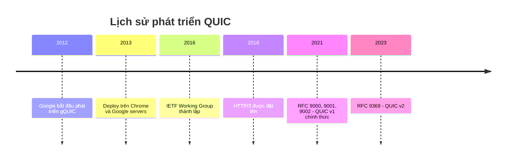

### Sequence Diagram - Handshake (A4.12)
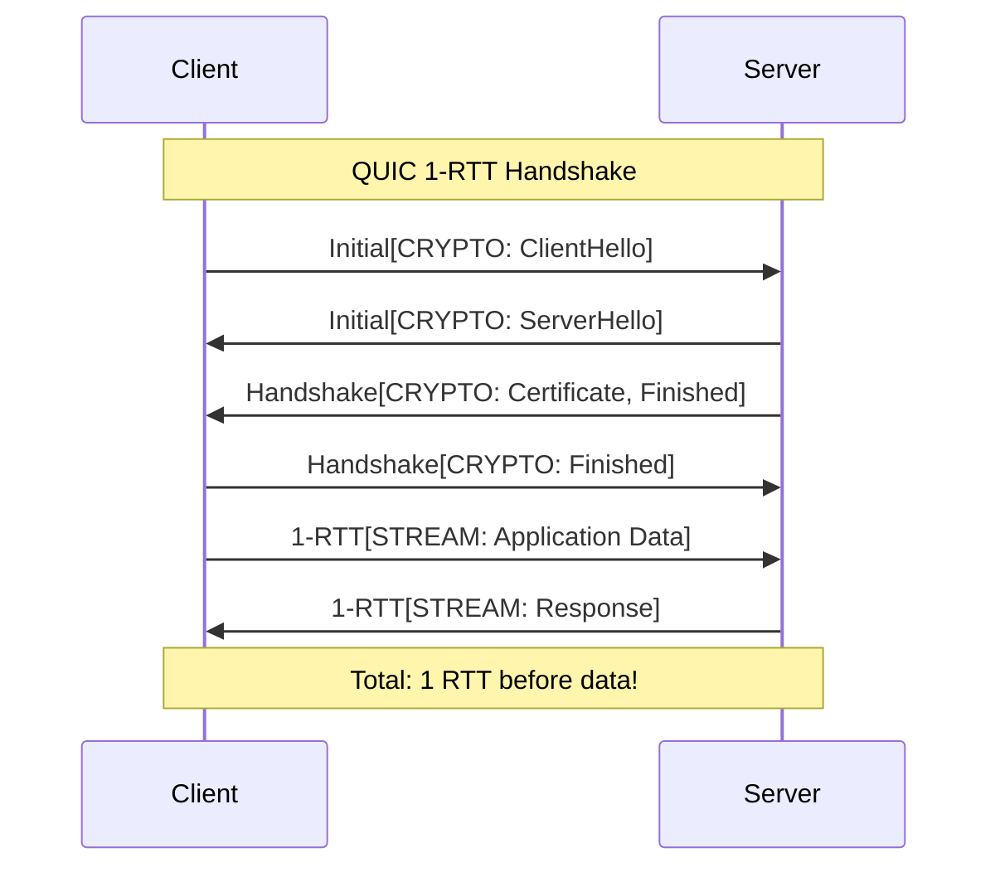

### Sequence Diagram - 0-RTT (A4.12)
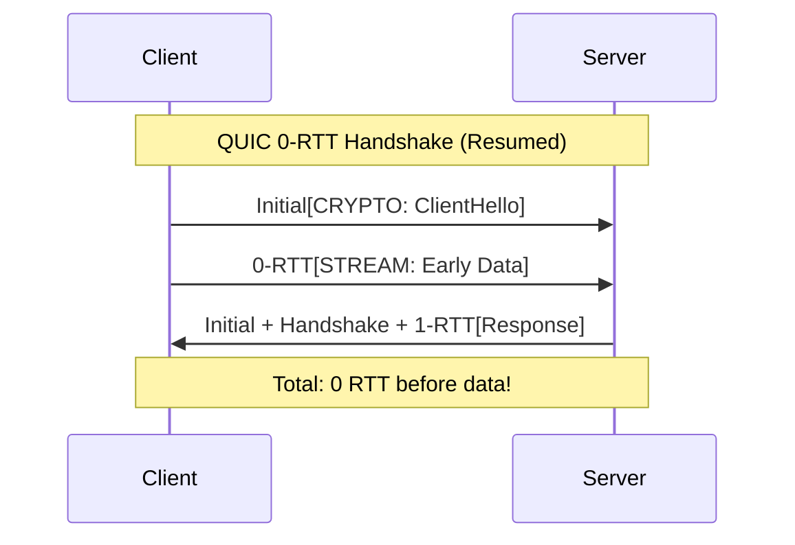

### State Diagram - Stream States (A5.10)
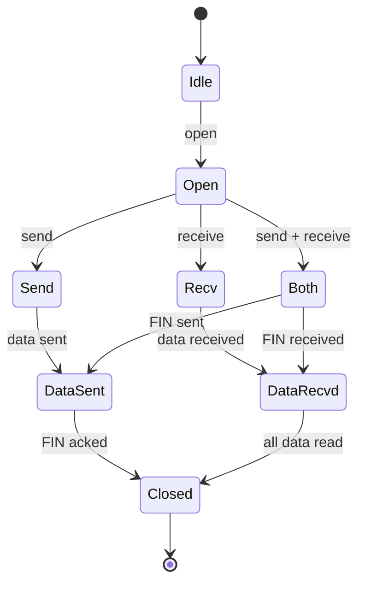

### Flowchart - Protocol Stack (A2.6)
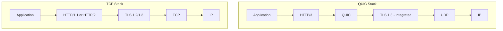

### Comparison Diagram - HOL Blocking (A5.9)
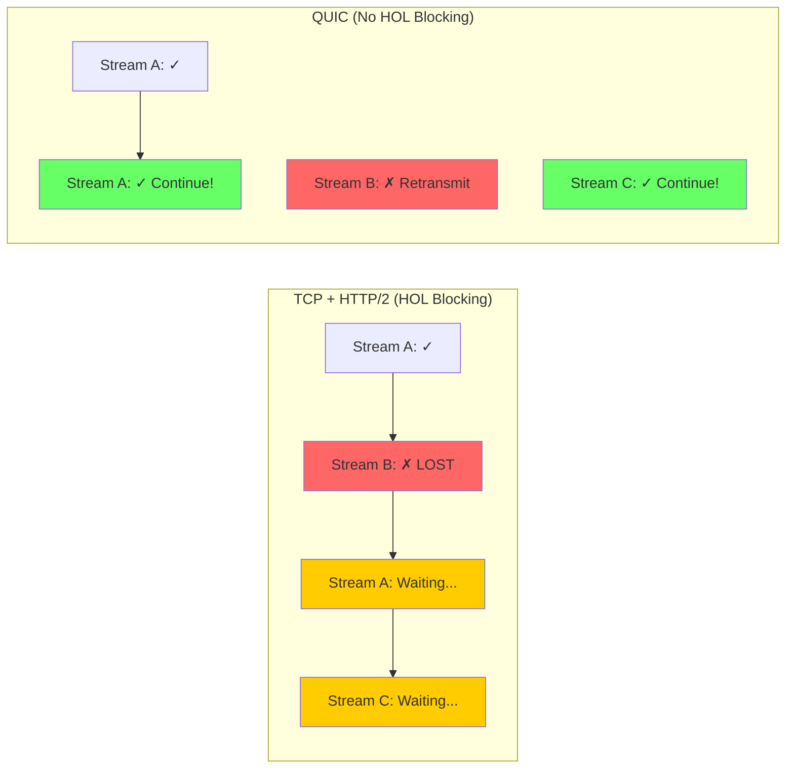

### Sequence Diagram - 1-RTT Handshake Chi tiết
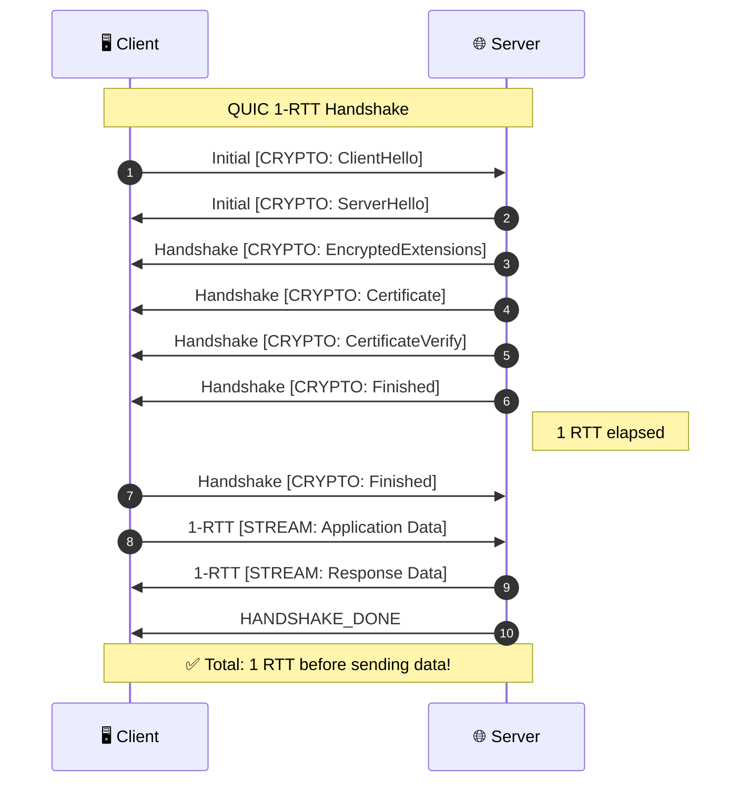

### Sequence Diagram - 0-RTT Handshake Chi tiết
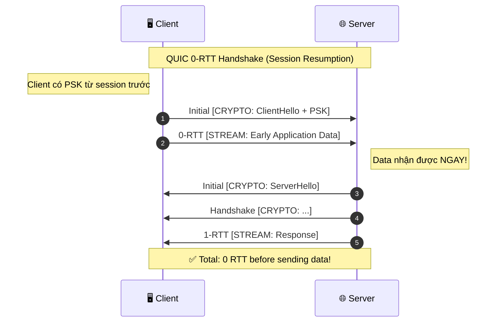

### Protocol Stack Comparison Chi tiết
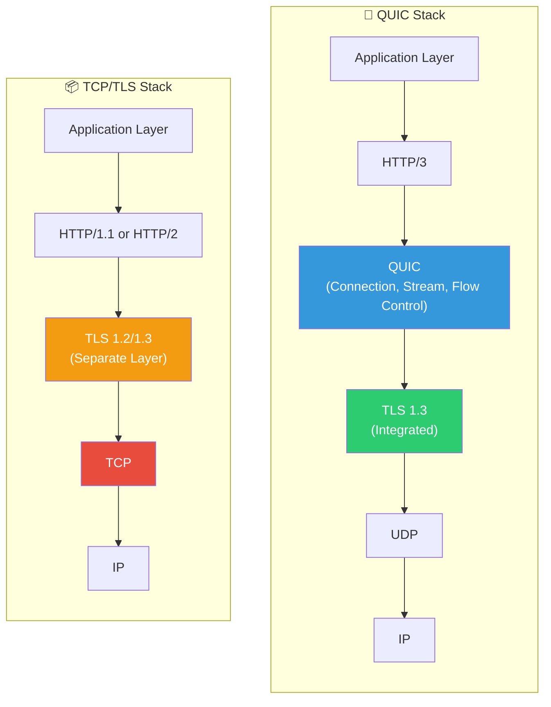

### Stream State Machine Chi tiết
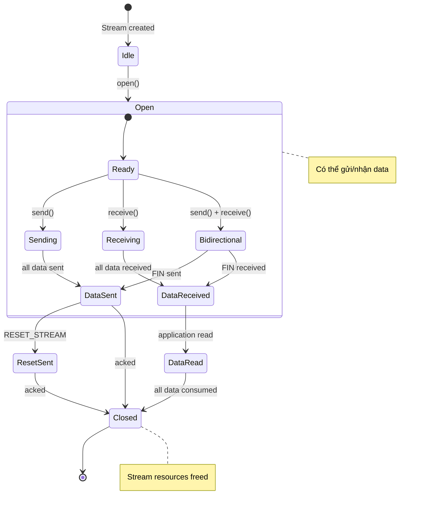

### Connection Migration Sequence
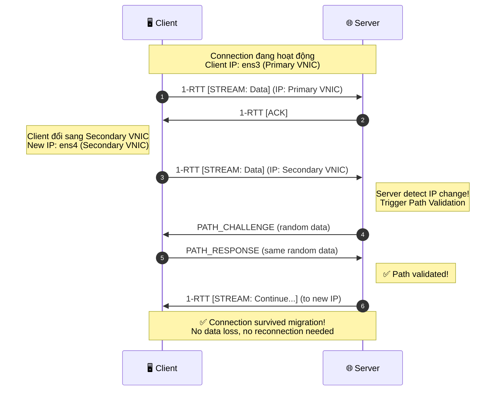

### HOL Blocking Comparison Chi tiết
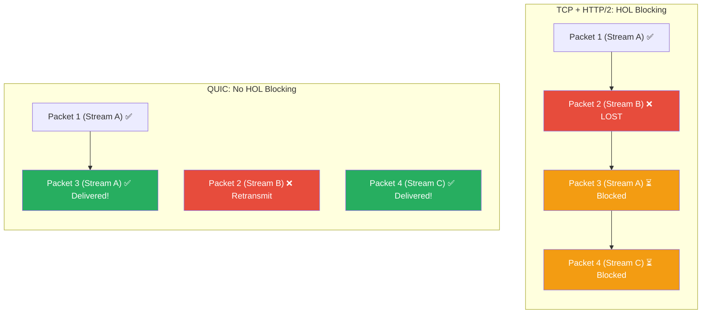

### Flow Control Diagram
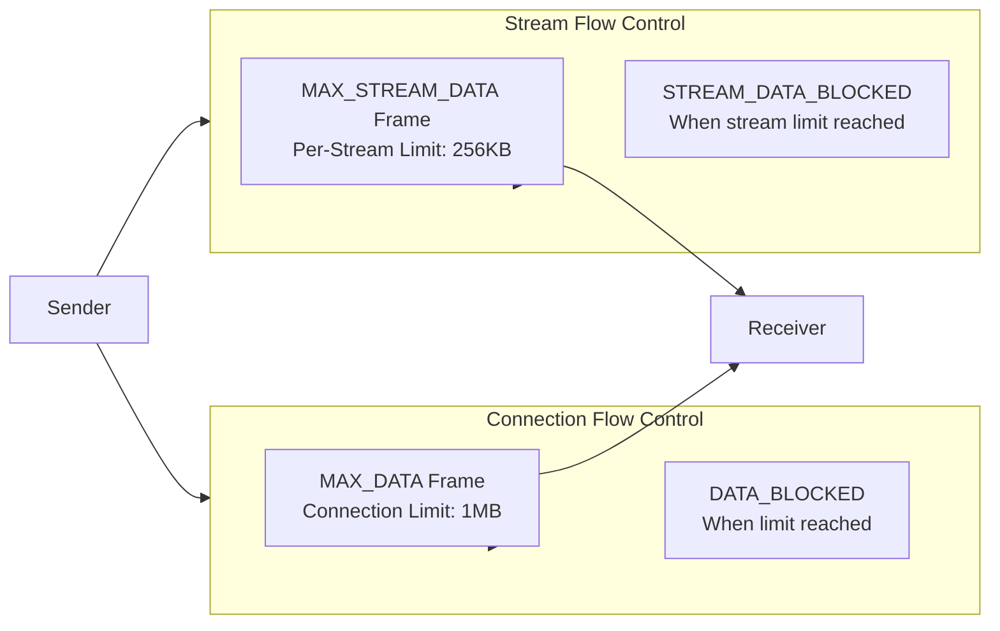

---

## 2. Vẽ bằng Python (Matplotlib)

### Cài đặt

```bash
pip install matplotlib numpy pandas seaborn
```

### 1. Timeline - Lịch sử QUIC (A1.4)

```python
import matplotlib.pyplot as plt
import matplotlib.patches as mpatches

fig, ax = plt.subplots(figsize=(14, 6))

# Data
events = [
    (2012, "Google bắt đầu\nphát triển gQUIC"),
    (2013, "Deploy trên Chrome\nvà Google servers"),
    (2016, "IETF Working Group\nthành lập"),
    (2018, "HTTP/3\nđược đặt tên"),
    (2021, "RFC 9000, 9001, 9002\nQUIC v1 chính thức"),
    (2023, "RFC 9369\nQUIC v2"),
]

years = [e[0] for e in events]
labels = [e[1] for e in events]

# Draw timeline
ax.axhline(y=0, color='#3498db', linewidth=3, zorder=1)

# Draw events
for i, (year, label) in enumerate(events):
    y = 0.5 if i % 2 == 0 else -0.5
    ax.scatter(year, 0, s=200, color='#3498db', zorder=2)
    ax.annotate(f"{year}\n{label}", 
                xy=(year, 0), 
                xytext=(year, y),
                fontsize=10,
                ha='center',
                va='center' if y > 0 else 'center',
                bbox=dict(boxstyle='round,pad=0.5', facecolor='white', edgecolor='#3498db'),
                arrowprops=dict(arrowstyle='->', color='#3498db'))

ax.set_xlim(2010, 2025)
ax.set_ylim(-1.5, 1.5)
ax.set_xlabel('Năm', fontsize=12)
ax.set_title('Lịch sử phát triển QUIC Protocol', fontsize=14, fontweight='bold')
ax.axis('off')

plt.tight_layout()
plt.savefig('quic_timeline.png', dpi=300, bbox_inches='tight')
plt.show()
```

### 2. Bar Chart - Handshake Latency Comparison (A11.9, B2)

```python
import matplotlib.pyplot as plt
import numpy as np

# Data
protocols = ['TCP + TLS 1.2', 'TCP + TLS 1.3', 'QUIC 1-RTT', 'QUIC 0-RTT']
new_connection = [3, 2, 1, 0]  # RTT
resumed_connection = [2, 1, 1, 0]  # RTT

x = np.arange(len(protocols))
width = 0.35

fig, ax = plt.subplots(figsize=(12, 7))

# Colors
color1 = '#3498db'  # Blue
color2 = '#2ecc71'  # Green

bars1 = ax.bar(x - width/2, new_connection, width, label='New Connection', color=color1, edgecolor='white', linewidth=1.5)
bars2 = ax.bar(x + width/2, resumed_connection, width, label='Resumed Connection', color=color2, edgecolor='white', linewidth=1.5)

# Labels and styling
ax.set_ylabel('RTT (Round Trip Time)', fontsize=12)
ax.set_xlabel('Protocol', fontsize=12)
ax.set_title('Handshake Latency Comparison\nQUIC vs TCP + TLS', fontsize=14, fontweight='bold')
ax.set_xticks(x)
ax.set_xticklabels(protocols, fontsize=11)
ax.legend(fontsize=11)
ax.set_ylim(0, 4)
ax.yaxis.grid(True, alpha=0.3)

# Value labels
def add_labels(bars):
    for bar in bars:
        height = bar.get_height()
        ax.annotate(f'{int(height)} RTT',
                    xy=(bar.get_x() + bar.get_width()/2, height),
                    xytext=(0, 3),
                    textcoords="offset points",
                    ha='center', va='bottom',
                    fontsize=10, fontweight='bold')

add_labels(bars1)
add_labels(bars2)

plt.tight_layout()
plt.savefig('handshake_comparison.png', dpi=300)
plt.show()
```

### 3. Pie Chart - QUIC Adoption (A1.8, C2.7)

```python
import matplotlib.pyplot as plt

# Data
labels = ['QUIC (HTTP/3)', 'HTTP/2', 'HTTP/1.1']
sizes = [26.5, 45.3, 28.2]  # Approximate percentages from W3Techs (Q4 2024)
colors = ['#3498db', '#2ecc71', '#e74c3c']
explode = (0.05, 0, 0)

fig, ax = plt.subplots(figsize=(10, 8))
wedges, texts, autotexts = ax.pie(sizes, explode=explode, labels=labels, colors=colors, 
                                   autopct='%1.1f%%', shadow=True, startangle=90,
                                   textprops={'fontsize': 12})

# Bold percentages
for autotext in autotexts:
    autotext.set_fontweight('bold')
    autotext.set_color('white')

ax.set_title('Internet Traffic by Protocol (2024)', fontsize=14, fontweight='bold')

# Legend
ax.legend(wedges, labels, title="Protocols", loc="center left", bbox_to_anchor=(1, 0, 0.5, 1))

plt.tight_layout()
plt.savefig('quic_adoption_pie.png', dpi=300, bbox_inches='tight')
plt.show()
```

### 4. Line Chart - Packet Loss Impact (B5.7)

```python
import matplotlib.pyplot as plt
import numpy as np

# Data
packet_loss = [0, 1, 2, 5, 10, 15, 20]
quic_time = [1.0, 1.08, 1.18, 1.45, 2.1, 3.2, 4.8]  # seconds (simulated)
tcp_time = [1.0, 1.25, 1.55, 2.3, 4.0, 6.5, 10.5]   # seconds (simulated)

fig, ax = plt.subplots(figsize=(12, 7))

# Plot lines
ax.plot(packet_loss, quic_time, 'o-', label='QUIC', color='#3498db', linewidth=2.5, markersize=10, markerfacecolor='white', markeredgewidth=2)
ax.plot(packet_loss, tcp_time, 's-', label='TCP', color='#e74c3c', linewidth=2.5, markersize=10, markerfacecolor='white', markeredgewidth=2)

# Fill area between lines
ax.fill_between(packet_loss, quic_time, tcp_time, alpha=0.1, color='gray')

# Labels
ax.set_xlabel('Packet Loss (%)', fontsize=12)
ax.set_ylabel('Download Time (seconds)', fontsize=12)
ax.set_title('Impact of Packet Loss on Download Time\n10MB File Transfer', fontsize=14, fontweight='bold')
ax.legend(fontsize=12, loc='upper left')
ax.grid(True, alpha=0.3)
ax.set_xticks(packet_loss)

# Annotation
ax.annotate('QUIC more resilient\nto packet loss!', 
            xy=(10, 3), xytext=(12, 6),
            arrowprops=dict(arrowstyle='->', color='gray'),
            fontsize=11, style='italic',
            bbox=dict(boxstyle='round', facecolor='wheat', alpha=0.5))

plt.tight_layout()
plt.savefig('packet_loss_impact.png', dpi=300)
plt.show()
```

### 5. Radar Chart - Feature Comparison (A11.10)

```python
import matplotlib.pyplot as plt
import numpy as np

# Categories
categories = ['Handshake\nLatency', 'HOL Blocking\nResistance', 'Connection\nMigration', 
              'Built-in\nSecurity', 'Multiplexing', 'Loss\nRecovery']
N = len(categories)

# Scores (1-5 scale, 5 is best)
tcp_tls_scores = [2, 2, 1, 3, 3, 3]
quic_scores = [5, 5, 5, 5, 5, 4]

# Compute angle
angles = [n / float(N) * 2 * np.pi for n in range(N)]
angles += angles[:1]

tcp_tls_scores += tcp_tls_scores[:1]
quic_scores += quic_scores[:1]

# Plot
fig, ax = plt.subplots(figsize=(10, 10), subplot_kw=dict(projection='polar'))

# TCP + TLS
ax.plot(angles, tcp_tls_scores, 'o-', linewidth=2, label='TCP + TLS', color='#e74c3c', markersize=8)
ax.fill(angles, tcp_tls_scores, alpha=0.25, color='#e74c3c')

# QUIC
ax.plot(angles, quic_scores, 'o-', linewidth=2, label='QUIC', color='#3498db', markersize=8)
ax.fill(angles, quic_scores, alpha=0.25, color='#3498db')

# Styling
ax.set_xticks(angles[:-1])
ax.set_xticklabels(categories, fontsize=11)
ax.set_ylim(0, 5)
ax.set_yticks([1, 2, 3, 4, 5])
ax.set_yticklabels(['1', '2', '3', '4', '5'], fontsize=9)
ax.legend(loc='upper right', bbox_to_anchor=(1.3, 1.1), fontsize=12)
ax.set_title('Feature Comparison: QUIC vs TCP+TLS\n(Score 1-5, higher is better)', fontsize=14, fontweight='bold', pad=20)

plt.tight_layout()
plt.savefig('feature_radar.png', dpi=300, bbox_inches='tight')
plt.show()
```

### 6. Scalability Chart (B6.6)

```python
import matplotlib.pyplot as plt
import numpy as np

# Data
clients = [1, 5, 10, 20, 50, 100, 200]
quic_throughput = [100, 98, 95, 90, 82, 72, 60]  # Mbps per client (simulated)
tcp_throughput = [100, 95, 88, 78, 65, 50, 35]   # Mbps per client (simulated)

fig, ax = plt.subplots(figsize=(12, 7))

ax.plot(clients, quic_throughput, 'o-', label='QUIC Server', color='#3498db', linewidth=2.5, markersize=10)
ax.plot(clients, tcp_throughput, 's-', label='TCP Server', color='#e74c3c', linewidth=2.5, markersize=10)

ax.set_xlabel('Number of Concurrent Clients', fontsize=12)
ax.set_ylabel('Throughput per Client (Mbps)', fontsize=12)
ax.set_title('Server Scalability: QUIC vs TCP', fontsize=14, fontweight='bold')
ax.legend(fontsize=12)
ax.grid(True, alpha=0.3)
ax.set_xscale('log')
ax.set_xticks(clients)
ax.set_xticklabels(clients)

plt.tight_layout()
plt.savefig('scalability.png', dpi=300)
plt.show()
```

### 7. Congestion Window Graph (A8.10)

```python
import matplotlib.pyplot as plt
import numpy as np

# Time axis
time = np.linspace(0, 100, 1000)

# CUBIC cwnd simulation
def cubic_cwnd(t):
    cwnd = np.zeros_like(t)
    for i, ti in enumerate(t):
        if ti < 10:
            cwnd[i] = ti * 10  # Slow start
        elif ti < 25:
            cwnd[i] = 100 * (1 - np.exp(-0.3 * (ti - 10)))  # Recovery
        elif ti < 35:
            cwnd[i] = 70 + (ti - 25) ** 1.3  # CUBIC growth
        elif ti < 45:
            cwnd[i] = max(90 - (ti - 35) * 8, 30)  # Loss event
        elif ti < 60:
            cwnd[i] = 30 + (ti - 45) ** 1.5  # CUBIC recovery
        else:
            cwnd[i] = min(60 + (ti - 60) ** 1.2, 120)
    return cwnd

# NewReno cwnd simulation
def newreno_cwnd(t):
    cwnd = np.zeros_like(t)
    for i, ti in enumerate(t):
        if ti < 10:
            cwnd[i] = ti * 10
        elif ti < 25:
            cwnd[i] = 100 * (1 - np.exp(-0.2 * (ti - 10)))
        elif ti < 35:
            cwnd[i] = 60 + (ti - 25) * 2  # Linear growth
        elif ti < 45:
            cwnd[i] = max(80 - (ti - 35) * 6, 30)
        elif ti < 60:
            cwnd[i] = 30 + (ti - 45) * 2
        else:
            cwnd[i] = min(60 + (ti - 60) * 1.5, 100)
    return cwnd

fig, ax = plt.subplots(figsize=(14, 7))

ax.plot(time, cubic_cwnd(time), label='CUBIC', color='#3498db', linewidth=2)
ax.plot(time, newreno_cwnd(time), label='NewReno', color='#e74c3c', linewidth=2)

# Add loss event markers
loss_times = [35, 45]
for lt in loss_times:
    ax.axvline(x=lt, color='gray', linestyle='--', alpha=0.5)
    ax.annotate('Packet\nLoss', xy=(lt, 90), fontsize=9, ha='center', color='gray')

ax.set_xlabel('Time (s)', fontsize=12)
ax.set_ylabel('Congestion Window (packets)', fontsize=12)
ax.set_title('Congestion Window Evolution: CUBIC vs NewReno', fontsize=14, fontweight='bold')
ax.legend(fontsize=12)
ax.grid(True, alpha=0.3)
ax.set_ylim(0, 130)

plt.tight_layout()
plt.savefig('cwnd_comparison.png', dpi=300)
plt.show()
```

### 8. HOL Blocking Comparison (A5.9)

```python
import matplotlib.pyplot as plt
import matplotlib.patches as mpatches
import numpy as np

fig, axes = plt.subplots(1, 2, figsize=(16, 7))

# === TCP + HTTP/2 (Left) ===
ax1 = axes[0]
ax1.set_title('TCP + HTTP/2: Head-of-Line Blocking', fontsize=13, fontweight='bold')

# Packets
packets = [
    {'id': 1, 'stream': 'A', 'status': 'delivered', 'y': 4},
    {'id': 2, 'stream': 'B', 'status': 'lost', 'y': 3},
    {'id': 3, 'stream': 'A', 'status': 'blocked', 'y': 2},
    {'id': 4, 'stream': 'C', 'status': 'blocked', 'y': 1},
]

colors = {'delivered': '#27ae60', 'lost': '#e74c3c', 'blocked': '#f39c12'}
labels = {'delivered': '✓ Delivered', 'lost': '✗ Lost', 'blocked': 'BLOCKED'}

for p in packets:
    color = colors[p['status']]
    rect = mpatches.FancyBboxPatch((0.5, p['y'] - 0.3), 3, 0.6,
                                    boxstyle="round,pad=0.02",
                                    facecolor=color, edgecolor='white', linewidth=2)
    ax1.add_patch(rect)
    ax1.text(2, p['y'], f"Packet {p['id']} (Stream {p['stream']})\n{labels[p['status']]}", 
             ha='center', va='center', fontsize=11, fontweight='bold', color='white')

ax1.set_xlim(0, 4)
ax1.set_ylim(0, 5)
ax1.axis('off')

# Explanation box
ax1.text(2, 0.3, "ALL streams blocked when Packet 2 is lost!\n(TCP requires in-order delivery)", 
         ha='center', fontsize=11, style='italic',
         bbox=dict(boxstyle='round', facecolor='#fff3cd', edgecolor='#ffc107'))

# === QUIC (Right) ===
ax2 = axes[1]
ax2.set_title('QUIC: No Head-of-Line Blocking', fontsize=13, fontweight='bold')

packets_quic = [
    {'id': 1, 'stream': 'A', 'status': 'delivered', 'y': 4},
    {'id': 2, 'stream': 'B', 'status': 'lost', 'y': 3},
    {'id': 3, 'stream': 'A', 'status': 'delivered', 'y': 2},
    {'id': 4, 'stream': 'C', 'status': 'delivered', 'y': 1},
]

colors_quic = {'delivered': '#27ae60', 'lost': '#e74c3c'}
labels_quic = {'delivered': '✓ Delivered', 'lost': '✗ Waiting retransmit'}

for p in packets_quic:
    color = colors_quic[p['status']]
    rect = mpatches.FancyBboxPatch((0.5, p['y'] - 0.3), 3, 0.6,
                                    boxstyle="round,pad=0.02",
                                    facecolor=color, edgecolor='white', linewidth=2)
    ax2.add_patch(rect)
    text = f"Packet {p['id']} (Stream {p['stream']})\n{labels_quic[p['status']]}"
    ax2.text(2, p['y'], text, ha='center', va='center', fontsize=11, fontweight='bold', color='white')

ax2.set_xlim(0, 4)
ax2.set_ylim(0, 5)
ax2.axis('off')

# Explanation box
ax2.text(2, 0.3, "Only Stream B is blocked!\nStreams A and C continue normally.", 
         ha='center', fontsize=11, style='italic',
         bbox=dict(boxstyle='round', facecolor='#d4edda', edgecolor='#28a745'))

plt.tight_layout()
plt.savefig('hol_blocking_comparison.png', dpi=300, bbox_inches='tight')
plt.show()
```

### 9. Performance Dashboard (C1.8)

```python
import matplotlib.pyplot as plt
import numpy as np

fig = plt.figure(figsize=(16, 10))

# Create grid
gs = fig.add_gridspec(2, 3, hspace=0.3, wspace=0.3)

# 1. Handshake Comparison (top left)
ax1 = fig.add_subplot(gs[0, 0])
protocols = ['TCP+TLS\n1.2', 'TCP+TLS\n1.3', 'QUIC\n1-RTT', 'QUIC\n0-RTT']
rtt = [3, 2, 1, 0]
colors = ['#e74c3c', '#f39c12', '#3498db', '#27ae60']
bars = ax1.bar(protocols, rtt, color=colors, edgecolor='white', linewidth=2)
ax1.set_ylabel('RTT')
ax1.set_title('Handshake Latency', fontweight='bold')
ax1.set_ylim(0, 4)
for bar, val in zip(bars, rtt):
    ax1.text(bar.get_x() + bar.get_width()/2, val + 0.1, f'{val}', ha='center', fontweight='bold')

# 2. Packet Loss Impact (top middle)
ax2 = fig.add_subplot(gs[0, 1])
loss = [0, 5, 10, 15, 20]
quic_t = [1.0, 1.4, 2.0, 3.0, 4.5]
tcp_t = [1.0, 2.0, 3.5, 6.0, 10.0]
ax2.plot(loss, quic_t, 'o-', label='QUIC', color='#3498db', linewidth=2)
ax2.plot(loss, tcp_t, 's-', label='TCP', color='#e74c3c', linewidth=2)
ax2.set_xlabel('Packet Loss (%)')
ax2.set_ylabel('Download Time (s)')
ax2.set_title('Packet Loss Resilience', fontweight='bold')
ax2.legend(fontsize=9)
ax2.grid(True, alpha=0.3)

# 3. Scalability (top right)
ax3 = fig.add_subplot(gs[0, 2])
clients = [1, 10, 50, 100]
throughput = [100, 95, 80, 65]
ax3.plot(clients, throughput, 'o-', color='#3498db', linewidth=2, markersize=8)
ax3.fill_between(clients, throughput, alpha=0.3, color='#3498db')
ax3.set_xlabel('Concurrent Clients')
ax3.set_ylabel('Throughput/Client (Mbps)')
ax3.set_title('Server Scalability', fontweight='bold')
ax3.grid(True, alpha=0.3)

# 4. Feature Radar (bottom left, spanning 2 columns)
ax4 = fig.add_subplot(gs[1, 0:2], projection='polar')
categories = ['Latency', 'HOL\nBlocking', 'Migration', 'Security', 'Recovery']
tcp_scores = [2, 2, 1, 3, 3]
quic_scores = [5, 5, 5, 5, 4]

angles = [n / float(len(categories)) * 2 * np.pi for n in range(len(categories))]
angles += angles[:1]
tcp_scores += tcp_scores[:1]
quic_scores += quic_scores[:1]

ax4.plot(angles, tcp_scores, 'o-', label='TCP+TLS', color='#e74c3c', linewidth=2)
ax4.fill(angles, tcp_scores, alpha=0.25, color='#e74c3c')
ax4.plot(angles, quic_scores, 'o-', label='QUIC', color='#3498db', linewidth=2)
ax4.fill(angles, quic_scores, alpha=0.25, color='#3498db')
ax4.set_xticks(angles[:-1])
ax4.set_xticklabels(categories, fontsize=10)
ax4.set_ylim(0, 5)
ax4.legend(loc='upper right', bbox_to_anchor=(1.2, 1.0))
ax4.set_title('Feature Comparison', fontweight='bold', pad=20)

# 5. Protocol Adoption (bottom right)
ax5 = fig.add_subplot(gs[1, 2])
labels = ['QUIC\n(HTTP/3)', 'HTTP/2', 'HTTP/1.1']
sizes = [26, 46, 28]
colors = ['#3498db', '#27ae60', '#e74c3c']
explode = (0.05, 0, 0)
ax5.pie(sizes, explode=explode, labels=labels, colors=colors, autopct='%1.0f%%',
        shadow=True, startangle=90, textprops={'fontsize': 10})
ax5.set_title('Protocol Adoption', fontweight='bold')

plt.suptitle('QUIC Performance Dashboard', fontsize=16, fontweight='bold', y=1.02)
plt.tight_layout()
plt.savefig('performance_dashboard.png', dpi=300, bbox_inches='tight')
plt.show()
```

### 10. Stream Interleaving Timeline (B3.7)

```python
import matplotlib.pyplot as plt
import matplotlib.patches as mpatches
import numpy as np

fig, ax = plt.subplots(figsize=(16, 6))

# Stream colors
colors = {'A': '#3498db', 'B': '#e74c3c', 'C': '#27ae60', 'D': '#9b59b6', 'E': '#f39c12'}

# Simulated packet data (time, stream, size_proportion)
packets = [
    (0.0, 'A', 0.2), (0.1, 'B', 0.15), (0.2, 'C', 0.18), (0.3, 'A', 0.22),
    (0.4, 'D', 0.16), (0.5, 'E', 0.2), (0.6, 'B', 0.19), (0.7, 'A', 0.17),
    (0.8, 'C', 0.21), (0.9, 'D', 0.15), (1.0, 'E', 0.18), (1.1, 'A', 0.23),
    (1.2, 'B', 0.2), (1.3, 'C', 0.16), (1.4, 'D', 0.19), (1.5, 'E', 0.17),
]

# Draw packets as colored bars
for time, stream, size in packets:
    y = {'A': 5, 'B': 4, 'C': 3, 'D': 2, 'E': 1}[stream]
    rect = mpatches.FancyBboxPatch((time, y - 0.3), 0.08, 0.6,
                                    boxstyle="round,pad=0.01",
                                    facecolor=colors[stream], 
                                    edgecolor='white', linewidth=1)
    ax.add_patch(rect)

# Draw timeline
ax.axhline(y=0, color='gray', linewidth=1)
for i, t in enumerate(np.arange(0, 1.7, 0.1)):
    ax.axvline(x=t, color='lightgray', linewidth=0.5, alpha=0.5)

# Labels
ax.set_yticks([1, 2, 3, 4, 5])
ax.set_yticklabels(['Stream E', 'Stream D', 'Stream C', 'Stream B', 'Stream A'], fontsize=11)
ax.set_xlabel('Time (seconds)', fontsize=12)
ax.set_title('QUIC Stream Multiplexing: Packet Interleaving\nDuring 5-File Concurrent Download', fontsize=14, fontweight='bold')

ax.set_xlim(-0.05, 1.7)
ax.set_ylim(0.3, 5.7)
ax.grid(True, axis='x', alpha=0.3)

# Legend
patches = [mpatches.Patch(color=colors[s], label=f'Stream {s}') for s in ['A', 'B', 'C', 'D', 'E']]
ax.legend(handles=patches, loc='upper right', fontsize=10)

plt.tight_layout()
plt.savefig('stream_interleaving.png', dpi=300, bbox_inches='tight')
plt.show()
```

---

## 3. Vẽ bằng PlantUML

### Sequence Diagram
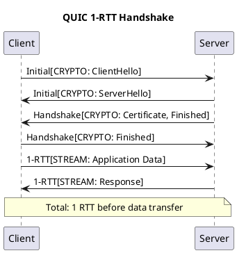

### State Diagram
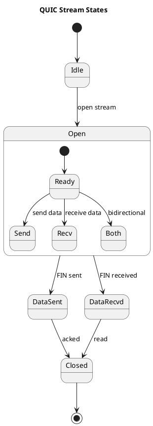

---

## 4. Vẽ bằng Draw.io (Diagrams.net)

Draw.io là công cụ trực quan, phù hợp cho:
- Network topology
- Protocol stack diagrams
- Packet/Frame structure
- Complex flowcharts

**Cách sử dụng:**
1. Truy cập https://app.diagrams.net
2. Chọn template phù hợp
3. Drag & drop shapes
4. Export PNG/SVG

**Tips:**
- Sử dụng shapes từ "Network" category
- Dùng colors nhất quán
- Export với DPI cao (300+)

---

## 5. Tổng hợp công cụ theo loại biểu đồ

| Loại biểu đồ | Công cụ khuyến nghị | Lý do |
|--------------|---------------------|-------|
| Timeline | Mermaid, draw.io | Đơn giản, nhúng được Markdown |
| Sequence Diagram | Mermaid, PlantUML | Text-based, dễ version control |
| State Diagram | Mermaid, PlantUML | Text-based, chính xác |
| Bar/Line/Pie Chart | Python Matplotlib | Dữ liệu động, chuyên nghiệp |
| Radar Chart | Python Matplotlib | Nhiều parameters so sánh |
| Protocol Stack | draw.io | Trực quan, flexible |
| Packet Structure | draw.io | Chi tiết byte-level |
| Network Topology | draw.io | Network shapes có sẵn |
| Infographics | Canva | Đẹp, chuyên nghiệp |

---

## 6. Checklist Biểu đồ

### PHẦN A (Lý thuyết): 14 biểu đồ
- [ ] A1.4: Timeline lịch sử QUIC (TV1)
- [ ] A1.8: Adoption chart (TV2)
- [ ] A2.6: Protocol Stack comparison (TV1)
- [ ] A3.10: Packet/Frame structure (TV2)
- [ ] A4.11: Timing comparison (TV1)
- [ ] A4.12: Handshake sequences (TV1)
- [ ] A5.9: HOL blocking comparison (TV2)
- [ ] A5.10: Stream state machine (TV2)
- [ ] A6.9: Migration sequence (TV1)
- [ ] A7.8: Flow control diagram (TV2)
- [ ] A8.10: Congestion window graph (TV1)
- [ ] A8.11: RTT estimation diagram (TV1)
- [ ] A11.9: Performance bar chart (TV1)
- [ ] A11.10: Feature radar chart (TV2)

### PHẦN B (Demo): 7 biểu đồ
- [ ] B2: Handshake timing bar chart (TV1)
- [ ] B3.7: Stream interleaving timeline (TV2)
- [ ] B3.8: Completion time comparison (TV2)
- [ ] B4.7: Migration timeline (TV1)
- [ ] B5.7: Packet loss line chart (TV2)
- [ ] B5.8: Recovery comparison chart (TV2)
- [ ] B6.6: Scalability chart (TV1)

### PHẦN C (Phân tích): 4 biểu đồ
- [ ] C1.7: Comprehensive performance charts (TV1)
- [ ] C1.8: Performance dashboard (TV1)
- [ ] C2.7: Adoption statistics charts (TV2)
- [ ] C2.8: Case study performance charts (TV2)

**TỔNG CỘNG: 25 biểu đồ**
- TV1: 13 biểu đồ
- TV2: 12 biểu đồ

---

## Tips để có biểu đồ đẹp

1. **Consistent Colors**: Sử dụng color palette nhất quán
   - QUIC: `#3498db` (blue)
   - TCP: `#e74c3c` (red)
   - Success: `#27ae60` (green)
   - Warning: `#f39c12` (orange)

2. **High DPI**: Export với dpi=300 cho print quality

3. **Clear Labels**: Font size ≥ 10pt

4. **White Background**: Dễ đọc khi in

5. **Legend**: Luôn có legend cho multi-series charts

---

## Hướng dẫn chạy Python Code

```bash
# 1. Cài đặt thư viện
pip install matplotlib numpy pandas seaborn

# 2. Tạo file .py và paste code
nano draw_charts.py

# 3. Chạy
python draw_charts.py

# 4. File PNG sẽ được lưu trong cùng thư mục
```

## Sử dụng Mermaid

### Option A: Nhúng trong README.md

GitHub tự động render Mermaid diagrams:

````markdown

````

### Option B: Mermaid Live Editor

1. Truy cập https://mermaid.live
2. Paste code Mermaid
3. Download PNG/SVG

### Option C: CLI Tool

```bash
# Cài đặt
npm install -g @mermaid-js/mermaid-cli

# Convert to PNG
mmdc -i diagram.mmd -o diagram.png -b transparent
```

---

*Tài liệu được tạo để hỗ trợ nghiên cứu đề tài QUIC - NT531.Q21*

---

*Cập nhật lần cuối: 08/02/2026*
